<!-- course-title: AI for the Holcim Operational Excellence Team -->
<!-- course-theme: holcim-theme -->

<!-- layout: full-bleed -->
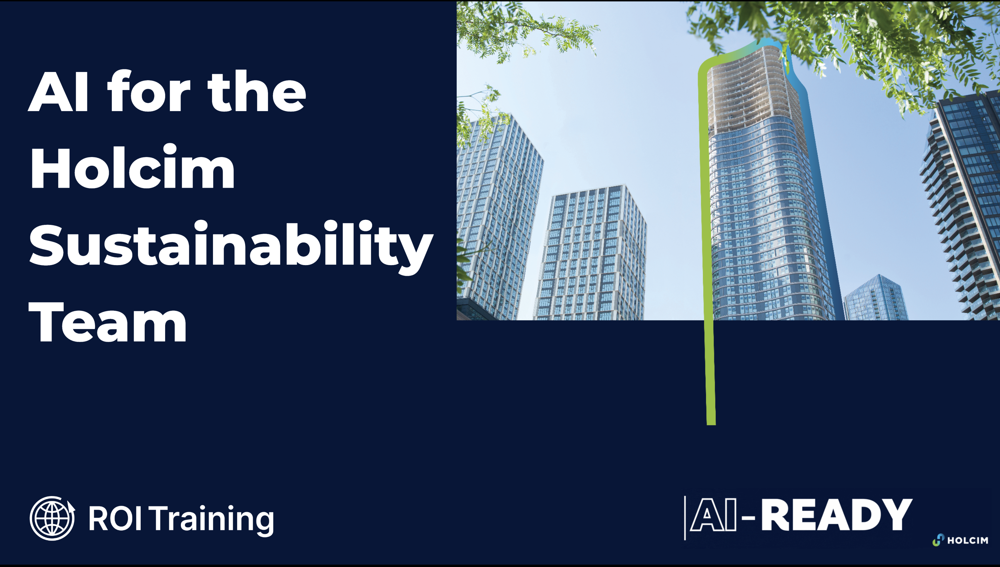
---
<!-- layout: panel-right -->
# Welcome!

- ROI leads the industry in designing and delivering customized technology and management training solutions
- Meet your instructor
  - Name
  - Background
  - Contact info
- Let’s get started!

---
# Course Objectives

- Apply Gemini across everyday Holcim Operational Excellence workflows for CEM and Geocycle
- Engineer structured prompts that produce Holcim-ready CEM product notes, Geocycle acceptance summaries, and OE infographics
- Use Gemini in Sheets to format, chart, and dashboard CEM clinker-factor and Geocycle AF performance data
- Package reusable prompts and grounded reference files into Gemini Gems for CEM and Geocycle workflows
- Build a Gemini Notebook briefing pack for low-carbon CEM and Geocycle updates
- Generate multi-slide Holcim-style presentations with Gemini in Google Slides
---
<!-- layout: panel-left -->
# Agenda

- Prompt Engineering
- Analyzing CEM and Geocycle Data in Sheets
- Build Reusable CEM and Geocycle Assistants
- Gemini Notebook
- Holcim-Style Presentations in Slides

---
<!-- layout: panel-right -->
# Who Should Attend

- Holcim Operational Excellence partners working on CEM formulations and clinker factor
- Geocycle colleagues supporting waste co-processing and alternative fuels
- Plant and product specialists who report CEM type mix, SCM share, and thermal substitution
- OE leaders who want practical, everyday Gemini skills

---
<!-- layout: panel-left -->
# Prerequisites

- A Google account with access to Gemini, Sheets, Slides, and Gemini Notebook (NotebookLM)
- Basic familiarity with Google Sheets and Google Drive
- No prior AI or scripting experience required

---
<!-- layout: stacked -->
# Five Skills, One Morning

- Five short sections, each pairs a concept with a hands-on lab
- Same Holcim OE scenarios throughout: CEM formulations, clinker factor, Geocycle AF and waste acceptance
- Every exercise uses synthetic or anonymized data: safe to explore
- By the end, you leave with techniques and artifacts you can reuse Monday

---
<!-- layout: navigation -->
# Today’s Sections

- **Prompt Engineering**
- Analyzing CEM and Geocycle Data in Sheets
- Build Reusable CEM and Geocycle Assistants
- Gemini Notebook
- Holcim-Style Presentations in Slides
---
# Why Prompting Is a Skill

- A vague ask gets a vague answer: “write something about low-carbon cement” returns something generic and un-Holcim
- Prompting is a craft you build in layers, not one perfect sentence
- Each layer narrows what “good” means before the model writes anything
- The payoff: output a CEM or Geocycle colleague can actually use

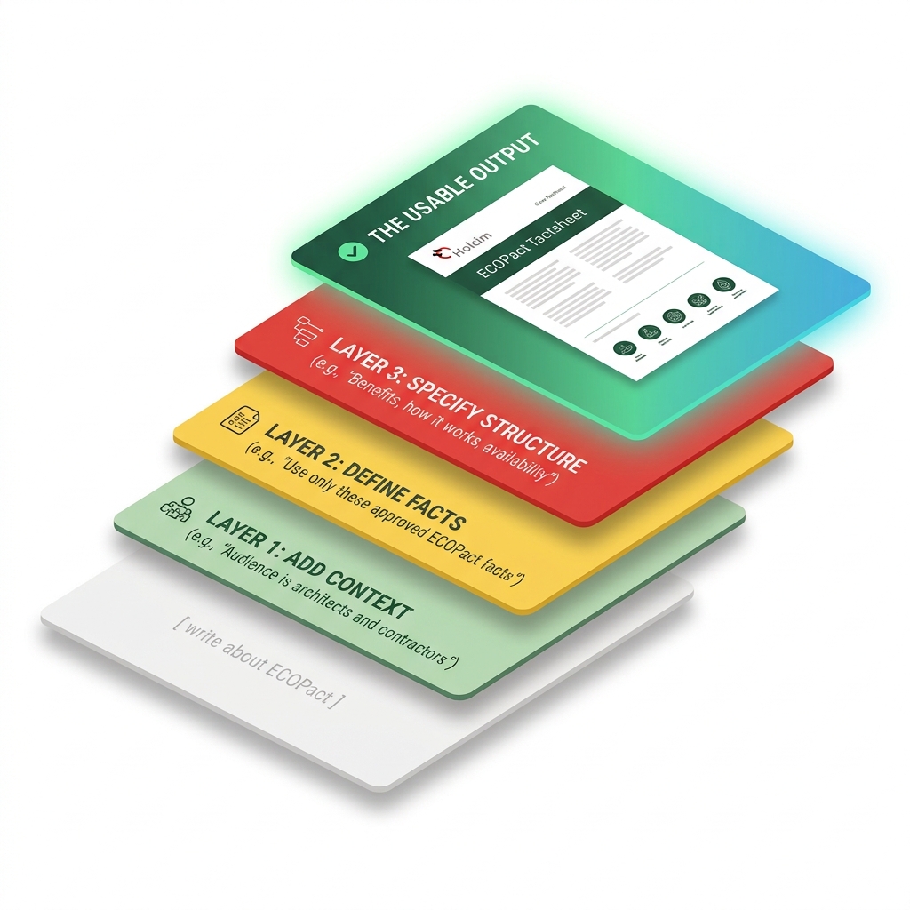
---
<!-- layout: stacked -->
# The “Role-Task-Steps-Examples” Framework

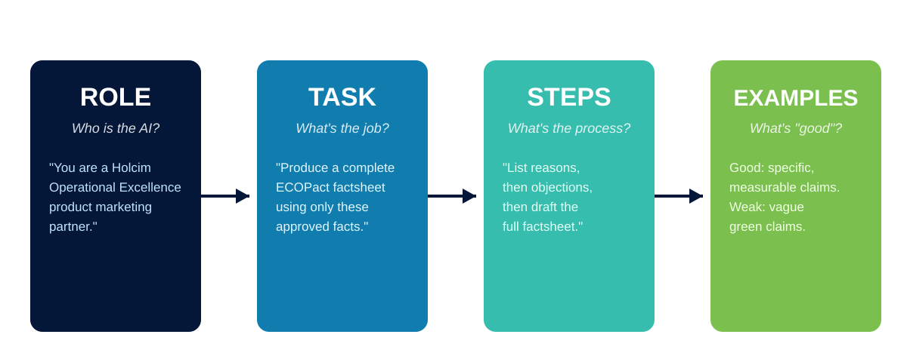
---
<!-- layout: 2-column -->
# From Generic to Specific

### Generic prompt
- “Write something about ECOPlanet”
- No audience, no approved facts, no format
- Reads like generic marketing copy
- You edit almost every line

### Structured prompt
- Role + Task + Steps + Examples, one chat
- Names the audience, the approved facts, the word count
- Locks out invented statistics
- You edit a few lines, not the whole draft
---
# Lab 1: Prompt Engineering Mastery

**Time:** 30 minutes

[Open Lab 1](https://labv.roitraining.com/?lab=https%3A%2F%2Fgithub.com%2Froitraining%2Fholcim-department-ai-training-labs%2Fblob%2Fmain%2Flabs%2Foperational-excellence%2Flab-01-prompt-engineering-mastery%2Flab.md)
---
<!-- layout: navigation -->
# Today’s Sections

- Prompt Engineering
- **Analyzing CEM and Geocycle Data in Sheets**
- Build Reusable CEM and Geocycle Assistants
- Gemini Notebook
- Holcim-Style Presentations in Slides
---
# AI Meets Your Spreadsheets

- Ask Gemini in Sheets for what you want, in plain language: no formulas required
- Format tables, add header filters, apply conditional formatting, insert charts
- Gemini proposes the change; you review and apply it
- Great for OE analysts who know CEM and Geocycle KPIs but not every Sheets function

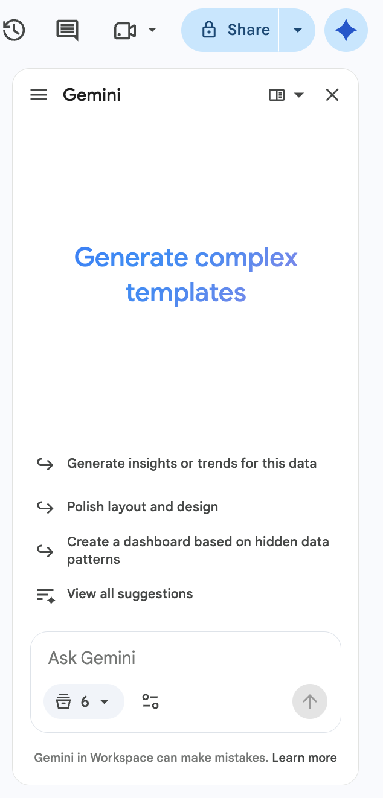
---
# Right-Sized Data, Real OE KPIs

- This lab’s extract is **100 rows and 12 columns**: 25 sites across 4 quarters of FY2025
- Columns cover cement type mix, clinker factor, SCM share, and Geocycle thermal substitution
- Gemini in Sheets performs best on smaller, clean tables
- No sampling step: `SiteData` is already Gemini-ready on import

> [!NOTE]
> CEM here means cement product families under EN 197-1 (CEM I through CEM V). Geocycle metrics track alternative-fuel substitution that supports those low-carbon cement goals.
---
<!-- layout: stacked -->
# From Data to Decisions

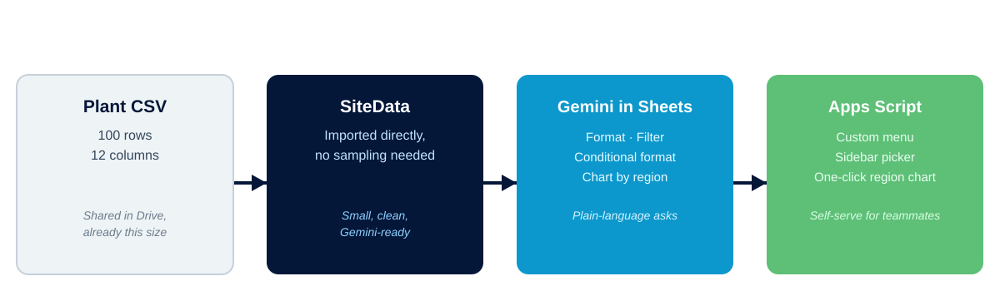
---
# Lab 2: Analyzing CEM and Geocycle Data with Sheets and Gemini

**Time:** 45 minutes

[Open Lab 2](https://labv.roitraining.com/?lab=https%3A%2F%2Fgithub.com%2Froitraining%2Fholcim-department-ai-training-labs%2Fblob%2Fmain%2Flabs%2Foperational-excellence%2Flab-02-analyzing-cem-geocycle-data-with-sheets-and-gemini%2Flab.md)
---
<!-- layout: navigation -->
# Today’s Sections

- Prompt Engineering
- Analyzing CEM and Geocycle Data in Sheets
- **Build Reusable CEM and Geocycle Assistants**
- Gemini Notebook
- Holcim-Style Presentations in Slides
---
# Stop Rewriting the Same Prompt

- Great prompts don’t survive the next new chat: Persona, Task, Process, and Examples get retyped from memory
- Different teammates end up with different quality, and different citations
- A CEM type clarification or Geocycle waste answer should look the same whether you or a colleague ran it
- Gems save the instructions, and the reference files, once, so everyone starts from the same standard

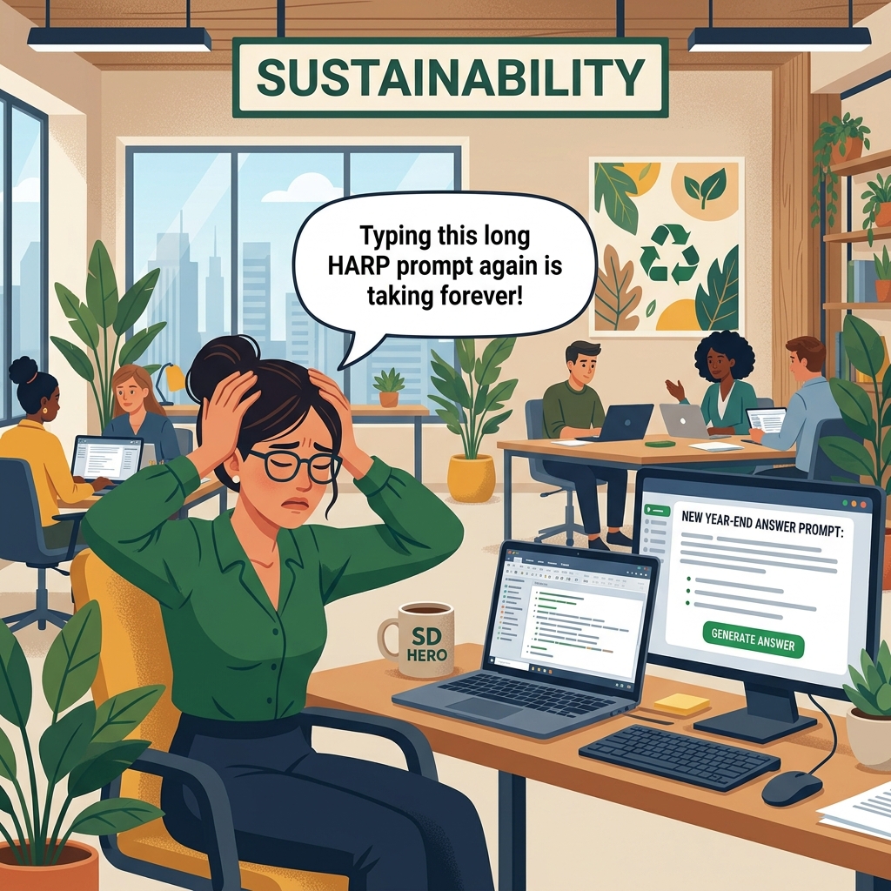
---
<!-- layout: stacked -->
# What’s a Gem

- A Gem is a saved Gemini assistant: instructions live in the Gem, not in your head
- A Gem can also hold Knowledge files, so it answers grounded in your own documents
- Preview before you save; edit anytime the standard changes

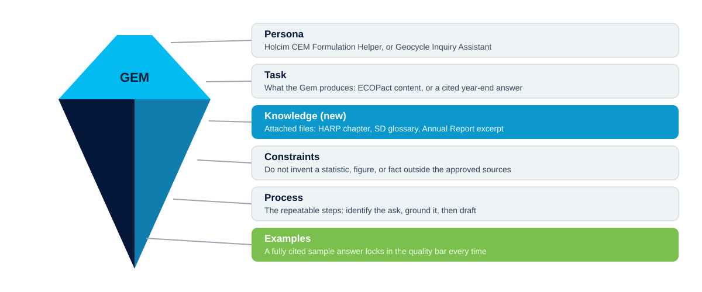
---
<!-- layout: 2-column -->
# Gems Your Team Can Reuse

### Holcim CEM Formulation Helper
- Persona: Operational Excellence CEM partner
- Knowledge: EN 197-1 cement-type glossary and clinker-factor notes
- Explains CEM I–V trade-offs without inventing plant figures

### Holcim Geocycle Inquiry Assistant
- Persona: Geocycle customer-facing assistant
- Knowledge: synthetic waste-acceptance and AF process notes
- Every answer cites its source, or says “Not found in the provided materials”
---
# Lab 3: Creating Reusable CEM and Geocycle Assistants with Gems

**Time:** 30 minutes

[Open Lab 3](https://labv.roitraining.com/?lab=https%3A%2F%2Fgithub.com%2Froitraining%2Fholcim-department-ai-training-labs%2Fblob%2Fmain%2Flabs%2Foperational-excellence%2Flab-03-creating-reusable-prompts-with-gems%2Flab.md)
---
<!-- layout: navigation -->
# Today’s Sections

- Prompt Engineering
- Analyzing CEM and Geocycle Data in Sheets
- Build Reusable CEM and Geocycle Assistants
- **Gemini Notebook**
- Holcim-Style Presentations in Slides
---
# Gemini Notebook

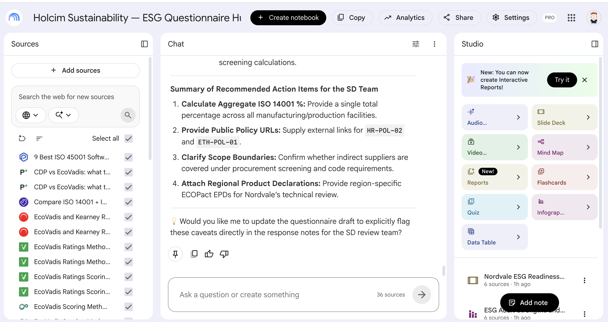
---
# From Chat to Grounded Research

- A regular chat can drift or invent details—a Notebook cannot leave its sources
- You choose what goes in: internal CEM and Geocycle notes, plus targeted web research
- Every answer traces back to a source you selected
- Built for an OE briefing you have to stand behind
---
<!-- layout: stacked -->
# Sources In, Insights Out

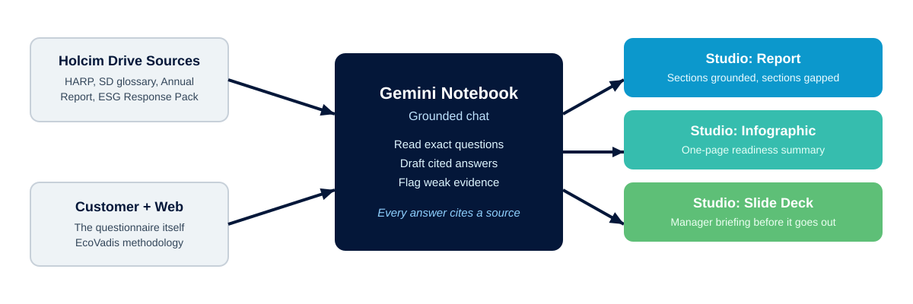
---
# Ask Sharper Questions

- Ask Notebook to compare clinker-factor progress with Geocycle AF substitution by region
- Ask for cited talking points for a leadership update, and flag anything not grounded in a source
- If sources don’t fully answer a question, the Notebook says so: it does not invent a figure
- Save the strongest answers as notes; convert them into Studio sources

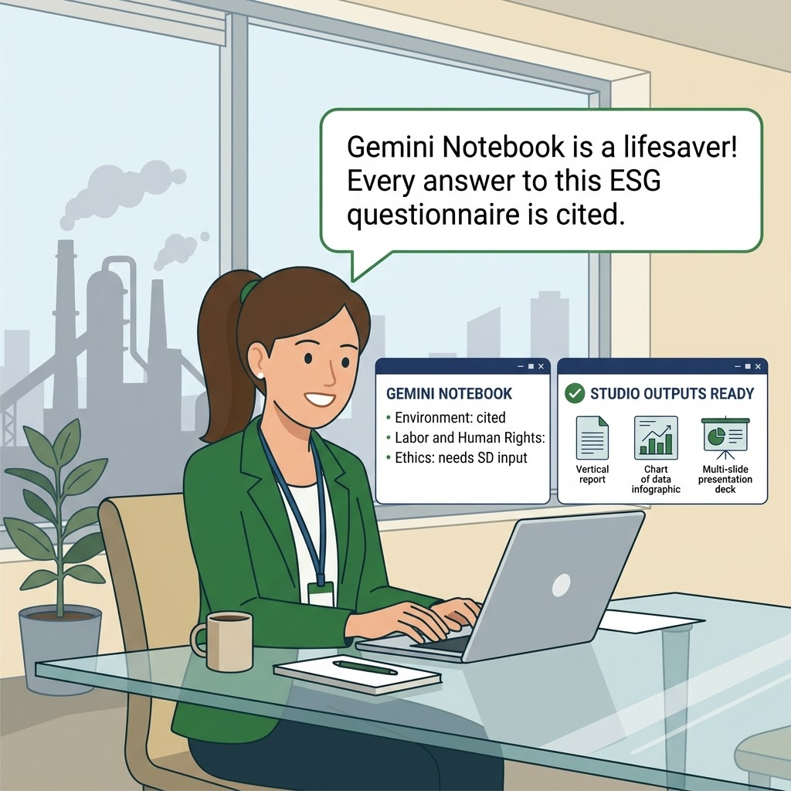
---
# Gemini Notebook Studio

- Save chat responses as notes, then convert notes into sources
- Narrow your sources to your own content before generating outputs
- Create polished assets
  - Reports
  - Infographics
  - Slide presentations
  - and more...

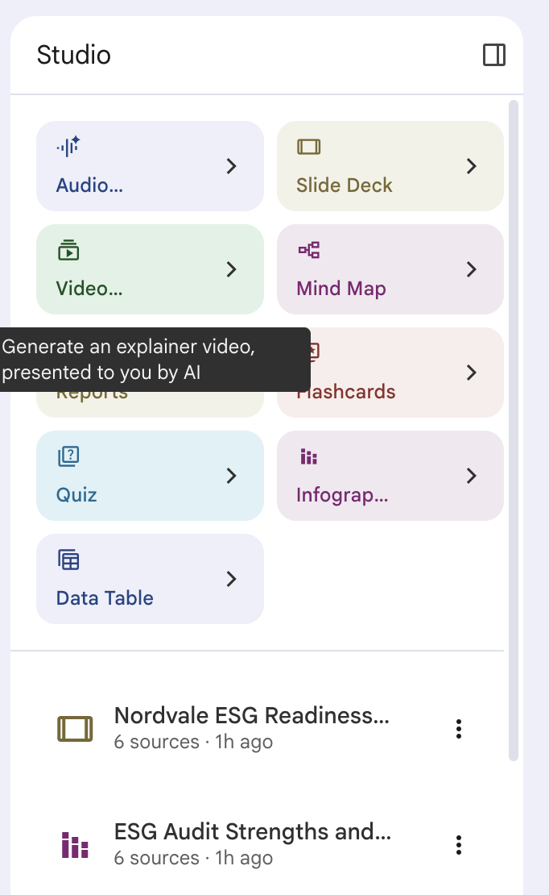
---
# Lab 4: Low-Carbon CEM and Geocycle Briefing with Gemini Notebook

**Time:** 30 minutes

[Open Lab 4](https://labv.roitraining.com/?lab=https%3A%2F%2Fgithub.com%2Froitraining%2Fholcim-department-ai-training-labs%2Fblob%2Fmain%2Flabs%2Foperational-excellence%2Flab-04-low-carbon-cem-geocycle-briefing-with-gemini-notebook%2Flab.md)
---
<!-- layout: navigation -->
# Today’s Sections

- Prompt Engineering
- Analyzing CEM and Geocycle Data in Sheets
- Build Reusable CEM and Geocycle Assistants
- Gemini Notebook
- **Holcim-Style Presentations in Slides**
---
# From Insights to a Leadership Deck

- Gemini in Google Slides can draft a multi-slide deck from a clear brief
- You stay the editor: Holcim structure, tone, and facts still need your review
- Best when you already have approved talking points from Sheets or Notebook
- Today you practice prompting for Holcim presentation style, not generic slide filler

---
<!-- layout: stacked -->
# Four Tools, One Toolkit

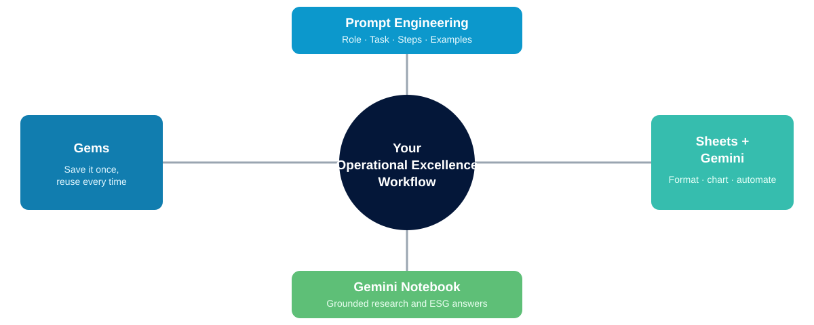
---
# Keep Data Safe

- Every exercise today used synthetic or anonymized data: carry that habit forward
- Do not paste confidential plant KPIs, unpublished clinker-factor targets, or real customer waste contracts into public AI tools
- When the ideal input is confidential, substitute a sanitized or synthetic version
- When in doubt, ask before you paste

> [!WARNING]
> Real Holcim plant data, unpublished CEM targets, and real Geocycle customer details do not belong in a public AI chat. Anonymize or use a synthetic sample.
---
# Lab 5: Creating Holcim-Style Presentations with Gemini in Slides

**Time:** 30 minutes

[Open Lab 5](https://labv.roitraining.com/?lab=https%3A%2F%2Fgithub.com%2Froitraining%2Fholcim-department-ai-training-labs%2Fblob%2Fmain%2Flabs%2Foperational-excellence%2Flab-05-holcim-style-presentations-with-gemini-in-slides%2Flab.md)
---
# What You Learned

- Engineered structured Gemini prompts using Role, Task, Steps, and Examples
- Used Gemini in Sheets to format, chart, and dashboard CEM and Geocycle performance data
- Packaged reusable prompts and grounded reference files into Gemini Gems
- Built a Gemini Notebook briefing pack for low-carbon CEM and Geocycle updates
- Generated a multi-slide Holcim-style presentation with Gemini in Google Slides
---
# Quiz 1 of 3

**Why is a Gemini Gem more useful than retyping your prompt every time for the Holcim Operational Excellence team?**

- A. It runs faster than a normal Gemini chat
- B. It saves the Persona, Task, Process, and Examples once, and can hold Knowledge files, so anyone on the team gets the same grounded quality without rebuilding the prompt
- C. It automatically emails the output to OE leadership
- D. It removes the need to review AI output before using it
---
# Quiz 1: Answer

**Why is a Gemini Gem more useful than retyping your prompt every time for the Holcim Operational Excellence team?**

**Correct: B.** It saves the Persona, Task, Process, and Examples once, and can hold Knowledge files, so anyone on the team gets the same grounded quality without rebuilding the prompt

- Gems store durable instructions, not just a one-off message
- The CEM Formulation Helper and Geocycle Inquiry Gems can hold Knowledge files, so answers stay grounded
- Teammates get consistent quality without knowing the underlying prompt craft
- You still preview and review output —a Gem does not remove that step
---
# Quiz 2 of 3

**Why does this course keep the Lab 2 `SiteData` file to just 100 rows and 12 columns instead of importing a full multi-year plant extract?**

- A. Google Sheets cannot import more than 100 rows
- B. Gemini in Sheets performs best on smaller, clean tables, well under Google’s guidance of about 1 million cells
- C. Apps Script cannot read more than 100 rows
- D. Clinker factor only calculates correctly below 100 rows
---
# Quiz 2: Answer

**Why does this course keep the Lab 2 `SiteData` file to just 100 rows and 12 columns instead of importing a full multi-year plant extract?**

**Correct: B.** Gemini in Sheets performs best on smaller, clean tables, well under Google’s guidance of about 1 million cells

- A 100-row, 12-column table is tiny compared to Google’s roughly 1 million cell guidance
- Keeping the working file small keeps Gemini prompts fast and reliable
- A larger extract would need a working-set strategy, the same idea taught elsewhere in this program
- Apps Script and formulas can still handle much larger ranges when needed
---
<!-- layout: 2-column -->
# Quiz 3 of 3: Discussion

### Prompt
You have one real Operational Excellence task you handle every week or month: a CEM product note, a clinker-factor dashboard, a Geocycle waste inquiry, or a leadership deck.

### Discuss
- Which tool from today fits that task best, and why?
- What data would you need to sanitize or synthesize first?
- Who else on the team would reuse it if you built it once?
---
<!-- layout: 2-column -->
# Quiz 3: Discussion Points

**Which tool fits your recurring OE task, and who else would reuse it?**

### Strong Answers Mention
- A specific, recurring task - not a vague “AI will help somewhere”
- A tool matched to the task’s shape (one-off vs. repeatable vs. data-heavy vs. research-heavy)
- A concrete plan to keep any real plant, customer, or formulation data safe

### Watch For
- Ambition without a named artifact or owner
- Confidential CEM or Geocycle data mentioned without a sanitization plan
- No teammate identified who would actually reuse the result
---
<!-- layout: stacked -->
# Questions and Answers

