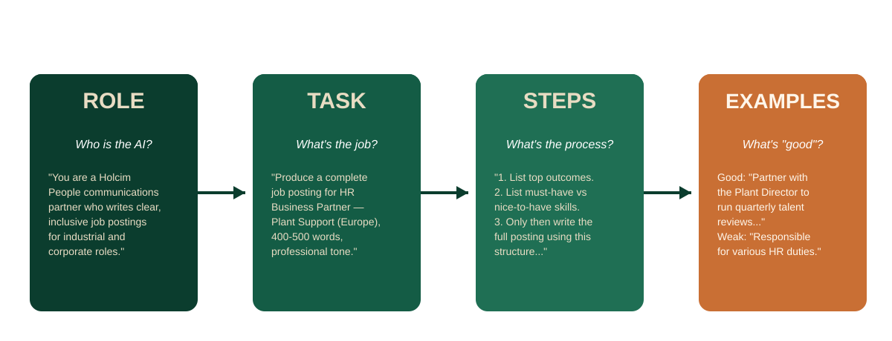
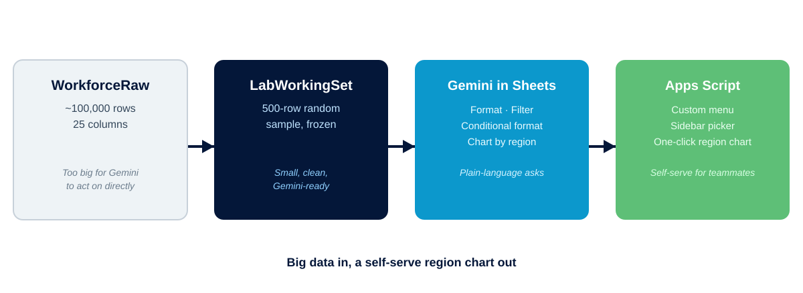
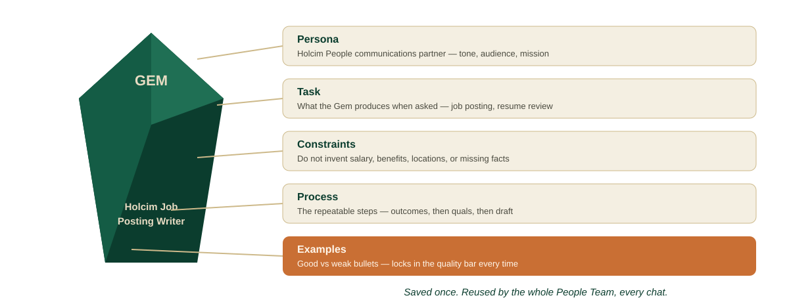
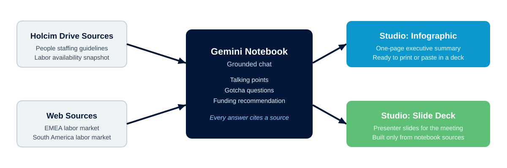
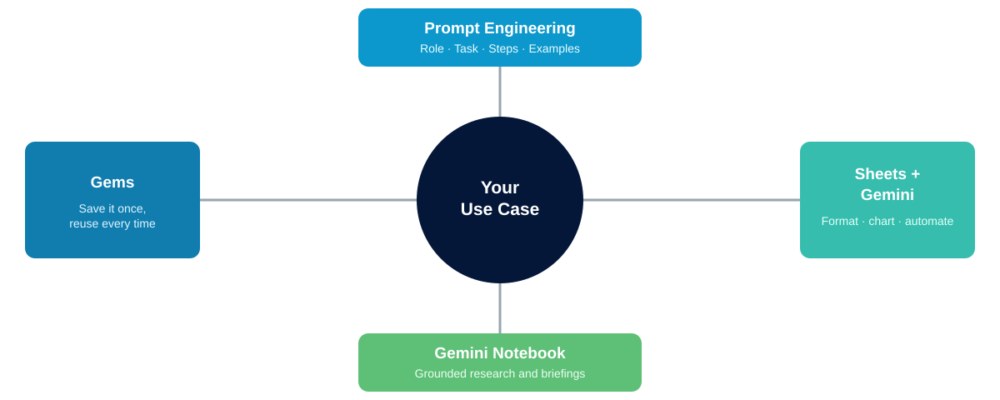

<!-- course-title: Holcim People: AI in Action -->

<!-- layout: title -->

Holcim People: AI in Action

# Chapter 1: Holcim People AI Labs

---

# Chapter 1: Objectives

- Engineer structured Gemini prompts using Role, Task, Steps, and Examples
- Use Gemini in Sheets to format, filter, and chart Holcim People data
- Package a reusable prompt into a Gemini Gem
- Build a Gemini Notebook briefing grounded in real and synthetic sources
- Apply these techniques to a Holcim People use case of your own

---

<!-- layout: stacked -->
# Five Skills, One Afternoon

- **Five short sections, each pairs a concept with a hands-on lab**
- Same Holcim People scenarios throughout: hiring, workforce data, meeting prep
- Every exercise uses synthetic or anonymized data — safe to explore
- By the end, you leave with techniques and artifacts you can reuse Monday

<!-- TODO IMAGE (Antigravity): Diverse Holcim People team collaborating around a laptop showing a friendly Gemini chat, mix of plant and office context.
Generate with an image-generation tool (e.g. Antigravity's built-in image generation, Gemini "Create image", or Nano Banana / Imagen) using this prompt:
"Photorealistic image of a diverse group of four professionals collaborating around a laptop in a bright, modern office, with a hint of an industrial cement-plant setting visible through a window in the background. One person points at a laptop screen showing a friendly, abstract chat interface. Clean corporate style, natural lighting, deep forest green and warm sand accent colors in clothing or decor, no visible logos, no readable UI text, no fake QR codes or URLs."
Style: clean corporate, deep forest green (#0b3d2e) and warm sand (#e8dcc3) accents, plenty of whitespace, landscape orientation, high resolution.
Save as: images/five-skills-hero.png (roughly 1600x900) and keep the Markdown reference below pointed at this path. -->

---

<!-- layout: navigation -->
# Chapter 1

- **Prompt Engineering**
- Analyzing Data in Sheets with Gemini
- Build Reusable Prompts
- Gemini Notebook
- Bring Your Own Use Case

---

# Why Prompting Is a Skill

- **A vague ask gets a vague answer** — "write a job posting" returns something generic and un-Holcim
- Prompting is a craft you build in layers, not one perfect sentence
- Each layer narrows what "good" means before the model writes anything
- The payoff: output a recruiter or hiring manager can actually use

---

<!-- layout: stacked -->
# The Role - Task - Steps - Examples Framework

- **Four layers turn a vague ask into a usable draft**
- Role sets the voice; Task sets the deliverable and constraints
- Steps force the model to reason before it writes
- Examples lock in what "good" looks like, bullet by bullet

---

<!-- layout: 2-column -->
# From Generic to Specific

### Generic prompt
- "Write a job posting for HR Business Partner"
- No audience, no region, no tone
- Reads like it could be any company
- You edit almost every line

### Structured prompt
- Role + Task + Steps + Examples, one chat
- Names the region, audience, word count
- Emphasizes safety, development, sustainability
- You edit a few lines, not the whole draft

---

# Lab 1: Prompt Engineering Mastery

**Time:** 30 minutes

---

<!-- layout: navigation -->
# Chapter 1

- Prompt Engineering
- **Analyzing Data in Sheets with Gemini**
- Build Reusable Prompts
- Gemini Notebook
- Bring Your Own Use Case

---

# AI Meets Your Spreadsheets

- **Ask Gemini in Sheets for what you want, in plain language** — no formulas required
- Format tables, add header filters, apply conditional formatting, insert charts
- Gemini proposes the change; you review and apply it
- Great for People analysts who know the data but not every Sheets function

---

# Big Data, Small Working Set

- Holcim's workforce extract runs about **100,000 rows** across 25 columns
- Gemini in Sheets performs best on smaller, clean tables
- The lab samples **500 rows** into a `LabWorkingSet` and freezes it with Paste Special
- `WorkforceRaw` stays untouched as the full source of record

> [!IMPORTANT]
> Never ask Gemini to reformat an entire 100,000-row sheet in one prompt. Work from the sampled set.

---

<!-- layout: stacked -->
# From Data to Decisions

- **One pipeline, four stages** — raw data to a self-serve chart
- A random working set keeps every Gemini prompt fast and reliable
- Gemini in Sheets handles the one-off formatting and charting
- Apps Script packages the repeatable part into a menu a teammate can click

---

# Lab 2: Analyzing Data with Sheets and Gemini

**Time:** 30 minutes

---

<!-- layout: navigation -->
# Chapter 1

- Prompt Engineering
- Analyzing Data in Sheets with Gemini
- **Build Reusable Prompts**
- Gemini Notebook
- Bring Your Own Use Case

---

# Stop Rewriting the Same Prompt

- **Great prompts don't survive the next new chat** — Role, Task, Steps, and Examples get retyped from memory
- Different teammates end up with different quality and different formats
- A resume screen should look the same whether you or a colleague ran it
- Gems save the instructions once, so everyone starts from the same standard

---

<!-- layout: stacked -->
# What's a Gem

- **A Gem is a saved Gemini assistant** — instructions live in the Gem, not in your head
- Built from the same five ingredients: Persona, Task, Constraints, Process, Examples
- Preview before you save; edit anytime the standard changes
- Anyone on the People team can open it and just ask

---

<!-- layout: 2-column -->
# Gems Your Team Can Reuse

### Holcim Job Posting Writer
- Persona: Holcim People comms partner
- Always covers safety, development, mission
- Outputs the same five-section structure every time

### Holcim Resume Reviewer
- Persona: Talent Acquisition specialist
- Fixed Markdown schema: role, region, rank, rationale
- Never invents a missing fact — writes "Not found"

---

# Lab 3: Creating Reusable Prompts with Gems

**Time:** 30 minutes

---

<!-- layout: navigation -->
# Chapter 1

- Prompt Engineering
- Analyzing Data in Sheets with Gemini
- Build Reusable Prompts
- **Gemini Notebook**
- Bring Your Own Use Case

---

# From Chat to Grounded Research

- **A regular chat can drift or invent details** — a Notebook cannot leave its sources
- You choose what goes in: internal guidelines, snapshots, and web research
- Every answer traces back to a source you selected
- Built for a briefing you have to defend in the room

---

<!-- layout: stacked -->
# Sources In, Insights Out

- **Three stages, one grounded narrative**
- Internal Drive sources plus targeted web research build the source set
- Chat turns sources into talking points and anticipated tough questions
- Studio turns saved notes into an infographic and a slide deck

---

# Ask Sharper Questions

- Ask for **talking points** structured the way you'll speak them: situation, context, risk, ask
- Ask for **gotcha questions** leadership might raise, with a source-grounded answer for each
- If sources don't fully answer a question, the Notebook says so — it does not invent data
- Save the strongest answers as notes; convert them into Studio sources

---

# Lab 4: Labor Market Briefings with Gemini Notebook

**Time:** 30 minutes

---

<!-- layout: navigation -->
# Chapter 1

- Prompt Engineering
- Analyzing Data in Sheets with Gemini
- Build Reusable Prompts
- Gemini Notebook
- **Bring Your Own Use Case**

---

# Make It Stick

- **Training sticks when it hits Monday morning work** — not a scripted scenario
- Pick one real People task: hiring, screening, workforce insight, or a briefing
- Apply at least two techniques from the last four sections
- Leave with something a colleague could actually review

<!-- TODO IMAGE (Antigravity): One Holcim People professional applying an AI-drafted artifact (job posting, chart, or briefing) to real work at their desk.
Generate with an image-generation tool (e.g. Antigravity's built-in image generation, Gemini "Create image", or Nano Banana / Imagen) using this prompt:
"Photorealistic image of one professional at a desk reviewing a printed or on-screen document, pen in hand, confident and focused expression, bright modern office, subtle branding cues in muted forest green and sand tones, no readable logos, no legible on-screen text, no fake QR codes or URLs."
Style: clean corporate, deep forest green (#0b3d2e) and warm sand (#e8dcc3) accents, natural light, roughly square crop for a side-by-side slide layout.
Save as: images/bring-it-to-work.png (roughly 1000x1000) and keep the Markdown reference below pointed at this path. -->

---

<!-- layout: stacked -->
# Four Tools, One Toolkit

- **You now have four ways to bring Gemini into People work**
- Structured prompting for any one-off request
- Sheets and Gemini for data you'd normally fight with formulas
- Gems for anything you do the same way, again and again
- Gemini Notebook for research you need to defend in a meeting

---

# Keep Data Safe

- Every exercise today used **synthetic or anonymized data** — carry that habit forward
- Do not paste confidential employee data, applicant PII, medical information, or performance ratings into public AI tools
- When the ideal input is confidential, substitute a sanitized or synthetic version
- When in doubt, ask before you paste

> [!WARNING]
> Real Holcim employee and applicant data does not belong in a public AI chat. Anonymize or use a synthetic sample.

---

# Lab 5: Bring Your Own Use Case

**Time:** 20 minutes

---

# What You Learned

- Engineered structured Gemini prompts using Role, Task, Steps, and Examples
- Used Gemini in Sheets to format, filter, and chart Holcim People data
- Packaged a reusable prompt into a Gemini Gem
- Built a Gemini Notebook briefing grounded in real and synthetic sources
- Applied these techniques to a Holcim People use case of your own

---

# Quiz 1 of 3

**Why is a Gemini Gem more useful than retyping your prompt every time for the Holcim People team?**

- A. It runs faster than a normal Gemini chat
- B. It saves the Role, Task, Steps, and Examples once so anyone on the team gets the same quality without rebuilding the prompt
- C. It automatically emails the output to HR leadership
- D. It removes the need to review AI output before using it

---

# Quiz 1 — Answer

**Why is a Gemini Gem more useful than retyping your prompt every time for the Holcim People team?**

**Correct: B.** It saves the Role, Task, Steps, and Examples once so anyone on the team gets the same quality without rebuilding the prompt

- Gems store durable instructions, not just a one-off message
- Teammates get consistent quality without knowing the underlying prompt craft
- You still preview and review output — a Gem does not remove that step
- Speed is a side effect, not the main reason to build one

---

# Quiz 2 of 3

**In Lab 2, why does the course have you build a 500-row `LabWorkingSet` instead of asking Gemini to act on the full ~100,000-row `WorkforceRaw` sheet?**

- A. `WorkforceRaw` is read-only
- B. Gemini in Sheets performs best on smaller, clean tables, well under Google's guidance of about 1 million cells
- C. Apps Script cannot read more than 500 rows
- D. FTE totals only calculate correctly below 500 rows

---

# Quiz 2 — Answer

**In Lab 2, why does the course have you build a 500-row `LabWorkingSet` instead of asking Gemini to act on the full ~100,000-row `WorkforceRaw` sheet?**

**Correct: B.** Gemini in Sheets performs best on smaller, clean tables, well under Google's guidance of about 1 million cells

- A 100,000-row, 25-column sheet is well over 2 million cells
- Sampling and freezing the set keeps Gemini prompts fast and reliable
- `WorkforceRaw` still exists as the full source of record
- Apps Script and formulas can still reach the full sheet when needed

---

<!-- layout: 2-column -->
# Quiz 3 of 3 — Discussion

### Prompt
You have one real People task you handle every week or month — hiring, screening, a workforce report, or a leadership briefing.

### Discuss
- Which tool from today fits that task best, and why?
- What data would you need to sanitize or synthesize first?
- Who else on the team would reuse it if you built it once?

---

<!-- layout: 2-column -->
# Quiz 3 — Discussion Points

**Which tool fits your recurring People task, and who else would reuse it?**

### Strong Answers Mention
- A specific, recurring task — not a vague "AI will help somewhere"
- A tool matched to the task's shape (one-off vs. repeatable vs. data-heavy vs. research-heavy)
- A concrete plan to keep any real employee or applicant data safe

### Watch For
- Ambition without a named artifact or owner
- Confidential data mentioned without a sanitization plan
- No teammate identified who would actually reuse the result

---

<!-- layout: stacked -->
# Questions and Answers

