<!-- course-title: AI for the Holcim Sustainability Team -->

<!-- layout: title -->
<!-- 

# AI for the Holcim Sustainability Team

## Practical Skills for Everyday Sustainability Work

--- -->

<!-- layout: full-bleed -->
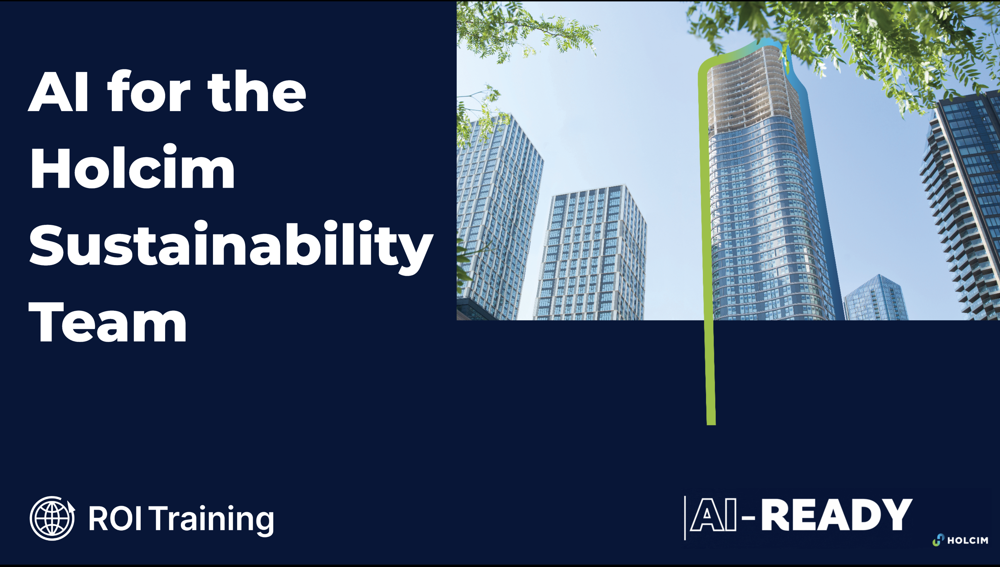

---

# Welcome!

- ROI leads the industry in designing and delivering customized technology and management training solutions
- Meet your instructor
  - Name
  - Background
  - Contact info
- Let's get started!

---

# Course Objectives

- Apply Gemini across everyday Holcim Sustainability workflows: prompting, spreadsheets, reusable assistants, and grounded research
- Engineer structured prompts that produce Holcim-ready ECOPact content, CSRD-aligned plant data checks, and promotional infographics
- Use Gemini in Sheets to format, filter, and chart Sustainability plant data
- Package reusable prompts and grounded reference files into Gemini Gems for repeatable Sustainability workflows
- Build a Gemini Notebook ESG Questionnaire Hub for grounded, citable customer responses
- Build a working Apps Script showcase using Gemini as a coding partner

---

# Agenda

- Prompt Engineering
- Analyzing Plant Data with Sheets and Gemini
- Build Reusable Sustainability Assistants
- Gemini Notebook
- Apps Script Showcase Challenge

---

# Who Should Attend

- Holcim Sustainability and Sustainable Development (SD) business partners
- ESG reporting, CSRD, and year-end disclosure specialists
- Plant sustainability leads and commercial teams supporting customer ESG requests
- Sustainability leaders who want practical, everyday Gemini skills

---

# Prerequisites

- A Google account with access to Gemini, Sheets, and Gemini Notebook (NotebookLM)
- Basic familiarity with Google Sheets and Google Drive
- No prior AI or scripting experience required

---

<!-- layout: stacked -->
# Five Skills, One Afternoon

- Five short sections, each pairs a concept with a hands-on lab
- Same Holcim Sustainability scenarios throughout: ECOPact content, plant data, year-end reporting, customer ESG questionnaires
- Every exercise uses synthetic or anonymized data: safe to explore
- By the end, you leave with techniques and artifacts you can reuse Monday

---

<!-- layout: navigation -->
# Today's Sections

- **Prompt Engineering**
- Analyzing Plant Data with Sheets and Gemini
- Build Reusable Sustainability Assistants
- Gemini Notebook
- Apps Script Showcase Challenge

---

# Why Prompting Is a Skill

- A vague ask gets a vague answer: "write something about ECOPact" returns something generic and un-Holcim
- Prompting is a craft you build in layers, not one perfect sentence
- Each layer narrows what "good" means before the model writes anything
- The payoff: output a Sustainability partner or customer-facing colleague can actually use

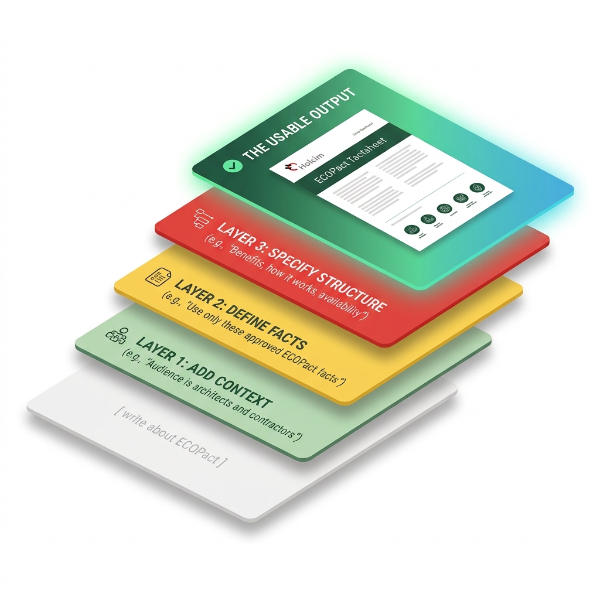

---
<!-- layout: stacked -->
# The "Role-Task-Steps-Examples" Framework

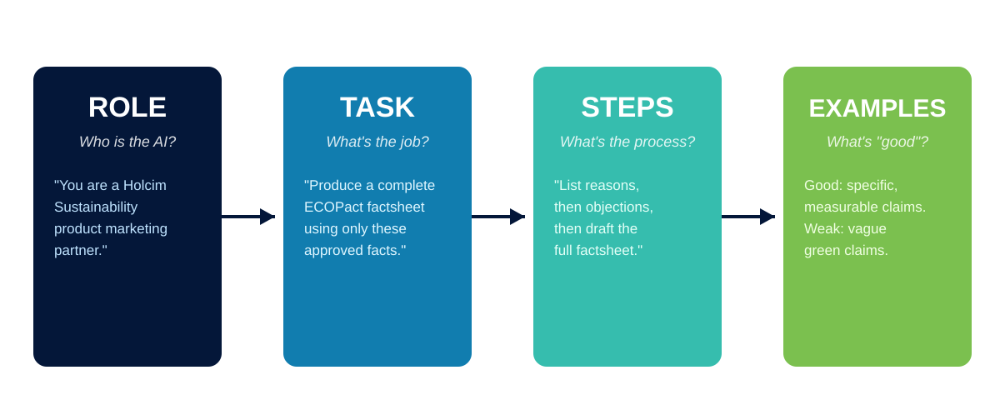

---

<!-- layout: 2-column -->
# From Generic to Specific

### Generic prompt
- "Write something about ECOPact"
- No audience, no approved facts, no format
- Reads like generic marketing copy
- You edit almost every line

### Structured prompt
- Role + Task + Steps + Examples, one chat
- Names the audience, the approved facts, the word count
- Locks out invented statistics
- You edit a few lines, not the whole draft

---

# Lab 1: Prompt Engineering Mastery

**Time:** 30 minutes

[Open Lab 1](https://labv.roitraining.com/?lab=https%3A%2F%2Fgithub.com%2Froitraining%2Fholcim-department-ai-training-labs%2Fblob%2Fmain%2Flabs%2Fsustainability%2Flab-01-prompt-engineering-mastery%2Flab.md)

---

<!-- layout: navigation -->
# Today's Sections

- Prompt Engineering
- **Analyzing Plant Data with Sheets and Gemini**
- Build Reusable Sustainability Assistants
- Gemini Notebook
- Apps Script Showcase Challenge

---

# AI Meets Your Spreadsheets

- Ask Gemini in Sheets for what you want, in plain language: no formulas required
- Format tables, add header filters, apply conditional formatting, insert charts
- Gemini proposes the change; you review and apply it
- Great for Sustainability analysts who know the data but not every Sheets function

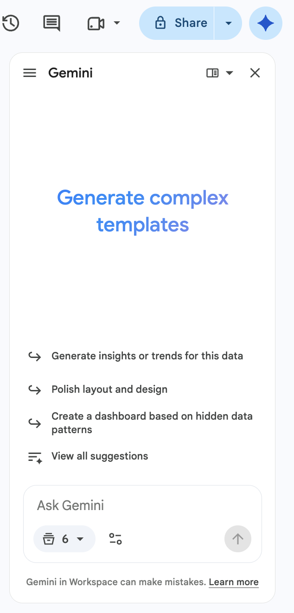

---

# Right-Sized Data, Real Plant KPIs

- This lab's plant extract is **100 rows and 12 columns**: 25 plants across 4 quarters of FY2025
- Gemini in Sheets performs best on smaller, clean tables
- No sampling step this time: `PlantData` is already Gemini-ready on import
- A larger extract would need the same working-set strategy used elsewhere in this program

> [!NOTE]
> Integrated Plants run a kiln and report a Thermal Substitution Rate. Grinding Stations do not, and report far lower direct CO2 — that's why the KPIs vary so much row to row.

---

<!-- layout: stacked -->
# From Data to Decisions

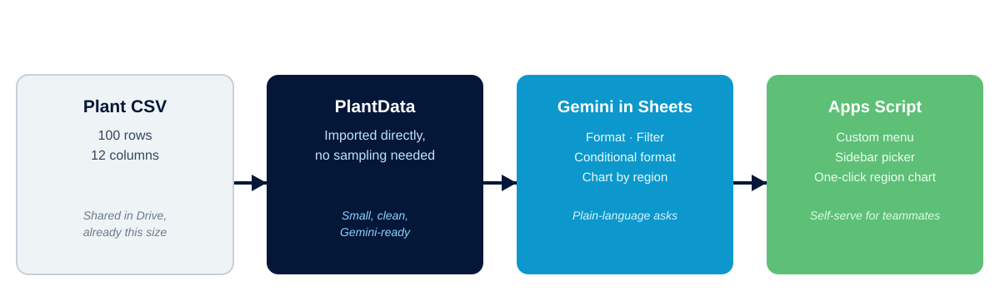

---

# Lab 2: Analyzing Plant Data with Sheets and Gemini

**Time:** 30 minutes

[Open Lab 2](https://labv.roitraining.com/?lab=https%3A%2F%2Fgithub.com%2Froitraining%2Fholcim-department-ai-training-labs%2Fblob%2Fmain%2Flabs%2Fsustainability%2Flab-02-analyzing-plant-data-with-sheets-and-gemini%2Flab.md)

---

<!-- layout: navigation -->
# Today's Sections

- Prompt Engineering
- Analyzing Plant Data with Sheets and Gemini
- **Build Reusable Sustainability Assistants**
- Gemini Notebook
- Apps Script Showcase Challenge

---

# Stop Rewriting the Same Prompt

- Great prompts don't survive the next new chat: Persona, Task, Process, and Examples get retyped from memory
- Different teammates end up with different quality, and different citations
- A year-end clarification answer should look the same, and cite the same source, whether you or a colleague ran it
- Gems save the instructions, and the reference files, once, so everyone starts from the same standard

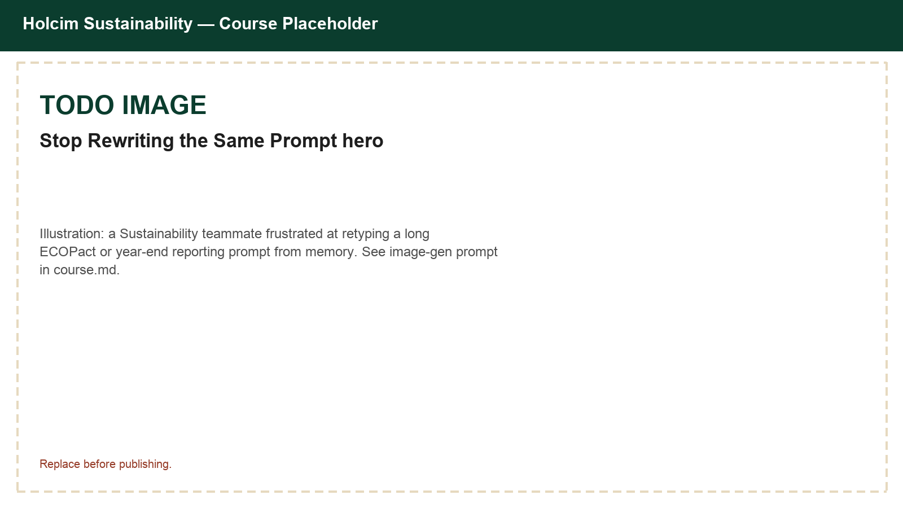

---

<!-- layout: stacked -->
# What's a Gem

- A Gem is a saved Gemini assistant: instructions live in the Gem, not in your head
- A Gem can also hold Knowledge files, so it answers grounded in your own documents
- Preview before you save; edit anytime the standard changes

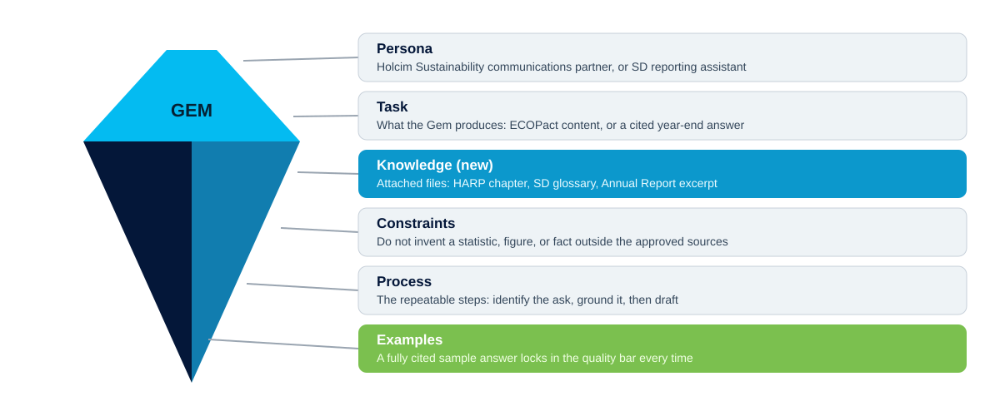

---

<!-- layout: 2-column -->
# Gems Your Team Can Reuse

### Holcim Sustainability Content Assistant
- Persona: Sustainability communications partner
- Always grounded in the approved ECOPact fact list
- Matches whatever format and length you ask for

### Holcim Year-End Reporting Assistant
- Persona: SD reporting assistant
- Knowledge: HARP chapter, SD glossary, Annual Report excerpt, ESG Response Pack
- Every answer cites its source, or says "Not found in the provided materials"

---

# Lab 3: Creating Reusable Sustainability Assistants with Gems

**Time:** 30 minutes

[Open Lab 3](https://labv.roitraining.com/?lab=https%3A%2F%2Fgithub.com%2Froitraining%2Fholcim-department-ai-training-labs%2Fblob%2Fmain%2Flabs%2Fsustainability%2Flab-03-creating-reusable-prompts-with-gems%2Flab.md)

---

<!-- layout: navigation -->
# Today's Sections

- Prompt Engineering
- Analyzing Plant Data with Sheets and Gemini
- Build Reusable Sustainability Assistants
- **Gemini Notebook**
- Apps Script Showcase Challenge

---

# Gemini Notebook

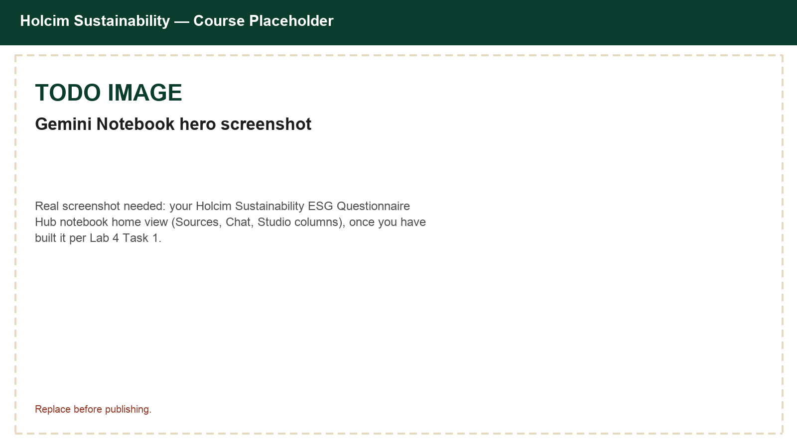

---

# From Chat to Grounded Research

- A regular chat can drift or invent details - a Notebook cannot leave its sources
- You choose what goes in: internal HARP and SD sources, the customer's own questionnaire, and web research
- Every answer traces back to a source you selected
- Built for a questionnaire response you have to stand behind

---

<!-- layout: stacked -->
# Sources In, Insights Out

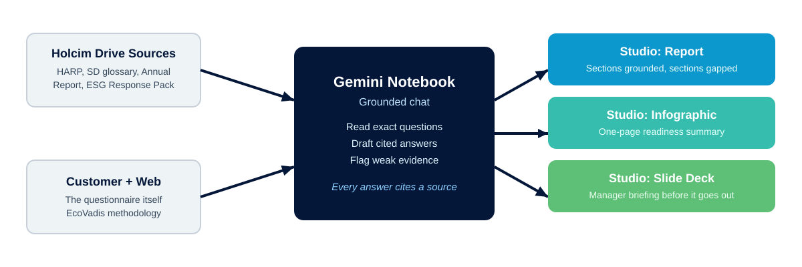

---

# Ask Sharper Questions

- Ask Notebook to read the exact questions from the customer's questionnaire, grouped by section
- Ask for a cited answer to each question, and flag anything not grounded in a source
- If sources don't fully answer a question, the Notebook says so: it does not invent a figure
- Save the strongest answers as notes; convert them into Studio sources

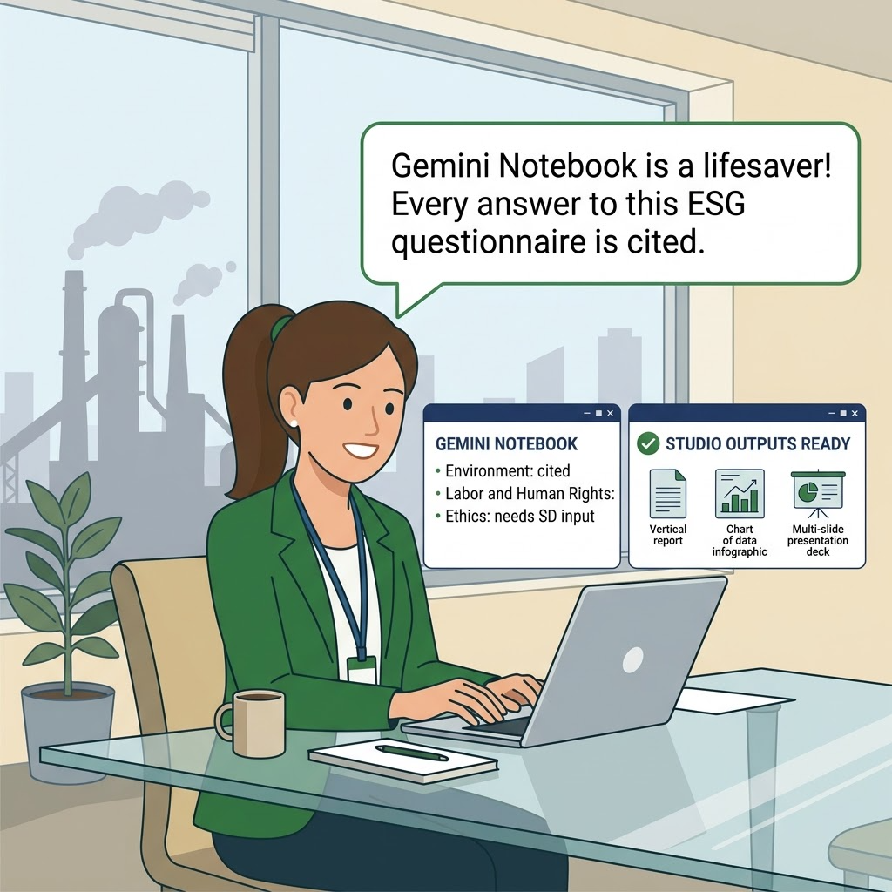

---

# Gemini Notebook Studio

- Save chat responses as notes, then convert notes into sources
- Narrow your sources to your own content before generating outputs
- Create polished assets
  - Reports
  - Infographics
  - Slide presentations
  - and more...

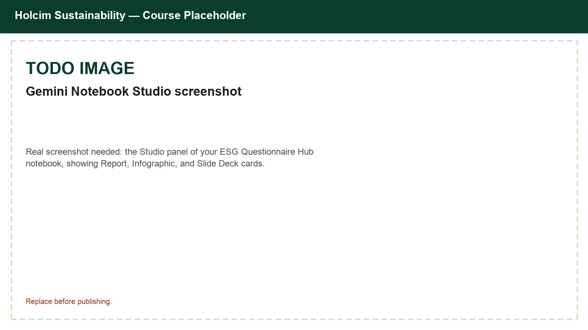

---

# Lab 4: ESG Questionnaire Hub with Gemini Notebook

**Time:** 30 minutes

[Open Lab 4](https://labv.roitraining.com/?lab=https%3A%2F%2Fgithub.com%2Froitraining%2Fholcim-department-ai-training-labs%2Fblob%2Fmain%2Flabs%2Fsustainability%2Flab-04-esg-questionnaire-hub-with-gemini-notebook%2Flab.md)

---

<!-- layout: navigation -->
# Today's Sections

- Prompt Engineering
- Analyzing Plant Data with Sheets and Gemini
- Build Reusable Sustainability Assistants
- Gemini Notebook
- **Apps Script Showcase Challenge**

---

# A Real SD Team Challenge

- Holcim's SD team uses a mobile dashboard, the "SD Performance APP," to rank countries by their impact on a Group metric
- The whole view is generated with Apps Script, no manual sorting
- This is the same 1-hour showcase the SD team uses to teach that skill
- You explore a live spreadsheet, read the brief written into it, and build your own version

---

<!-- layout: stacked -->
# Four Tools, One Toolkit

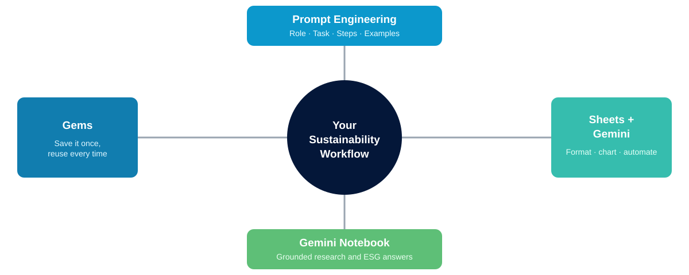

---

# Keep Data Safe

- Every exercise today used synthetic or anonymized data: carry that habit forward
- Do not paste confidential plant emissions, unpublished figures, or a real customer's ESG questionnaire into public AI tools
- When the ideal input is confidential, substitute a sanitized or synthetic version
- When in doubt, ask before you paste

> [!WARNING]
> Real Holcim plant data, unpublished disclosures, and real customer questionnaires do not belong in a public AI chat. Anonymize or use a synthetic sample.

---

# Lab 5: Apps Script Showcase Challenge

**Time:** 30 minutes

[Open Lab 5](https://labv.roitraining.com/?lab=https%3A%2F%2Fgithub.com%2Froitraining%2Fholcim-department-ai-training-labs%2Fblob%2Fmain%2Flabs%2Fsustainability%2Flab-05-apps-script-showcase-challenge%2Flab.md)

---

# What You Learned

- Engineered structured Gemini prompts using Role, Task, Steps, and Examples
- Used Gemini in Sheets to format, filter, and chart Holcim Sustainability plant data
- Packaged reusable prompts and grounded reference files into Gemini Gems
- Built a Gemini Notebook ESG Questionnaire Hub grounded in Holcim sources and web research
- Built a working Apps Script showcase using Gemini as a coding partner

---

# Quiz 1 of 3

**Why is a Gemini Gem more useful than retyping your prompt every time for the Holcim Sustainability team?**

- A. It runs faster than a normal Gemini chat
- B. It saves the Persona, Task, Process, and Examples once, and can hold Knowledge files, so anyone on the team gets the same grounded quality without rebuilding the prompt
- C. It automatically emails the output to Sustainability leadership
- D. It removes the need to review AI output before using it

---

# Quiz 1 - Answer

**Why is a Gemini Gem more useful than retyping your prompt every time for the Holcim Sustainability team?**

**Correct: B.** It saves the Persona, Task, Process, and Examples once, and can hold Knowledge files, so anyone on the team gets the same grounded quality without rebuilding the prompt

- Gems store durable instructions, not just a one-off message
- The Year-End Reporting Assistant Gem also holds Knowledge files, so it answers grounded in HARP, the SD glossary, and the Annual Report every time
- Teammates get consistent quality without knowing the underlying prompt craft
- You still preview and review output - a Gem does not remove that step

---

# Quiz 2 of 3

**Why does this course keep the Lab 2 `PlantData` file to just 100 rows and 12 columns instead of importing a full multi-year plant extract?**

- A. Google Sheets cannot import more than 100 rows
- B. Gemini in Sheets performs best on smaller, clean tables, well under Google's guidance of about 1 million cells
- C. Apps Script cannot read more than 100 rows
- D. Specific Net CO2 only calculates correctly below 100 rows

---

# Quiz 2 - Answer

**Why does this course keep the Lab 2 `PlantData` file to just 100 rows and 12 columns instead of importing a full multi-year plant extract?**

**Correct: B.** Gemini in Sheets performs best on smaller, clean tables, well under Google's guidance of about 1 million cells

- A 100-row, 12-column table is tiny compared to Google's roughly 1 million cell guidance
- Keeping the working file small keeps Gemini prompts fast and reliable
- A larger plant extract would need a working-set strategy, the same idea taught elsewhere in this program
- Apps Script and formulas can still handle much larger ranges when needed

---

<!-- layout: 2-column -->
# Quiz 3 of 3 - Discussion

### Prompt
You have one real Sustainability task you handle every week or month: ECOPact content, a plant data check, a year-end clarification question, or a customer ESG questionnaire.

### Discuss
- Which tool from today fits that task best, and why?
- What data would you need to sanitize or synthesize first?
- Who else on the team would reuse it if you built it once?

---

<!-- layout: 2-column -->
# Quiz 3 - Discussion Points

**Which tool fits your recurring Sustainability task, and who else would reuse it?**

### Strong Answers Mention
- A specific, recurring task - not a vague "AI will help somewhere"
- A tool matched to the task's shape (one-off vs. repeatable vs. data-heavy vs. research-heavy)
- A concrete plan to keep any real plant, customer, or reporting data safe

### Watch For
- Ambition without a named artifact or owner
- Confidential customer or emissions data mentioned without a sanitization plan
- No teammate identified who would actually reuse the result

---

<!-- layout: stacked -->
# Questions and Answers

