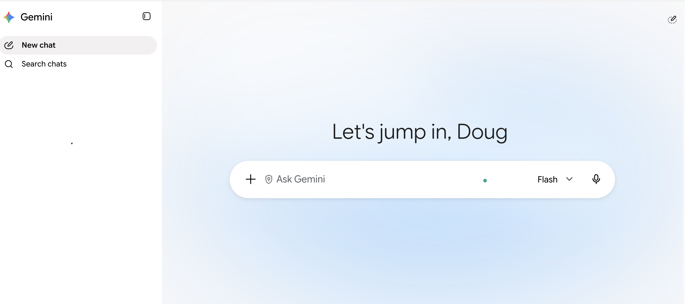

# Prompt Engineering Mastery with Gemini for Holcim Operational Excellence

## Time Required

30 minutes

## Overview

In this lab, you will practice structured prompt engineering in Gemini. Using Holcim Operational Excellence scenarios for **CEM** (cement formulations under EN 197-1) and **Geocycle** (alternative fuels and waste co-processing), you progressively improve prompts for a product brief, a waste-acceptance summary, and an OE infographic so outputs become more accurate, consistent, and useful.

### You learn how to:

- Build an ECOPlanet / blended CEM product brief prompt step by step with role, task, steps, and examples.
- Design a multi-turn prompt that drafts a Geocycle waste-stream acceptance summary from synthetic intake facts and returns structured Markdown.
- Improve Gemini image prompts with the Holcim logo, style detail, and meta-prompting to create a clinker-factor versus AF infographic.

## Scenario


You support Holcim Operational Excellence for CEM and Geocycle. Product marketing needs a clear ECOPlanet / low-clinker cement note, Geocycle needs a first-pass waste-acceptance summary a plant coordinator can scan, and OE leadership wants a simple infographic that shows how **clinker factor** and **thermal substitution** move together. Gemini can help, but only if your prompts are structured. You will treat prompting as a craft: start simple, then add role context, process steps, examples, and feedback loops until the output matches what OE colleagues can use.

## Lab Instructions

### Task 1: Open Gemini and craft a progressive ECOPlanet CEM product brief

In this task, you open the Gemini app and improve a CEM product brief prompt in four stages: simple request, then Role, Task, Steps, and Examples.

1. Open [https://gemini.google.com/](https://gemini.google.com/) in Chrome (or your preferred browser) and sign in with your Google account.

2. Start a **new chat** so this exercise has a clean history.


3. Paste this **simple** prompt and send it:

```text
Write a product brief for ECOPlanet cement.
```

4. Skim the result. Note what is generic, invented, or not Holcim-specific (made-up percentages, no CEM type language, no sense of clinker factor).

5. In the **same chat**, send this improved prompt that adds a **Role**:

```text
You are a Holcim Operational Excellence CEM partner who writes clear, accurate product notes about low-carbon cement formulations. You never invent performance statistics; you only use figures the user gives you or figures you already know are accurate and publicly disclosed by Holcim.

Rewrite the ECOPlanet brief so it sounds like Holcim: confident, factual, and practical for commercial teams and plant OE partners.
```

6. Next, add a clear **Task** and constraints, including the approved facts Gemini should use. Send:

```text
Task: Produce a complete product brief for "ECOPlanet", Holcim's low-carbon cement positioning used in this training course.

Constraints:
- Audience: Holcim commercial teams and Operational Excellence partners
- Length: about 300-400 words
- Tone: confident, factual, plain language
- Use only these approved training facts (do not add other statistics):
  - ECOPlanet covers lower-carbon cement options that reduce clinker intensity versus traditional CEM I formulations where standards and markets allow
  - Formulation levers include CEM II-V blends and supplementary cementitious materials (SCMs) such as slag, fly ash, or calcined clay
  - Lower clinker factor is a core Operational Excellence lever alongside Geocycle alternative-fuel substitution in the kiln
  - Product performance (strength class and durability requirements) must still be met for the intended application
  - Part of Holcim's mission: building progress for people and the planet
- Do not invent pricing, market share, or country-by-country availability lists
```

7. Add **Steps** so Gemini follows a repeatable process. Send:

```text
Follow these steps before you write the final brief:
1. List the top 4 reasons an OE partner would position ECOPlanet / blended CEM over a default CEM I offer.
2. List the 3 most likely objections a performance-focused specifier would raise, with a one-line rebuttal for each.
3. Only then write the full brief using this structure:
   - What ECOPlanet means in CEM terms (2-3 sentences)
   - Key formulation levers (clinker factor, SCMs, CEM II-V)
   - How it connects to Geocycle AF (one short paragraph; no invented AF rates)
   - Call to action for an internal OE follow-up
Show the intermediate lists briefly, then the final brief.
```

8. Finish the progression with **Examples**. Send:

```text
Use this style example for benefit-bullet quality (do not copy the content):

Good bullet: "Shifts product mix toward CEM II-V blends so less clinker is needed for the same performance class."
Weak bullet: "It's a greener cement option."

Now regenerate only the key benefits as 5 strong bullets in that style.
```

<!-- TODO IMAGE: Screenshot of Gemini chat showing the multi-turn ECOPlanet CEM brief progression -->


> [!IMPORTANT]
> Keep this as **one multi-turn chat**. The value is watching quality improve as you add Role, Task, Steps, and Examples - not starting over each time.

### Task 2: Draft a Geocycle waste-stream acceptance summary

In this task, you paste synthetic intake facts into Gemini and build a screening prompt that returns consistent Markdown a Geocycle coordinator can scan quickly.

> [!WARNING]
> The waste-stream data below is **synthetic training data**. Do not treat customer names, tonnes, or acceptance decisions as real Holcim or Geocycle records, and do not add real confidential customer data during this lab.

1. Start a **new Gemini chat** for this exercise.

2. Copy the synthetic intake table below, along with the simple prompt underneath it, into the chat and send them together:

```text
Stream ID | Customer (synthetic) | Waste type | Form | Est. tonnes / month | Contaminants flagged | Characterization available | Requested start
GC-EU-101 | Nordvale Materials | Spent solvents | Liquid | 40 | Chlorine check needed | Partial lab pack | 2026-11
GC-EU-118 | RhinePack GmbH | RDF fluff | Solid | 220 | None listed | Full | 2026-10
GC-LATAM-044 | CostaVerde Industrias | Waste oils | Liquid | 15 | Heavy metals unknown | None | 2026-12
GC-AMEA-009 | Atlas Foundry Co. | Foundry sands | Solid | 90 | None listed | Full | 2026-10
GC-NA-033 | Lakeshore Chemicals | Mixed organics | Sludge | 55 | High moisture | Partial | 2026-11

Here are five Geocycle intake requests. Which ones are ready for a trial discussion?
```

3. Read the answer. It is a reasonable start, but not consistent enough to compare streams side by side.

4. Add a **Role** and **Task** upgrade in the same chat:

```text
You are a Holcim Geocycle intake coordinator supporting Operational Excellence. You prepare first-pass readiness summaries for alternative-fuel and alternative-raw-material streams.

Task: Review each stream in the table above and return ONLY valid Markdown. No preamble.
```

5. Add the required **output schema** and rating rules. Send:

```text
For each stream, output a Markdown block in exactly this shape:

## Stream: <Stream ID> (<Customer>, <Waste type>)
- **Characterization status:** <one line>
- **Contaminant risk:** <one line>
- **Readiness rating:** <Ready for trial talk | Needs data | Hold>
- **Recommended next action:** <one short sentence>

Rules:
- Readiness rating definitions:
  - Ready for trial talk: Full characterization available AND Contaminants flagged is "None listed"
  - Needs data: Partial characterization AND no open chlorine or heavy-metals unknown
  - Hold: No characterization, OR Contaminants flagged mentions chlorine check needed, heavy metals unknown, or any other open contaminant unknown that blocks a trial discussion
- Do not invent permit numbers, pricing, or acceptance guarantees
- Do not change any tonne figures
```

6. Add **Steps** and an **example** so Gemini stays consistent. Send:

```text
Process each stream with these steps:
1. Read Characterization available (Full, Partial lab pack, or None).
2. Read Contaminants flagged exactly as written.
3. Assign Readiness rating using the definitions above.
4. Write one next action that asks for missing data when needed.

Example of good formatting:

## Stream: GC-EU-118 (RhinePack GmbH, RDF fluff)
- **Characterization status:** Full characterization available
- **Contaminant risk:** None listed
- **Readiness rating:** Ready for trial talk
- **Recommended next action:** Schedule a trial discussion with the plant AF lead for the October window.

Re-run the review for all five streams using this format only.
```

7. Skim the five blocks and confirm:

   - RhinePack and Atlas Foundry are **Ready for trial talk**
   - Lakeshore is **Needs data** (Partial, moisture only)
   - Nordvale and CostaVerde are **Hold** (open chlorine or heavy-metals unknowns, or no characterization)

<!-- TODO IMAGE: Screenshot of structured Geocycle acceptance Markdown output -->


> [!NOTE]
> If Gemini summarizes instead of using your schema, reply: `Reformat using the exact Markdown schema. Do not add extra sections.`

### Task 3: Create a clinker-factor versus AF infographic with Gemini image tools

In this task, you use Gemini's image generation to create an OE infographic that shows CEM clinker-factor reduction and Geocycle thermal substitution as two related levers. You start simple, then add the Holcim logo, approved content, style direction, and a meta-prompt to refine the image prompt itself.

1. In Gemini, start a **new chat**. Then select the **create image** tool from the tools menu.

2. Send a **simple** image request:

```text
Create an infographic about Holcim Operational Excellence for CEM and Geocycle.
```

> [!NOTE]
> It will create something, and it might look good. However, it likely invents its own statistics and layout. Let's be more specific.

3. Create a new chat, and select the create image tool again.

4. Copy the Holcim logo below to the clipboard, and paste it in the prompt box.


5. Send a stronger prompt that references the logo and locks the content:

```text
Create a vertical promotional infographic image for Holcim Operational Excellence.

Brand:
- Place the attached Holcim logo clearly near the top
- Keep logo proportions intact; do not distort or recolor the logo mark incorrectly

Content to include as readable text on the infographic:
- Title: Two levers, one low-carbon agenda
- Left column header: CEM
- Left column lines: Lower clinker factor; CEM II-V blends and SCMs
- Right column header: Geocycle
- Right column lines: Higher safe thermal substitution; alternative fuels
- Footer: Synthetic training visual - not real plant KPIs

Visual direction:
- Clean corporate design suitable for a global building materials company
- Plenty of whitespace; avoid clutter
- Suggest industrial cement and waste-to-fuel themes without unsafe worksite imagery
- No invented percentages, fake charts, fake QR codes, or extra logos
```

<!-- TODO IMAGE: Screenshot of first structured OE infographic with logo -->


6. Add **style details** in a follow-up to refine (or regenerate) the infographic:

```text
Regenerate the infographic with these style constraints:
- Color palette: Holcim red, charcoal gray, white, and warm sand accents (not neon)
- Typography: bold modern sans-serif for the title; simple sans-serif for body text
- Layout: logo top, title under logo, two equal columns for CEM and Geocycle, footer at bottom
- Aspect: portrait infographic (roughly A4 / letter proportions)
- Keep all infographic text exactly as specified; prioritize correct spelling
```

7. Practice **meta-prompting for image generation**. Ask Gemini to improve the prompt before making the next image:

```text
You are an expert prompt engineer for image generation.

Meta-task:
1. Critique my previous infographic prompt for ambiguity, missing art direction, and text-rendering risks.
2. Write an improved single image prompt (under 180 words) that is more specific about composition, lighting, layout language, and negative constraints.
```

8. Copy the improved prompt to the clipboard, create a new chat, re-select the create image tool, paste the Holcim logo again, and run the improved prompt.

<!-- TODO IMAGE: Screenshot of the final OE CEM vs Geocycle infographic after meta-prompt -->


> [!TIP]
> If text on the image is misspelled, ask Gemini to regenerate with: `Keep all infographic text exactly as specified; prioritize correct spelling of CEM, Geocycle, and Holcim.`

### Bonus Task 4: Meta-prompt a reusable OE prompt template

1. In a **new chat**, ask Gemini:

```text
Turn the Role-Task-Steps-Examples pattern we used for the ECOPlanet CEM brief into a reusable blank template for Holcim Operational Excellence prompts about CEM formulations or Geocycle intake. Leave placeholders in ALL CAPS.
```

2. Save the template somewhere you can reuse after class.

## Congratulations!

In this lab, you have:

- Built an ECOPlanet / blended CEM product brief prompt step by step with role, task, steps, and examples.
- Designed a multi-turn prompt that drafted a Geocycle waste-stream acceptance summary from synthetic intake facts and returned structured Markdown.
- Improved Gemini image prompts with the Holcim logo, style detail, and meta-prompting to create a clinker-factor versus AF infographic.
