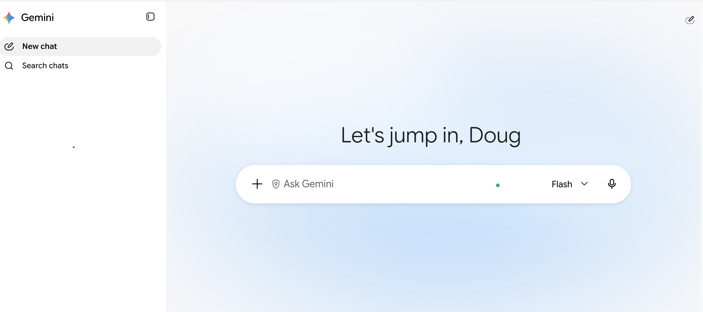
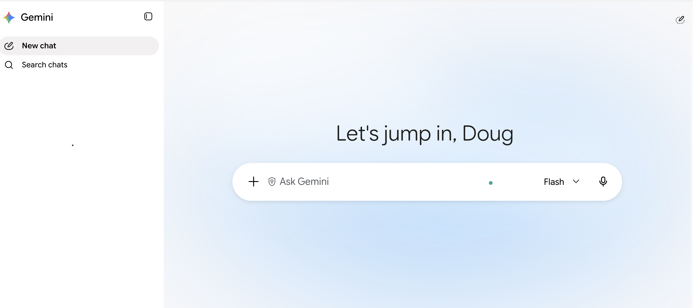
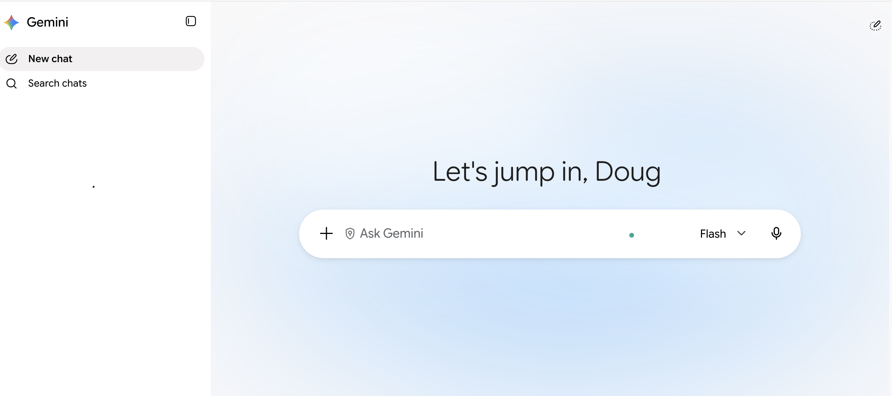
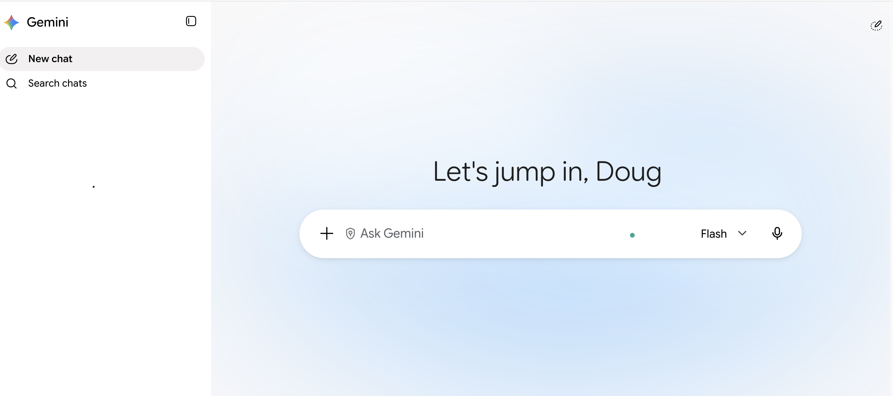

# Prompt Engineering Mastery with Gemini for Holcim Operational Excellence

## Time Required

30 minutes

## Overview

In this lab, you will practice structured prompt engineering in Gemini. Using Holcim Operational Excellence scenarios for **CEM** (cement formulations under EN 197-1) and **Geocycle** (alternative fuels and waste co-processing), you progressively improve prompts for a product brief, a waste-acceptance summary, and an OE infographic so outputs become more accurate, consistent, and useful.

### You learn how to:

- Build an ECOPlanet / blended CEM product brief prompt step by step with role, task, steps, and examples.
- Design a multi-turn prompt that drafts a Geocycle waste-stream acceptance summary from synthetic intake facts.
- Improve Gemini image prompts with brand assets, style detail, and meta-prompting to create a clinker-factor versus AF infographic.

## Scenario


You support Holcim Operational Excellence for CEM and Geocycle. Product marketing needs a clear ECOPlanet / low-clinker cement note, Geocycle needs a first-pass waste-acceptance summary a plant coordinator can scan, and OE leadership wants a simple infographic that shows how **clinker factor** and **thermal substitution** move together. Gemini can help, but only if your prompts are structured. You will treat prompting as a craft: start simple, then add role context, process steps, examples, and feedback loops until the output matches what OE colleagues can use.

## Lab Instructions

### Task 1: Open Gemini and craft a progressive ECOPlanet CEM product brief

In this task, you open the Gemini app and improve a CEM product brief prompt in four stages: simple request, then Role, Task, Steps, and Examples.

1. Open [https://gemini.google.com/](https://gemini.google.com/) in Chrome (or your preferred browser) and sign in with your Google account.

2. Start a **new chat** so this exercise has a clean history.



3. Paste this **simple** prompt and send it:

```text
Write a product brief for ECOPlanet cement.
```

4. Skim the result. Note what is generic, invented, or not Holcim-specific (made-up percentages, no CEM type language, no sense of clinker factor).

5. In the **same chat**, send this improved prompt that adds a **Role**:

```text
You are a Holcim Operational Excellence CEM partner who writes clear, accurate product notes about low-carbon cement formulations. You never invent performance statistics; you only use figures the user gives you or figures you already know are accurate and publicly disclosed by Holcim.

Rewrite the ECOPlanet brief so it sounds like Holcim: confident, factual, and practical for commercial teams and plant OE partners.
```

6. Next, add a clear **Task** and constraints, including the approved facts Gemini should use. Send:

```text
Task: Produce a complete product brief for "ECOPlanet", Holcim's low-carbon cement positioning used in this training course.

Constraints:
- Audience: Holcim commercial teams and Operational Excellence partners
- Length: about 300–400 words
- Tone: confident, factual, plain language
- Use only these approved training facts (do not add other statistics):
  - ECOPlanet covers lower-carbon cement options that reduce clinker intensity versus traditional CEM I formulations where standards and markets allow
  - Formulation levers include CEM II–V blends and supplementary cementitious materials (SCMs) such as slag, fly ash, or calcined clay
  - Lower clinker factor is a core Operational Excellence lever alongside Geocycle alternative-fuel substitution in the kiln
  - Product performance (strength class and durability requirements) must still be met for the intended application
  - Part of Holcim's mission: building progress for people and the planet
- Do not invent pricing, market share, or country-by-country availability lists
```

7. Add **Steps** so Gemini follows a repeatable process. Send:

```text
Follow these steps before you write the final brief:
1. List the top 4 reasons an OE partner would position ECOPlanet / blended CEM over a default CEM I offer.
2. List the 3 most likely objections a performance-focused specifier would raise, with a one-line rebuttal for each.
3. Only then write the full brief using this structure:
   - What ECOPlanet means in CEM terms (2–3 sentences)
   - Key formulation levers (clinker factor, SCMs, CEM II–V)
   - How it connects to Geocycle AF (one short paragraph; no invented AF rates)
   - Call to action for an internal OE follow-up
Show the intermediate lists briefly, then the final brief.
```

8. Finish the progression with **Examples**. Send:

```text
Use this style example for benefit-bullet quality (do not copy the content):

Good bullet: "Shifts product mix toward CEM II–V blends so less clinker is needed for the same performance class."
Weak bullet: "It's a greener cement option."

Now regenerate only the key benefits as 5 strong bullets in that style.
```

<!-- TODO IMAGE: Screenshot of Gemini chat showing the multi-turn ECOPlanet CEM brief progression -->


> [!IMPORTANT]
> Keep this as **one multi-turn chat**. The value is watching quality improve as you add Role, Task, Steps, and Examples—not starting over each time.

### Task 2: Draft a Geocycle waste-stream acceptance summary

In this task, you paste synthetic intake facts into Gemini and build a screening prompt that returns consistent Markdown a Geocycle coordinator can scan quickly.

> [!WARNING]
> The waste-stream data below is **synthetic training data**. Do not treat customer names, tonnes, or acceptance decisions as real Holcim or Geocycle records, and do not add real confidential customer data during this lab.

1. Start a **new Gemini chat** for this exercise.

2. Copy the synthetic intake table below, along with the simple prompt underneath it, into the chat and send them together:

```text
Stream ID | Customer (synthetic) | Waste type | Form | Est. tonnes / month | Contaminants flagged | Characterization available | Requested start
GC-EU-101 | Nordvale Materials | Spent solvents | Liquid | 40 | Chlorine check needed | Partial lab pack | 2025-11
GC-EU-118 | RhinePack GmbH | RDF fluff | Solid | 220 | None listed | Full | 2025-10
GC-LATAM-044 | CostaVerde Industrias | Waste oils | Liquid | 15 | Heavy metals unknown | None | 2025-12
GC-AMEA-009 | Atlas Foundry Co. | Foundry sands | Solid | 90 | None listed | Full | 2025-10
GC-NA-033 | Lakeshore Chemicals | Mixed organics | Sludge | 55 | High moisture | Partial | 2025-11

Here are five Geocycle intake requests. Which ones are ready for a trial discussion?
```

3. Read the answer. It is a reasonable start, but not consistent enough to compare streams side by side.

4. Add a **Role** and **Task** upgrade in the same chat:

```text
You are a Holcim Geocycle intake coordinator supporting Operational Excellence. You prepare first-pass readiness summaries for alternative-fuel and alternative-raw-material streams.

Task: Review each stream in the table above and return ONLY valid Markdown. No preamble.
```

5. Add the required **output schema** and rating rules. Send:

```text
For each stream, output a Markdown block in exactly this shape:

## Stream: <Stream ID> (<Customer>, <Waste type>)
- **Characterization status:** <one line>
- **Contaminant risk:** <one line>
- **Readiness rating:** <Ready for trial talk | Needs data | Hold>
- **Recommended next action:** <one short sentence>

Rules:
- Readiness rating definitions:
  - Ready for trial talk: Full characterization available AND no open contaminant unknowns
  - Needs data: Partial characterization, or contaminants flagged but still under review
  - Hold: No characterization, or heavy metals / chlorine unknowns that block a trial discussion
- Do not invent permit numbers, pricing, or acceptance guarantees
- Do not change any tonne figures
```

6. Skim the five blocks and confirm RhinePack and Atlas Foundry are closer to **Ready for trial talk**, while CostaVerde is **Hold**.

<!-- TODO IMAGE: Screenshot of structured Geocycle acceptance Markdown output -->


### Task 3: Create a clinker-factor versus AF infographic with Gemini image tools

In this task, you generate a simple infographic that shows CEM clinker-factor reduction and Geocycle thermal substitution as two related OE levers.

1. Start a **new Gemini chat**.

2. If your account supports image generation / creation tools, open that capability. If not, ask Gemini for a detailed image brief you can hand to a designer—still complete the prompt craft.

3. Send this first prompt:

```text
Create an infographic about Holcim Operational Excellence for CEM and Geocycle.
```

4. Critique the result (or the draft brief): too vague, likely invents percentages, weak Holcim framing.

5. Send a stronger prompt:

```text
Create a clean corporate infographic for Holcim Operational Excellence.
Title: "Two levers, one low-carbon agenda"
Left column: CEM — lower clinker factor with CEM II–V blends and SCMs
Right column: Geocycle — higher safe thermal substitution with alternative fuels
Footer: "Synthetic training visual — not real plant KPIs"
Style: Holcim-like industrial professional, red and gray accents, minimal text, no fake charts with invented numbers
Include the Holcim wordmark only if you can keep it simple; otherwise omit logos
```

6. Optionally attach `images/holcim-logo.png` from this lab folder if your Gemini account accepts image uploads for brand reference.

7. Ask Gemini to refine once:

```text
Tighten the layout: larger title, fewer words per column, equal visual weight for CEM and Geocycle, no invented percentages.
```

<!-- TODO IMAGE: Screenshot of the final OE CEM vs Geocycle infographic -->


### Bonus Task 4: Meta-prompt a reusable OE prompt template

1. In a **new chat**, ask Gemini:

```text
Turn the Role-Task-Steps-Examples pattern we used for the ECOPlanet CEM brief into a reusable blank template for Holcim Operational Excellence prompts about CEM formulations or Geocycle intake. Leave placeholders in ALL CAPS.
```

2. Save the template somewhere you can reuse after class.

## Congratulations!

You practiced progressive prompting for CEM product messaging, structured Geocycle intake summaries, and an OE infographic that keeps clinker factor and alternative fuels as related—but distinct—levers.
