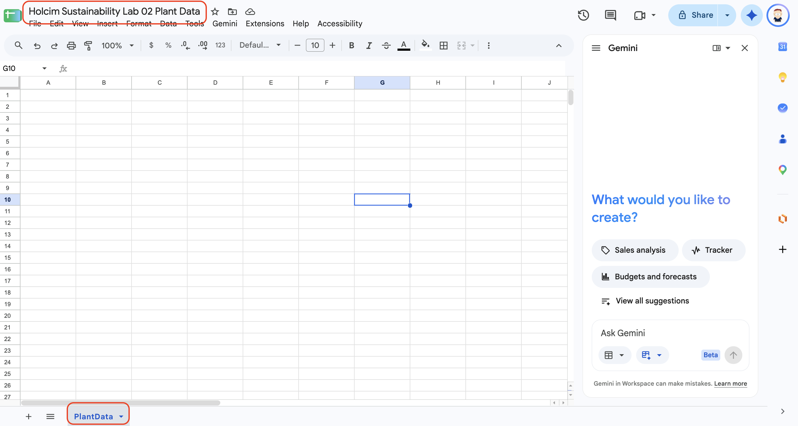
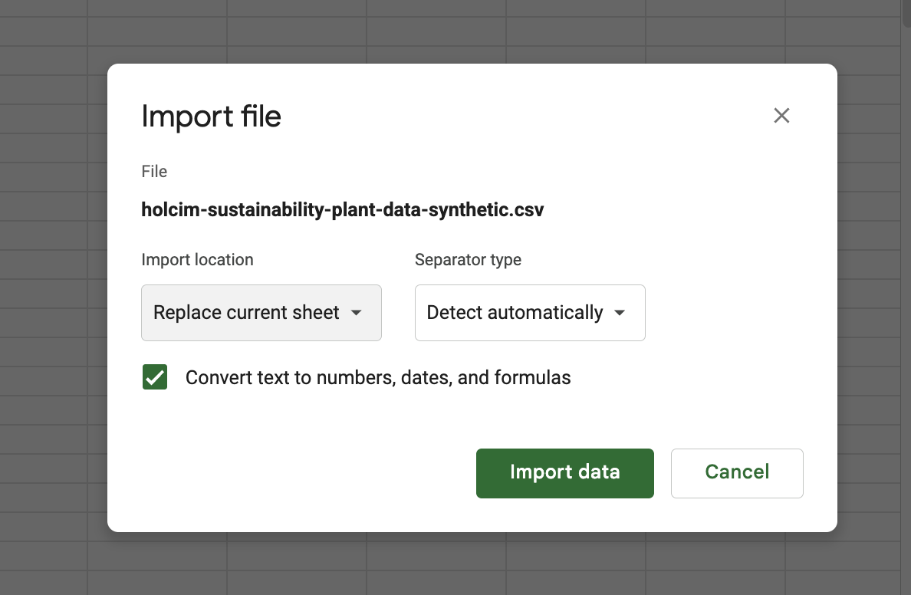
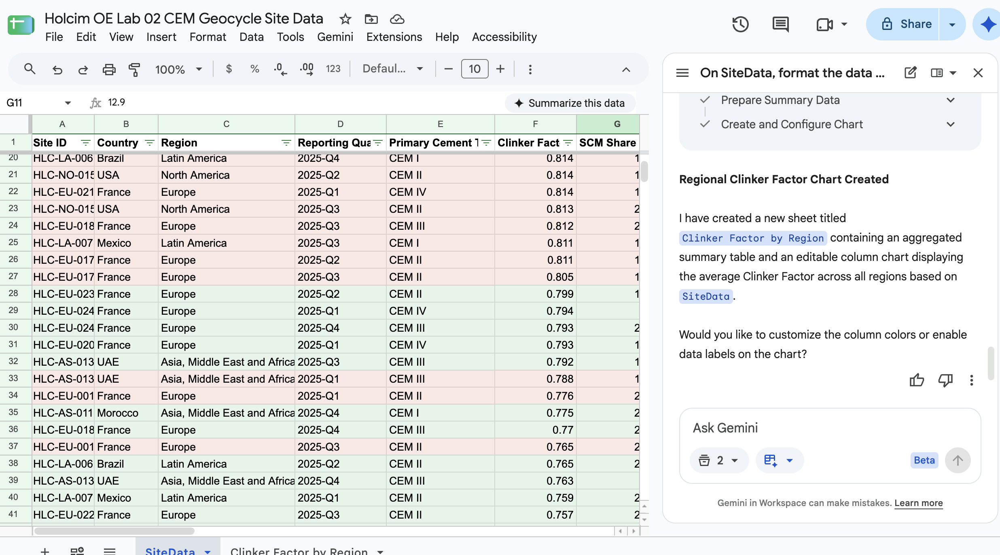
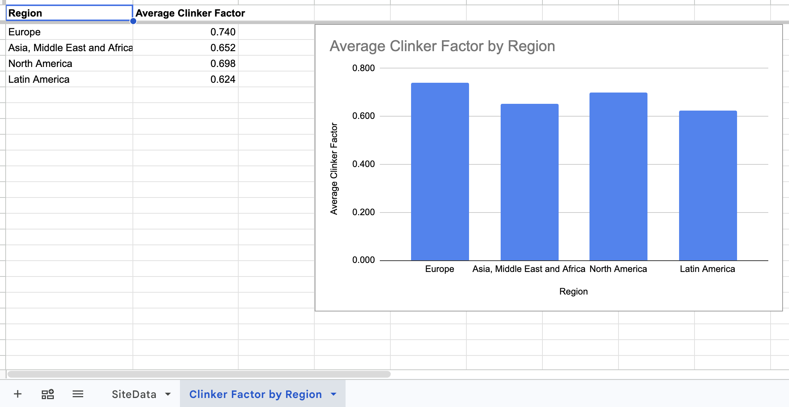
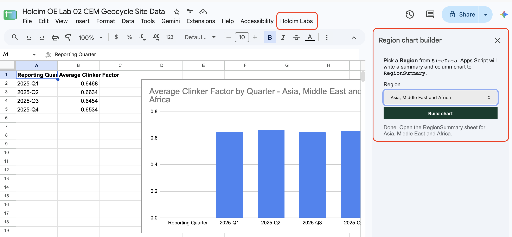
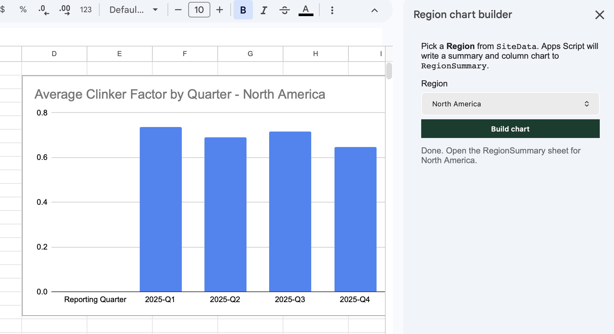

# Analyzing CEM and Geocycle Performance Data with Sheets and Gemini

## Time Required

45 minutes

## Overview

In this lab, you will import a Holcim Operational Excellence site-data CSV into Google Sheets, use Gemini in Sheets to format and visualize CEM clinker-factor and Geocycle thermal-substitution metrics, ask focused analysis questions, and build a small Apps Script sidebar that charts average clinker factor by quarter for one region.

### You learn how to:

- Create a Google Sheet and import synthetic CEM and Geocycle site CSV data.
- Use Gemini in Sheets to format a table, add header filters, apply conditional formatting, and insert a chart.
- Ask Gemini one question at a time to compare clinker factor by cement type, read quarterly trends, and list OE priority sites.
- Build a simple Apps Script menu and sidebar that charts one region’s average clinker factor by quarter.

## Scenario


Holcim’s Operational Excellence team receives a quarterly site-level extract covering **primary cement type** (CEM I–V), **clinker factor**, **SCM share**, **ECOPlanet volume share**, and Geocycle **thermal substitution** plus waste tonnes. The file is small enough to work with directly, so you will import it, use Gemini in Sheets to turn it into a clean analytics table and dashboard chart, then ship a simple Apps Script chart builder so colleagues can review one region’s clinker-factor trend without writing formulas.

> [!NOTE]
> Gemini in Sheets works best on smaller, clean tables. Google documents more consistent Gemini performance on files below about 1 million cells. At 100 rows and 12 columns, this file is already well inside that range.

## Lab Instructions

### Task 1: Create a Sheet and import the OE site CSV

In this task, you create a spreadsheet and load the synthetic CEM and Geocycle site data.

1. Open [Google Sheets](https://sheets.google.com/) and sign in with your account.

2. Click **Blank spreadsheet**.

3. Rename the spreadsheet to `Holcim OE Lab 02 CEM Geocycle Site Data`.

4. Rename the first tab from `Sheet1` to `SiteData`.



5. Open the shared CSV in Drive (confirm you can view it):

[https://drive.google.com/file/d/1V6GoUmOCxlfn9tCcZxDcsE6UTUNeyYAe/view?usp=sharing](https://drive.google.com/file/d/1V6GoUmOCxlfn9tCcZxDcsE6UTUNeyYAe/view?usp=sharing)

6. Return to your Sheet. Choose **File** | **Import**, and paste the Drive file link into the search box. Select the file and choose **Insert**. In the Import dialog set the following and click **Import data**.

   - Import location: **Replace current sheet**.
   - Separator type: **Detect automatically** (or **Comma**).
   - Convert text to numbers, dates, and formulas: **Checked**.



7. Confirm row 1 contains these headers (12 columns):

`Site ID`, `Country`, `Region`, `Reporting Quarter`, `Primary Cement Type`, `Clinker Factor`, `SCM Share (%)`, `Thermal Substitution Rate (%)`, `Cementitious Production (tonnes)`, `ECOPlanet Volume Share (%)`, `Geocycle Waste Processed (tonnes)`, `OE Priority Site`

8. Freeze the header row: select row 1, then **View** | **Freeze** | **1 row**.

> [!NOTE]
> This is **100 rows**: 25 synthetic sites across 4 quarters of FY2025. All site IDs and figures are synthetic training data, not real Holcim KPIs.

### Task 2: Format, filter, chart, and start a dashboard view with Gemini in Sheets

In this task, you use **Ask Gemini** in Sheets to turn `SiteData` into a clearer OE analytics table with filters, conditional formatting, and a chart.

1. Open the `SiteData` sheet and select any cell inside the data.

2. At the top right, click **Ask Gemini** to open the side panel, if it is not already open.


3. Ask Gemini to format the table. Paste:

```text
On SiteData, format the data as a clean table:
- Bold and freeze the header row if needed
- Autofit useful column widths for Site ID, Country, Region, Primary Cement Type, Reporting Quarter, and OE Priority Site
- Keep all existing columns
Do not delete rows.
```

4. Review Gemini’s proposal. Apply or insert the suggested formatting when it looks correct.

5. Add header filters with Gemini:

```text
On SiteData, turn on filters for the header row so I can filter Region, Primary Cement Type, Reporting Quarter, and OE Priority Site.
```

6. Manually verify filters: click a header filter arrow and confirm you can filter **Region** values and cement types such as `CEM I` and `CEM II`.

7. Add conditional formatting for OE priority sites:

> [!NOTE]
> In this lab, **OE Priority Site = Yes** means the site needs attention (for example high clinker factor or low thermal substitution). That is why Yes is highlighted in red.

```text
On SiteData, apply conditional formatting to the rows based on the OE Priority Site column:
- Yes = light red fill
- No = light green fill
```

8. Create a chart with Gemini:

```text
Using SiteData, create an editable column chart that shows average Clinker Factor by Region.
Title the chart "Average Clinker Factor by Region".
Insert it into a new sheet.
```

9. Click **Insert** when Gemini previews the chart. Confirm the chart is editable.






### Task 3: Ask Gemini focused analysis questions

In this task, you use **Ask Gemini** on `SiteData` to answer questions this file can actually support. Each prompt names the sheet, the columns, and one result.

> [!IMPORTANT]
> Do not ask Gemini to “analyze this CSV.” Ask one question per prompt, and read the proposal before you apply it. If a proposal deletes rows or invents 2026 forecasts, cancel it or undo.

1. Open the `SiteData` sheet. If the side panel is closed, click **Ask Gemini**.

2. Compare clinker factor by cement type. Paste:

```text
Using SiteData, create a new sheet named ClinkerByCementType.
Calculate average Clinker Factor for:
- each Primary Cement Type
- each combination of Region and Primary Cement Type
For each group show the row count and the average.
Round averages to three decimal places.
Do not add a chart.
Do not change SiteData.
```

3. Open `ClinkerByCementType` and confirm CEM I averages sit higher than CEM III–V in most groups.

4. Read the quarterly trend for clinker factor and AF together. Paste:

```text
Using SiteData, create a new sheet named OeQuarterlyTrend.
For each Reporting Quarter, calculate:
- Average Clinker Factor
- Average Thermal Substitution Rate (%)
- Average ECOPlanet Volume Share (%)
Put the quarters in order: 2025-Q1, 2025-Q2, 2025-Q3, 2025-Q4.
Round averages to one decimal place for percentages and three decimal places for Clinker Factor.
Do not change SiteData.
```

5. Check direction on `OeQuarterlyTrend`. Average clinker factor should ease from Q1 to Q4, and average thermal substitution should rise. ECOPlanet share should end higher in Q4 than Q1 (it may dip in one middle quarter).

6. List OE priority sites in the last quarter. Paste:

```text
On SiteData, list rows that meet all of these conditions:
- Reporting Quarter is 2025-Q4
- OE Priority Site is Yes
Return Site ID, Country, Region, Primary Cement Type, Clinker Factor, Thermal Substitution Rate (%), and ECOPlanet Volume Share (%).
Put the rows on a new sheet named OePriorityQ4.
Sort by Clinker Factor, highest first.
Do not change SiteData.
```

7. Ask for a short reading of the tables, and for the limit Gemini must state. Paste:

```text
Using ClinkerByCementType and OeQuarterlyTrend, write three observations.
Each observation must cite a number from one of those sheets.
Then answer: can you forecast each site's 2026 clinker factor from this file?
If four quarters are not enough history, answer no, and say what you would need instead.
Do not create a forecast.
```

**Success criteria**

- `ClinkerByCementType` separates CEM I from lower-clinker blends.
- `OeQuarterlyTrend` shows clinker factor easing and thermal substitution rising from Q1 to Q4, with ECOPlanet share higher in Q4 than Q1.
- `OePriorityQ4` lists Q4 priority sites only.
- The written observations cite those tables and decline to forecast 2026.

### Task 4: Build a simple Apps Script region chart builder

In this task, you add a small Apps Script project that shows the core pattern: a custom menu, an HTML sidebar, a server function that reads the sheet, and a chart written back to Sheets.

1. In your spreadsheet, open **Extensions** | **Apps Script**.

2. Rename the project to `Holcim OE Region Clinker Chart Builder`.

3. Replace any default `Code.gs` content with:

```javascript
/**
 * Holcim Operational Excellence Lab 02 - simple Apps Script demo
 * Custom menu + HTML sidebar + sheet read/write + chart
 */

var SOURCE_SHEET = 'SiteData';
var OUTPUT_SHEET = 'RegionSummary';

function onOpen() {
  SpreadsheetApp.getUi()
    .createMenu('Holcim Labs')
    .addItem('Open region chart builder', 'showSidebar')
    .addToUi();
}

function showSidebar() {
  var html = HtmlService.createHtmlOutputFromFile('Sidebar')
    .setTitle('Region chart builder')
    .setWidth(280);
  SpreadsheetApp.getUi().showSidebar(html);
}

/** Return sorted unique Region values from SiteData. */
function getRegions() {
  var sheet = SpreadsheetApp.getActive().getSheetByName(SOURCE_SHEET);
  if (!sheet) {
    throw new Error('Missing sheet: ' + SOURCE_SHEET);
  }
  var data = sheet.getDataRange().getDisplayValues();
  var regionCol = data[0].indexOf('Region');
  if (regionCol < 0) {
    throw new Error('Region column not found.');
  }
  var seen = {};
  for (var i = 1; i < data.length; i++) {
    var value = String(data[i][regionCol] || '').trim();
    if (value) {
      seen[value] = true;
    }
  }
  return Object.keys(seen).sort();
}

/**
 * Filter SiteData to one region, write average Clinker Factor by Reporting
 * Quarter, and insert a column chart on RegionSummary.
 */
function buildRegionChart(region) {
  var ss = SpreadsheetApp.getActive();
  var source = ss.getSheetByName(SOURCE_SHEET);
  if (!source) {
    throw new Error('Missing sheet: ' + SOURCE_SHEET);
  }

  var data = source.getDataRange().getDisplayValues();
  var headers = data[0];
  var regionCol = headers.indexOf('Region');
  var quarterCol = headers.indexOf('Reporting Quarter');
  var clinkerCol = headers.indexOf('Clinker Factor');

  var sums = {};
  var counts = {};
  for (var i = 1; i < data.length; i++) {
    if (String(data[i][regionCol] || '').trim() !== region) {
      continue;
    }
    var quarter = String(data[i][quarterCol] || 'Unknown').trim() || 'Unknown';
    var clinker = Number(data[i][clinkerCol]);
    if (isNaN(clinker)) {
      continue;
    }
    sums[quarter] = (sums[quarter] || 0) + clinker;
    counts[quarter] = (counts[quarter] || 0) + 1;
  }

  var out = ss.getSheetByName(OUTPUT_SHEET);
  if (!out) {
    out = ss.insertSheet(OUTPUT_SHEET);
  }
  out.clear();
  out.getCharts().forEach(function (chart) {
    out.removeChart(chart);
  });

  var rows = [['Reporting Quarter', 'Average Clinker Factor']];
  Object.keys(sums).sort().forEach(function (quarter) {
    rows.push([quarter, sums[quarter] / counts[quarter]]);
  });
  out.getRange(1, 1, rows.length, 2).setValues(rows);
  out.getRange(1, 1, 1, 2).setFontWeight('bold');

  if (rows.length > 1) {
    var chart = out.newChart()
      .setChartType(Charts.ChartType.COLUMN)
      .addRange(out.getRange(1, 1, rows.length, 2))
      .setOption('title', 'Average Clinker Factor by Quarter - ' + region)
      .setPosition(2, 4, 0, 0)
      .build();
    out.insertChart(chart);
  }

  return {
    region: region,
    quarters: rows.length - 1
  };
}
```

4. Click **+** next to **Files** and add an **HTML** file named `Sidebar` (Apps Script will create `Sidebar.html`). Replace its contents with:

```html
<!DOCTYPE html>
<html>
  <head>
    <base target="_top" />
    <style>
      body { font-family: Arial, sans-serif; font-size: 13px; margin: 12px; color: #202124; }
      select, button { width: 100%; margin-top: 6px; padding: 8px; box-sizing: border-box; }
      button { background: #0b3d2e; color: #fff; border: 0; font-weight: 600; cursor: pointer; }
      #msg { margin-top: 12px; color: #5f6368; }
      .error { color: #b3261e; }
    </style>
  </head>
  <body>
    <p>Pick a <strong>Region</strong> from <code>SiteData</code>. Apps Script will write a summary and column chart to <code>RegionSummary</code>.</p>

    <label for="region">Region</label>
    <select id="region"></select>
    <button onclick="buildChart()">Build chart</button>
    <div id="msg">Loading regions…</div>

    <script>
      function setMsg(text, isError) {
        var el = document.getElementById('msg');
        el.className = isError ? 'error' : '';
        el.textContent = text;
      }

      google.script.run
        .withSuccessHandler(function (regions) {
          var select = document.getElementById('region');
          regions.forEach(function (region) {
            var option = document.createElement('option');
            option.value = region;
            option.textContent = region;
            select.appendChild(option);
          });
          setMsg('Ready.');
        })
        .withFailureHandler(function (err) {
          setMsg(err.message || String(err), true);
        })
        .getRegions();

      function buildChart() {
        var region = document.getElementById('region').value;
        setMsg('Building chart for ' + region + '…');
        google.script.run
          .withSuccessHandler(function (result) {
            setMsg('Done. Open the RegionSummary sheet for ' + result.region + '.');
          })
          .withFailureHandler(function (err) {
            setMsg(err.message || String(err), true);
          })
          .buildRegionChart(region);
      }
    </script>
  </body>
</html>
```

5. Save the project, return to the spreadsheet, and reload the browser tab.

6. From the **Holcim Labs** menu, choose **Open region chart builder**.



7. Pick a **Region**, click **Build chart**, then open the `RegionSummary` sheet and confirm a column chart appears.



> [!TIP]
> If the custom menu is missing after reload, run `onOpen` once from the Apps Script editor, then reload the Sheet.

### Bonus Task 5: Ask Gemini to explain the Apps Script

1. Open a Gemini chat and paste `Code.gs`.

2. Ask:

```text
Explain this Apps Script for a Holcim Operational Excellence analyst who is new to coding.
Cover: onOpen menu, sidebar, how getRegions reads SiteData, and how buildRegionChart writes RegionSummary.
Suggest one safe improvement that does not change the sheet names.
```

3. Skim the explanation and keep one improvement idea for later.

## Congratulations!

In this lab, you have:

- Created a Google Sheet and imported synthetic CEM and Geocycle site CSV data from Google Drive.
- Used Gemini in Sheets to format a table, add header filters, apply conditional formatting, and insert a chart.
- Asked Gemini one question at a time to compare clinker factor by cement type, read quarterly trends, and list OE priority sites.
- Built a simple Apps Script menu and sidebar that charts one region's average clinker factor by quarter.
