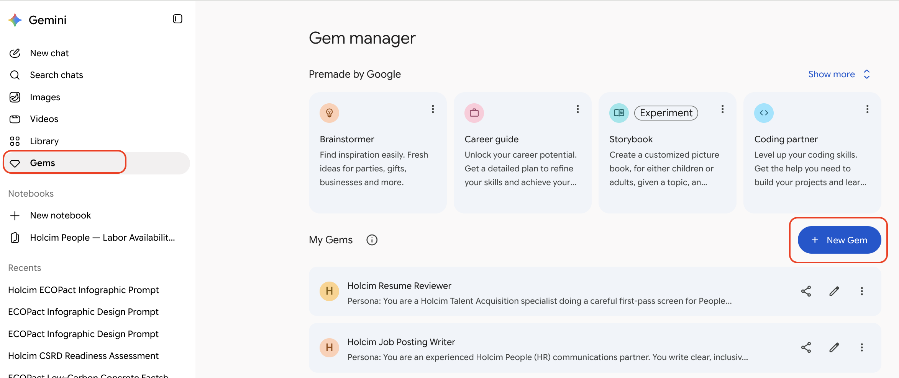
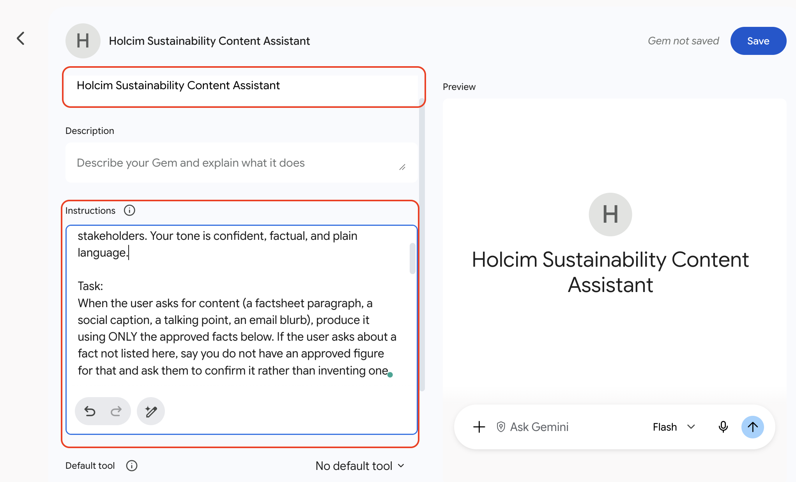
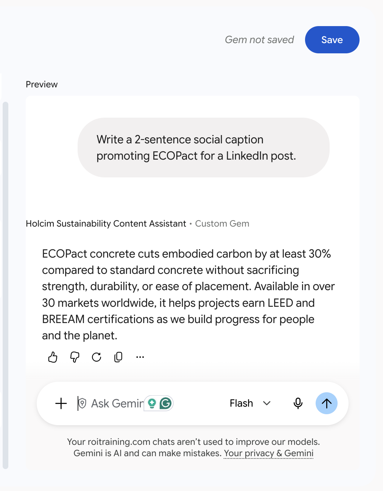
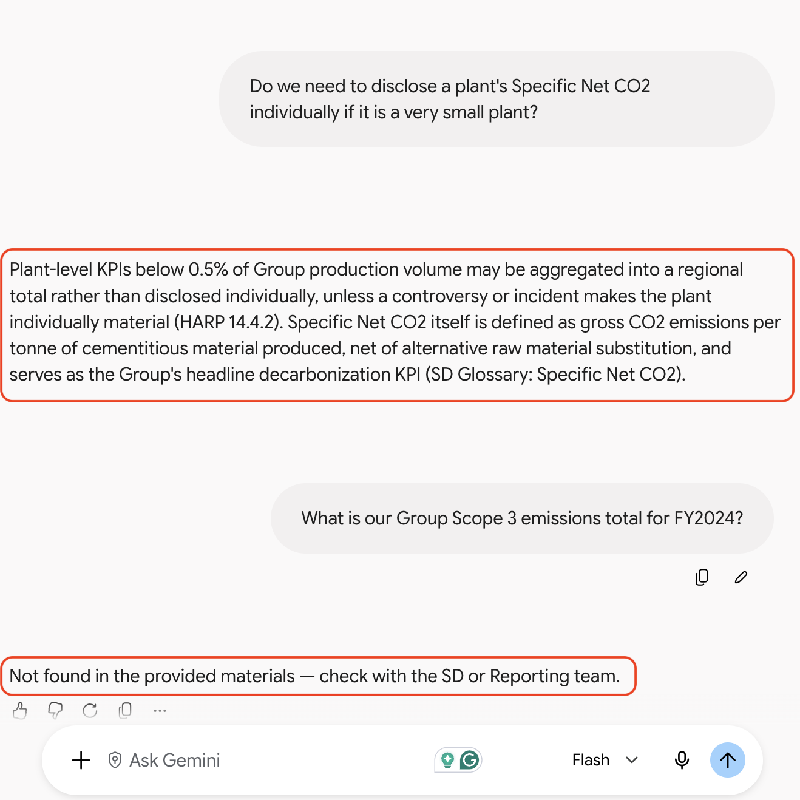

# Creating Reusable CEM and Geocycle Assistants with Gemini Gems

## Time Required

30 minutes

## Overview

In this lab, you will create two reusable **Gemini Gems** for Holcim Operational Excellence: a CEM formulation helper grounded in an EN 197-1 glossary, and a Geocycle inquiry assistant grounded in synthetic waste-acceptance notes. You open Gemini, expand the sidebar, open Gems, paste durable instructions, attach reference files as Knowledge, preview each Gem, save it, and run short requests so teammates can reuse the same standard without rebuilding prompts from scratch.

### You learn how to:

- Open Gemini Gems from the sidebar and create a new custom Gem.
- Package a structured CEM formulation prompt into a reusable Gem.
- Attach reference documents as Gem Knowledge so a second Gem can answer Geocycle intake questions grounded in your own files.

## Scenario


OE partners often rewrite the same prompts when someone asks “what’s the difference between CEM II and CEM III?” or when Geocycle gets a first customer question about a new waste stream. Gems store instructions once, and can also hold reference files as **Knowledge**, so a Gem can act as an always-available, grounded assistant for those recurring CEM and Geocycle questions.

## Lab Instructions

### Task 1: Open Gemini Gems and create the CEM Formulation Helper Gem

In this task, you open the Gems manager and create **Holcim CEM Formulation Helper** using the instructions below.

1. Open [https://gemini.google.com/](https://gemini.google.com/).

2. Expand the left sidebar if it is collapsed.

3. In the sidebar, select **Gems**.

4. Click **New Gem**.



5. Set the Gem **Name** to:

```text
Holcim CEM Formulation Helper
```

6. In **Instructions**, paste the following:

```text
Persona:
You are a Holcim Operational Excellence CEM partner. You explain cement families (CEM I–V under EN 197-1), clinker factor, and SCM levers in clear language for commercial and plant OE colleagues. Your tone is confident, factual, and plain language.

Task:
When the user asks about cement types, clinker factor, SCMs, or ECOPlanet positioning, answer using ONLY the Knowledge files and any facts the user supplies in the chat. If the answer is not in those materials, say so and ask for the missing fact rather than inventing a plant KPI.

Constraints:
- Do not invent clinker-factor percentages, market share, or plant names
- Do not invent EN 197-1 subclass details beyond what Knowledge provides
- Keep CEM product formulation separate from Geocycle AF unless the user explicitly asks how they relate
- Flag requests for confidential or unpublished figures

Process (follow these steps every time):
1. Identify whether the question is about cement type, clinker factor, SCMs, or product positioning.
2. Pull only relevant points from Knowledge.
3. Answer in short sections with bullets where helpful.
4. End with one clarifying question if a site-specific number is missing.

Writing quality example:
- Good: "CEM III typically uses substantial slag, so clinker intensity is usually lower than CEM I for the same conversation about embodied carbon."
- Weak: "Blended cements are greener."
```

7. Under **Knowledge**, upload:

`assets/holcim-cem-en197-glossary-synthetic.md`

from this lab folder.



8. In the **Preview** panel, test with:

```text
In two short paragraphs, explain when an OE partner might discuss moving from CEM I toward CEM II or CEM III, and what clinker factor means in that conversation.
```

9. Check that the preview stays grounded and does not invent site KPIs.

10. Click **Save**.



> [!IMPORTANT]
> Previewing does not save the Gem. Click **Save** after you are happy with the preview.

### Task 2: Create the Geocycle Inquiry Assistant Gem with Knowledge files

In this task, you create a second Gem that answers first-pass Geocycle intake questions using synthetic acceptance notes.

1. Click **New Gem**.

2. Set the Gem **Name** to:

```text
Holcim Geocycle Inquiry Assistant
```

3. In **Instructions**, paste:

```text
Persona:
You are a Holcim Geocycle inquiry assistant supporting Operational Excellence. You help colleagues draft careful first responses about waste-stream intake and alternative fuels. You never promise acceptance.

Task:
Answer using ONLY the Knowledge files and facts the user provides. If characterization data is missing, say a trial discussion is premature.

Constraints:
- No invented permits, prices, emission limits, or acceptance dates
- No guarantee of kiln acceptance
- Keep Geocycle AF discussion distinct from CEM product carbon claims unless the user supplies a grounded link

Process:
1. Restate the waste type and what is known vs unknown.
2. Cite the Knowledge checklist items that apply.
3. Recommend the next data request in one sentence.
```

4. Upload as Knowledge:

`assets/holcim-geocycle-acceptance-notes-synthetic.md`

5. Preview with:

```text
A customer offers 40 tonnes/month of spent solvents with only a partial lab pack and a chlorine check still open. Draft a short internal note on readiness for a trial talk.
```

6. Confirm the Gem refuses to guarantee acceptance and asks for characterization.

7. Click **Save**.



### Task 3: Reuse both Gems from the sidebar

1. From **Gems**, open **Holcim CEM Formulation Helper**.

2. Ask:

```text
Give me five bullet talking points for a plant visit about lowering clinker factor without mentioning Geocycle.
```

3. Open **Holcim Geocycle Inquiry Assistant** and ask:

```text
Rewrite this customer email reply so it is careful and does not promise acceptance: "Thanks — we can take your RDF next month."
```

4. Compare the two outputs: different personas, same reusable standard.

### Bonus Task 4: Improve one Gem with a teammate scenario

1. Edit either Gem’s instructions to add one example input/output pair from your real OE work (sanitize confidential details).

2. Preview again and save.

## Congratulations!

You packaged CEM formulation guidance and Geocycle inquiry handling into two reusable Gemini Gems with Knowledge files your OE teammates can share.
