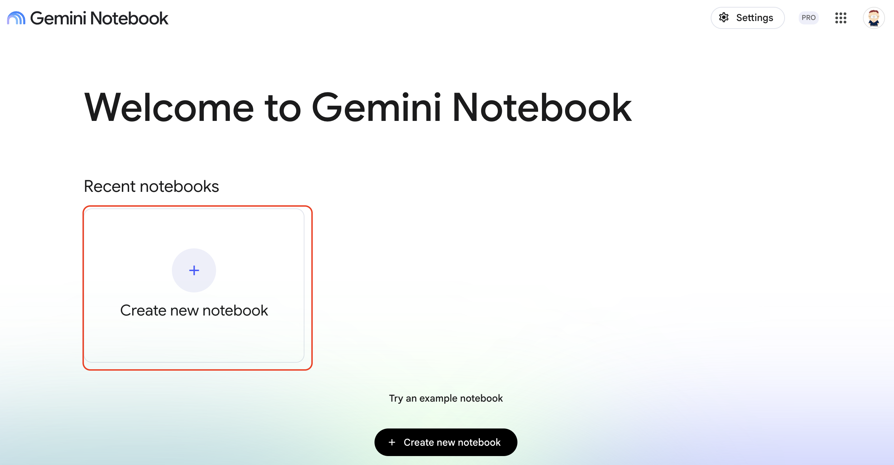
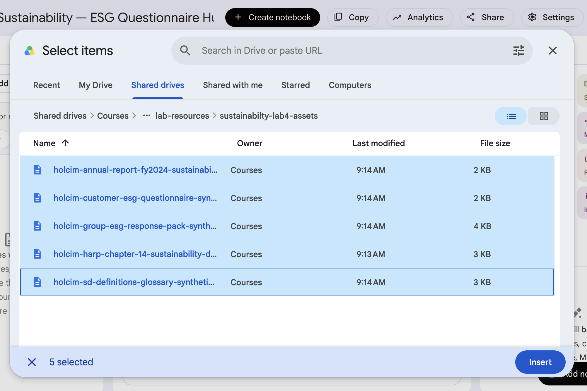
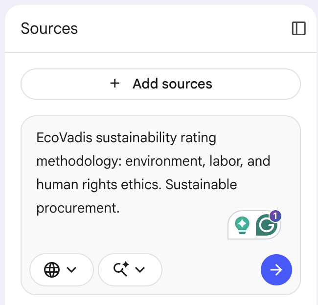
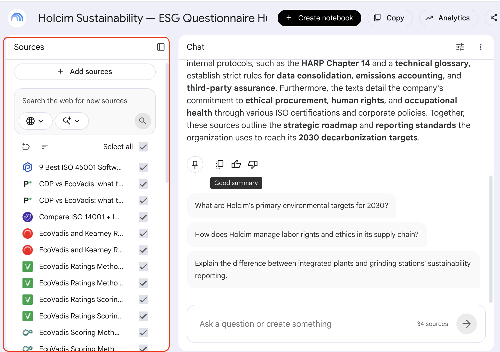
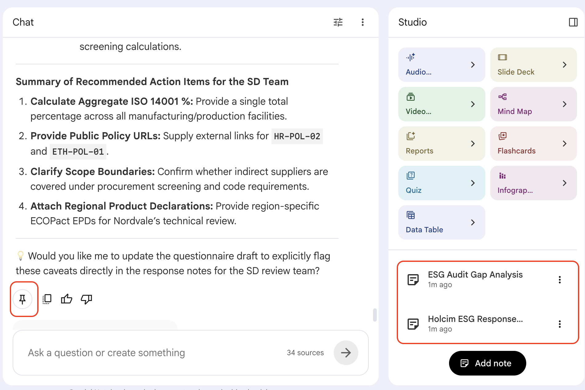
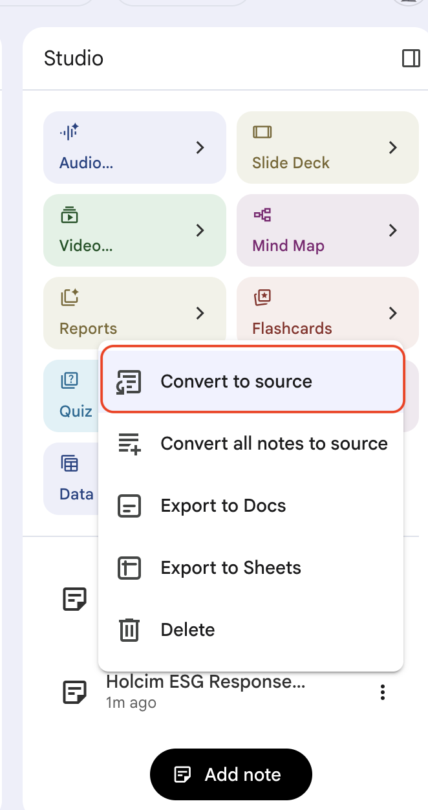
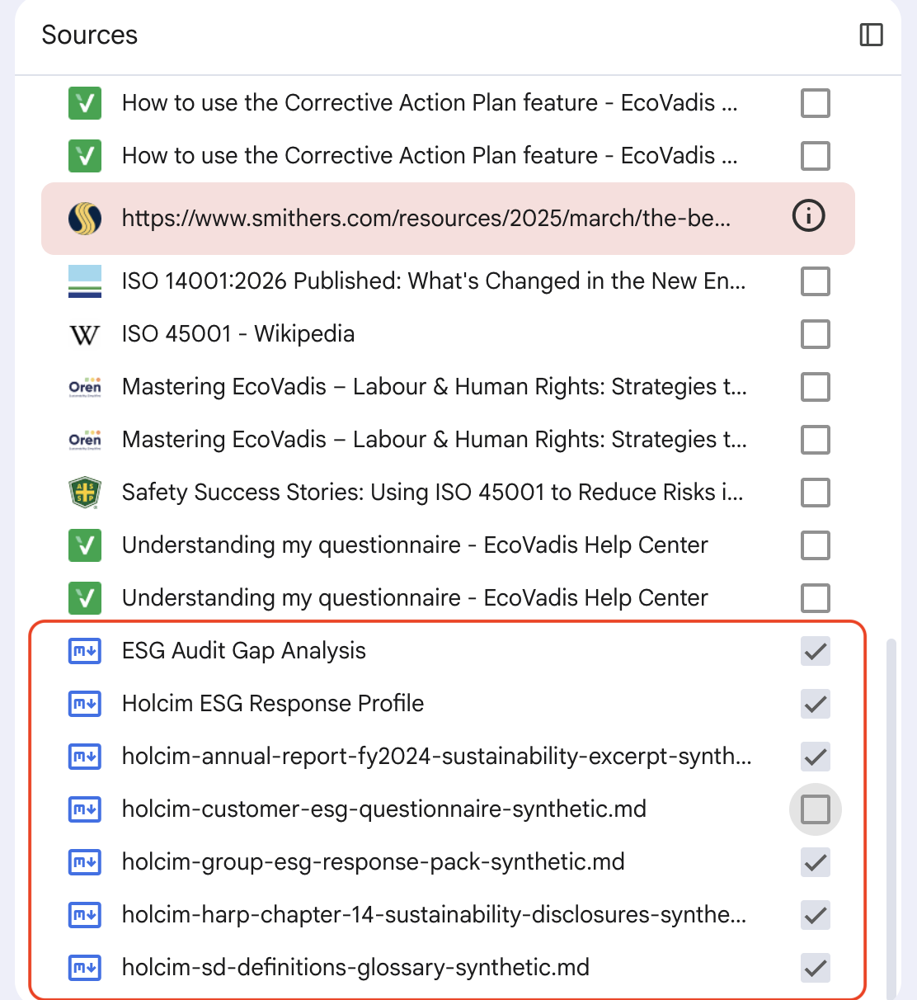
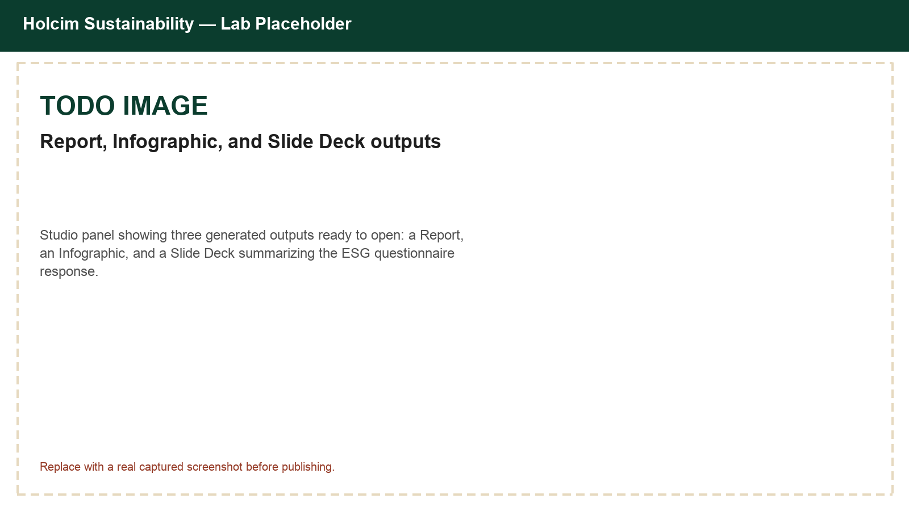

# Building a Low-Carbon CEM and Geocycle Briefing with Gemini Notebook

## Time Required

30 minutes

## Overview

In this lab, you will build a Gemini Notebook (NotebookLM) briefing pack for Holcim Operational Excellence. You add synthetic CEM clinker-factor and Geocycle AF sources, research public context with web sources, draft cited talking points in chat, and generate Studio outputs grounded in your selected sources.

### You learn how to:

- Create a Gemini Notebook and add Holcim OE CEM and Geocycle sources.
- Research public cement and alternative-fuel context using web sources.
- Draft grounded, cited leadership talking points in chat.
- Convert notes to sources and generate an Infographic and Slide Deck in Studio from your own content.

## Scenario


You are preparing a short Operational Excellence update that must cover two related levers: **CEM clinker-factor / product-mix progress** and **Geocycle thermal substitution**. Digging through scattered notes every month wastes time and risks inconsistent stories. A Gemini Notebook keeps the briefing grounded in sources you choose.

> [!WARNING]
> Every source in this lab is **synthetic training content**. Do not attach real unpublished plant KPIs or real customer waste contracts during this lab.

## Lab Instructions

### Task 1: Create a notebook and add OE sources

In this task, you create the notebook and load the internal sources that will ground later answers.

1. Open [https://notebooklm.google.com/](https://notebooklm.google.com/) and sign in with your account.

2. On the home page, create a **New notebook**.



3. Rename the notebook to:

```text
Holcim OE — Low-Carbon CEM and Geocycle Briefing
```

4. Click **Add sources**, choose **Drive**, and add these two shared files (confirm you can view each link first):

   - CEM clinker-factor brief: [https://drive.google.com/file/d/1Gxj6nPDWLB33ecD68EoDlfTd4_xLAhGG/view?usp=drive_link](https://drive.google.com/file/d/1Gxj6nPDWLB33ecD68EoDlfTd4_xLAhGG/view?usp=drive_link)
   - Geocycle AF brief: [https://drive.google.com/file/d/1SAkzt4tigtlLx6KOyxkr08w20XqJkKQw/view?usp=drive_link](https://drive.google.com/file/d/1SAkzt4tigtlLx6KOyxkr08w20XqJkKQw/view?usp=drive_link)

<!-- TODO IMAGE: Screenshot of Add sources with both OE briefs visible -->


5. Wait until both sources appear as ready in the **Sources** panel.

### Task 2: Research public context with web sources

In this task, you use **Search for Web Sources** to pull public context so your briefing can use standard industry language.

1. In the **Search the Web for new sources** tool, enter:

```text
EN 197-1 cement types CEM I CEM II CEM III clinker factor supplementary cementitious materials overview
```



2. Review the results, and **Import** a small number of reputable overviews.

3. Run a second search:

```text
cement kiln alternative fuels thermal substitution waste co-processing overview
```

4. Import relevant results. Confirm the **Sources** panel includes your OE briefs plus web sources.



### Task 3: Draft cited talking points in chat

In this task, you use chat to produce leadership-ready talking points with citations.

1. Ensure all sources are selected.

2. Ask:

```text
Create a 6-bullet leadership briefing that covers:
1) CEM clinker-factor direction
2) product mix toward CEM II–V / ECOPlanet
3) Geocycle thermal substitution direction
4) why the two levers are related but not identical
5) one risk or data gap
6) one recommended OE follow-up
Cite sources for each bullet. If a figure is not in the sources, say so instead of inventing it.
```

3. Save the strongest answer to a note (push pin / save to note).



4. Stress-test the draft:

```text
Review the briefing bullets. Flag any bullet that invents a KPI or over-claims carbon performance. Suggest a safer rewrite for each flagged bullet.
```

5. Save the cleaned version as a note, then convert important notes into sources if your Notebook UI offers **Convert notes to sources**.



### Task 4: Generate Studio outputs from Holcim OE sources only

In this task, you narrow sources and generate visual outputs for the briefing.

1. In Sources, select only your OE briefs (and converted notes), not every web source—unless a web source is essential for definitions.



2. In **Studio**, generate an **Infographic** titled:

```text
CEM clinker factor and Geocycle AF: two OE levers
```

3. Generate a short **Slide Deck** for a 5-minute OE update.



4. Skim both outputs for invented numbers. If you see any, regenerate with a stricter instruction:

```text
Use only figures present in the selected sources. If a figure is missing, use qualitative language instead of a number.
```

### Bonus Task 5: Add one web source and refresh one bullet

1. Import one additional web source on calcined clay or slag in blended cements.

2. Ask Notebook to refresh only the product-mix bullet with a citation to that source.

3. Save the updated bullet as a note.

## Congratulations!

You built a Gemini Notebook briefing pack that keeps CEM clinker-factor progress and Geocycle AF progress grounded, citable, and ready for Studio outputs.
