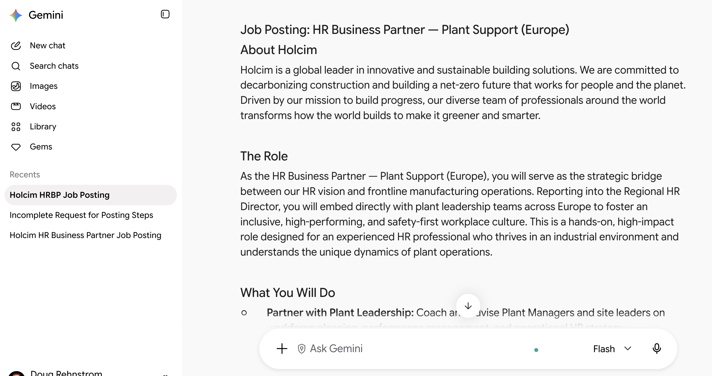
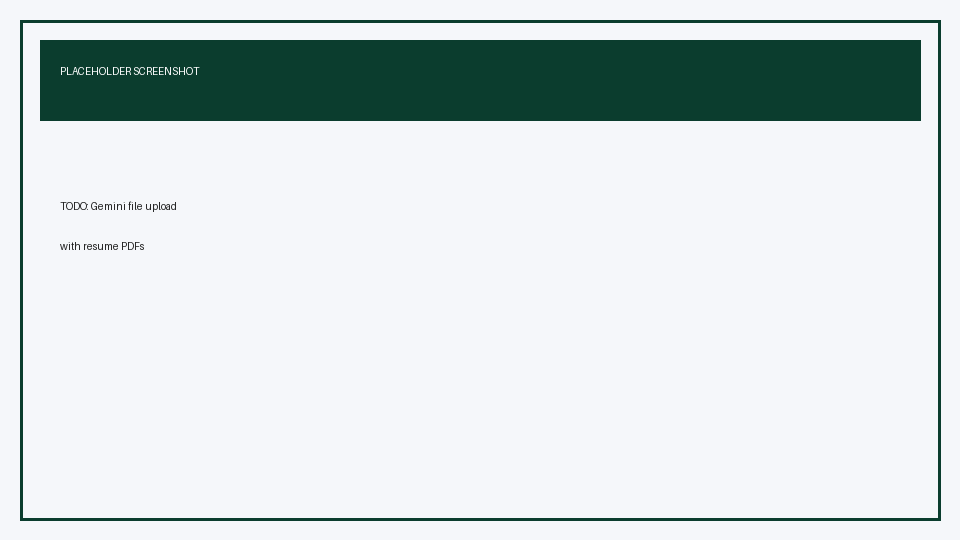
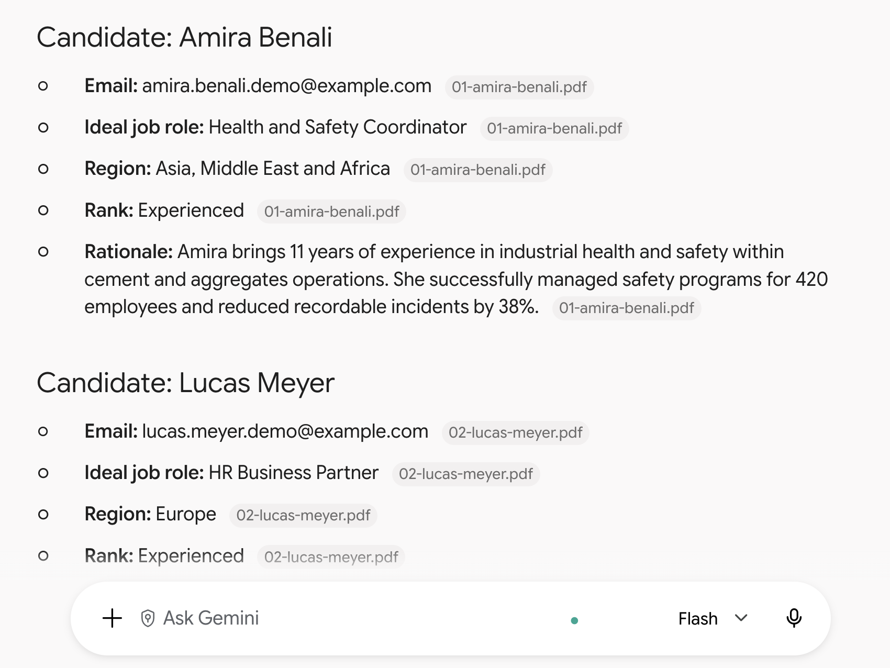
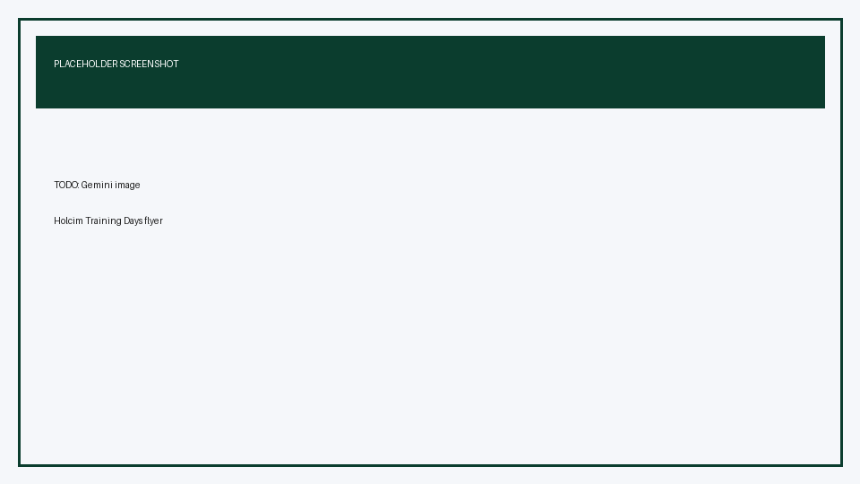

# Prompt Engineering Mastery with Gemini for Holcim People Teams

## Time Required

45 minutes

## Overview

In this lab, you will practice structured prompt engineering in the Gemini browser app. Using Holcim People (HR) scenarios, you progressively improve prompts for job postings, resume screening, and event flyer image generation so outputs become more accurate, consistent, and useful.

### You learn how to:
- Build job-posting prompts step by step with role, task, steps, and examples.
- Design multi-turn resume-screening prompts that return structured Markdown from candidate PDFs.
- Improve Gemini image prompts with brand assets, style detail, and meta-prompting.

## Scenario

You support Holcim’s People team. Hiring managers need clearer job posts, faster first-pass resume reviews, and a polished flyer for the annual **Holcim Training Days** event. Gemini can help—but only if your prompts are structured. You will treat prompting as a craft: start simple, then add role context, process steps, examples, and feedback loops until the output matches what Holcim colleagues can use.

> [!NOTE]
> Holcim’s current operating regions for this lab are **Europe**, **Latin America**, and **Asia, Middle East and Africa (AMEA)**. Use those region names in resume outputs.

## Lab Instructions

### Task 1: Open Gemini and craft a progressive job-posting prompt

In this task, you open the Gemini app in your browser and improve a job-posting prompt in four stages: simple request, then Role, Task, Steps, and Examples.

1. Open [https://gemini.google.com/](https://gemini.google.com/) in Chrome (or your preferred browser) and sign in with the Google account your instructor provides.

2. Start a **new chat** so this exercise has a clean history.

<!-- TODO IMAGE: Screenshot of gemini.google.com signed-in home/new chat view -->


3. Paste this **simple** prompt and send it:

```text
Write a job posting for an HR Business Partner at Holcim.
```

4. Skim the result. Note what is generic, missing, or not Holcim-specific (industry, regions, safety culture, sustainable construction).

5. In the **same chat**, send this improved prompt that adds a **Role**:

```text
You are an experienced Holcim People (HR) communications partner who writes clear, inclusive job postings for industrial and corporate roles in sustainable construction.

Rewrite the HR Business Partner job posting so it sounds like Holcim: purpose-driven, people-centered, and practical for plant and office audiences.
```

6. Next, add a clear **Task** and constraints. Send:

```text
Task: Produce a complete job posting for "HR Business Partner — Plant Support (Europe)" at Holcim.

Constraints:
- Audience: experienced HR professionals (5+ years)
- Length: about 400–500 words
- Tone: professional, warm, plain language
- Emphasize: health and safety, talent development, partnership with plant leadership, and Holcim’s sustainable construction mission
- Do not invent salary numbers or fake benefits
```

7. Add **Steps** so Gemini follows a repeatable process. Send:

```text
Follow these steps before you write the final posting:
1. List the top 5 outcomes this HR Business Partner must deliver in the first year.
2. List must-have vs nice-to-have qualifications.
3. Only then write the full job posting using this structure:
   - About Holcim (2–3 sentences)
   - The role
   - What you will do
   - What you bring
   - Why join Holcim People
Show the intermediate lists briefly, then the final posting.
```

8. Finish the progression with **Examples** (few-shot style). Send:

```text
Use this style example for bullet quality (do not copy the content):

Good bullet: "Partner with the Plant Director to run quarterly talent reviews and build succession plans for critical production roles."
Weak bullet: "Responsible for various HR duties and supporting the business."

Now regenerate only the "What you will do" section with 6 strong bullets in that style.
```

<!-- TODO IMAGE: Screenshot of Gemini chat showing the multi-turn job posting progression -->


> [!IMPORTANT]
> Keep this as **one multi-turn chat**. The value is watching quality improve as you add Role, Task, Steps, and Examples—not starting over each time.

**Success criteria**

- You have a Holcim-flavored HR Business Partner posting with a clear structure.
- You can explain how each prompt layer (Role, Task, Steps, Examples) changed the output.

### Task 2: Screen synthetic resumes with a structured Markdown prompt

In this task, you add synthetic candidate PDFs from Google Drive into Gemini and build a screening prompt that returns consistent Markdown fields Holcim recruiters can scan quickly.

1. Open the shared lab resources folder in Google Drive:

[https://drive.google.com/drive/folders/1DjfQAg4Q7WhfPQOC7YiJLvtxcKTyZuAC](https://drive.google.com/drive/folders/1DjfQAg4Q7WhfPQOC7YiJLvtxcKTyZuAC)

2. Open the **resumes** subfolder and confirm you see these **10 synthetic** PDF resumes (demo data only—not real people):

| File | Candidate |
| :--- | :--- |
| `01-amira-benali.pdf` | Amira Benali |
| `02-lucas-meyer.pdf` | Lucas Meyer |
| `03-sofia-ramos.pdf` | Sofia Ramos |
| `04-james-okafor.pdf` | James Okafor |
| `05-elena-novak.pdf` | Elena Novak |
| `06-priya-sharma.pdf` | Priya Sharma |
| `07-mateo-silva.pdf` | Mateo Silva |
| `08-chen-wei.pdf` | Chen Wei |
| `09-fatima-elhassan.pdf` | Fatima Elhassan |
| `10-thomas-berger.pdf` | Thomas Berger |

> [!WARNING]
> These resumes are **synthetic training files**. Do not treat names, emails, or employers as real. Do not add confidential Holcim employee or applicant data during this lab.

3. Start a **new Gemini chat** for resume screening.

4. Begin with a weak prompt (no structure). Add **two** PDFs from Drive (for example `03-sofia-ramos.pdf` and `08-chen-wei.pdf`) using Gemini’s **Add from Drive** option:

   1. In the Gemini prompt box, click **Upload and tools** (the **+** button).
   2. Choose **Drive** (also labeled **Add from Drive**)—do not use local **Files** upload for this task.
   3. In the **Select files** picker, the resumes may not appear under **Recent**. Use the search icon and search for a filename (for example `sofia` or `03-sofia`), or browse to the shared **lab-resources** / **resumes** folder.
   4. Select the two PDFs, confirm them, and check that they appear as attachments on the prompt, then send:

```text
Look at these resumes and tell me what you think.
```

5. Observe how unstructured the answer is. Then send a **Role + Task** upgrade in the same chat (keep the Drive files attached, or use **Add from Drive** again if needed):

```text
You are a Holcim Talent Acquisition specialist doing a first-pass screen for People and Operations roles.

Task: Review each attached resume and return ONLY valid Markdown. No preamble.
```

6. Add the required **output schema**, Holcim roles, regions, and ranking labels. Send:

```text
For each candidate, output a Markdown block in exactly this shape:

## Candidate: <Full Name>
- **Email:** <email>
- **Ideal job role:** <one Holcim-relevant role>
- **Region:** <Europe | Latin America | Asia, Middle East and Africa>
- **Rank:** <Exceptional | Experienced | Entry-Level>
- **Rationale:** <2 short sentences>

Rules:
- Ideal job role must be plausible for Holcim (examples: HR Business Partner, Plant People Director, Plant Manager, Health and Safety Coordinator, Sustainability Manager, Talent Acquisition Specialist, Learning and Development Specialist, Cement Process Engineer, Sales Manager — Building Solutions, Logistics Specialist).
- Region must be one of Holcim’s three regions based on location and mobility clues in the resume. If unclear, choose the best fit and say why in the rationale.
- Rank definitions:
  - Exceptional: deep expertise and leadership impact clearly evidenced
  - Experienced: solid professional track record, ready for mid/senior individual contributor or manager roles
  - Entry-Level: early career or light industry experience
- If a field is missing in the PDF, write `Not found` rather than inventing it.
```

7. Add **Steps** and an **example** so Gemini stays consistent. Send:

```text
Process each resume with these steps:
1. Extract name and email exactly as written.
2. Infer the single best Holcim role from experience and skills.
3. Map location to a Holcim region.
4. Assign Rank using the definitions above.
5. Write a cautious rationale (evidence only).

Example of good formatting:

## Candidate: Alex Example
- **Email:** alex.example@example.com
- **Ideal job role:** Health and Safety Coordinator
- **Region:** Europe
- **Rank:** Experienced
- **Rationale:** Led multi-site safety programs for five years. Clear industrial health and safety evidence without claiming executive scope.

Re-run the review for the currently attached resumes using this format only.
```

<!-- TODO IMAGE: Screenshot of Gemini Add from Drive selecting resume PDFs from the shared folder -->


8. Use **Add from Drive** again to attach **three more** resumes (mix of senior and junior profiles) and send:

```text
Review the newly attached resumes with the same schema and rules. Append new candidate blocks only.
```

9. Optional stretch inside this task: use **Add from Drive** to attach the remaining resumes and ask Gemini to also produce a **summary table** after all individual blocks:

```text
After all candidate blocks, add a Markdown summary table with columns:
Candidate name | Email | Ideal job role | Region | Rank
Sort the table by Rank in this order: Exceptional, Experienced, Entry-Level.
```

<!-- TODO IMAGE: Screenshot of Gemini structured Markdown candidate output -->


> [!NOTE]
> If Gemini summarizes instead of using your schema, reply: `Reformat using the exact Markdown schema. Do not add extra sections.`

> [!IMPORTANT]
> Prefer **Add from Drive** for every resume in this task so everyone works from the same public [lab-resources Drive folder](https://drive.google.com/drive/folders/1DjfQAg4Q7WhfPQOC7YiJLvtxcKTyZuAC).

**Success criteria**

- Each reviewed candidate has name, email, ideal job role, Holcim region, and rank.
- Ranks use only `Exceptional`, `Experienced`, or `Entry-Level`.
- You can point to at least one place where Steps or Examples improved consistency.

### Task 3: Generate a Holcim Training Days flyer with progressive image prompts

In this task, you use Gemini’s image generation to create a flyer for **Holcim Training Days**, starting simple, then adding the Holcim logo, style direction, and a meta-prompt to refine the image prompt itself.

1. Start a **new Gemini chat**.

2. Send a **simple** image request:

```text
Create an image of a flyer for Holcim Training Days.
```

3. Note what is vague (layout, brand, date, audience, style).

4. Attach the Holcim logo from this lab folder:

```text
labs/people/lab-01-prompt-engineering-mastery/assets/holcim-logo-upload.png
```

(You may also use `assets/holcim-logo.png` or `assets/holcim-logo.svg` if your Gemini upload accepts that format.)

5. Send a stronger prompt that references the logo:

```text
Create a vertical event flyer image for "Holcim Training Days".

Brand:
- Place the attached Holcim logo clearly near the top
- Keep logo proportions intact; do not distort or recolor the logo mark incorrectly

Event content to include as readable text on the flyer:
- Title: Holcim Training Days
- Subtitle: Learn. Lead. Build Progress.
- Audience: Holcim People teams and people leaders
- Line: Annual learning event
- Footer: Building progress for people and the planet

Visual direction:
- Clean corporate design suitable for a global industrial company
- Plenty of whitespace; avoid clutter
- Suggest growth, learning, and sustainable construction without literal unsafe worksite imagery
```

6. Add **style details** in a follow-up to refine (or regenerate) the flyer:

```text
Regenerate the flyer with these style constraints:
- Color palette: deep forest green, white, and warm sand accents (Holcim-inspired, not neon)
- Typography: bold modern sans-serif for the title; simple sans-serif for body text
- Layout: logo top, title center-upper, 3 short benefit bullets mid-page, footer at bottom
- Benefit bullets:
  1) Practical AI and People skills
  2) Peer learning across regions
  3) Tools you can use Monday morning
- Aspect: portrait flyer (roughly A4 / letter proportions)
- No fake QR codes, no fake URLs, no extra logos
```

7. Practice **meta-prompting for image generation**. Ask Gemini to improve the prompt before making the next image:

```text
You are an expert prompt engineer for image generation.

Meta-task:
1. Critique my previous flyer prompt for ambiguity, missing art direction, and text-rendering risks.
2. Write an improved single image prompt (under 180 words) that is more specific about composition, lighting, camera/layout language, and negative constraints.
3. Then generate a new flyer image using ONLY your improved prompt, still using the attached Holcim logo.
```

<!-- TODO IMAGE: Screenshot of a strong Holcim Training Days flyer result in Gemini -->


> [!TIP]
> If text on the image is misspelled, ask Gemini to regenerate with: `Keep all flyer text exactly as specified; prioritize correct spelling of Holcim Training Days.`

**Success criteria**

- You produced at least two flyer iterations (simple vs structured).
- The stronger version includes the Holcim logo and clearer style direction.
- You used meta-prompting once to rewrite the image prompt, then regenerated.

### Bonus Task 4: Package a reusable Holcim prompt playbook snippet

With fewer step-by-step hints, turn what you learned into a short reusable prompt your People teammates can copy.

1. In a new Gemini chat, ask Gemini to draft a one-page **Prompt Playbook** Markdown snippet that includes:

- The Role / Task / Steps / Examples pattern
- Your best job-posting prompt skeleton (with blanks for role title and region)
- Your resume-screening schema (fields and rank definitions)
- A short checklist for image prompts (logo, text lock, style, negative constraints, meta-prompt pass)

2. Edit the playbook so it uses Holcim regions and avoids inventing confidential policy details.

3. Optional: save the final Markdown into a note your team shares after class.

## Congratulations!

In this lab, you have:
- Built job-posting prompts step by step with role, task, steps, and examples.
- Designed multi-turn resume-screening prompts that return structured Markdown from candidate PDFs.
- Improved Gemini image prompts with brand assets, style detail, and meta-prompting.


