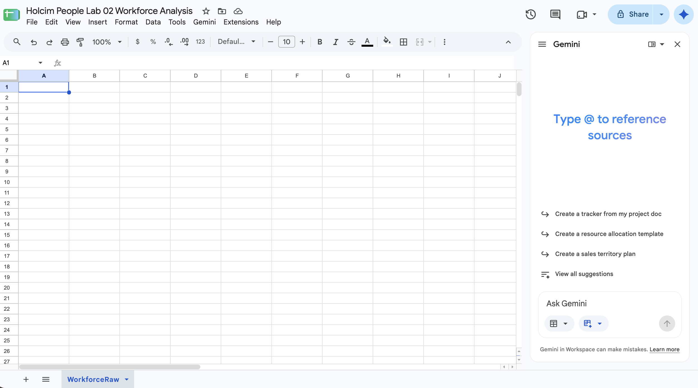
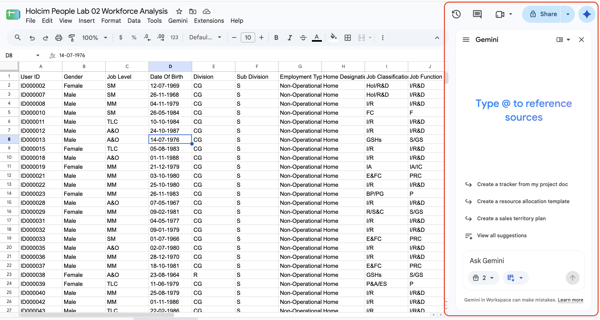
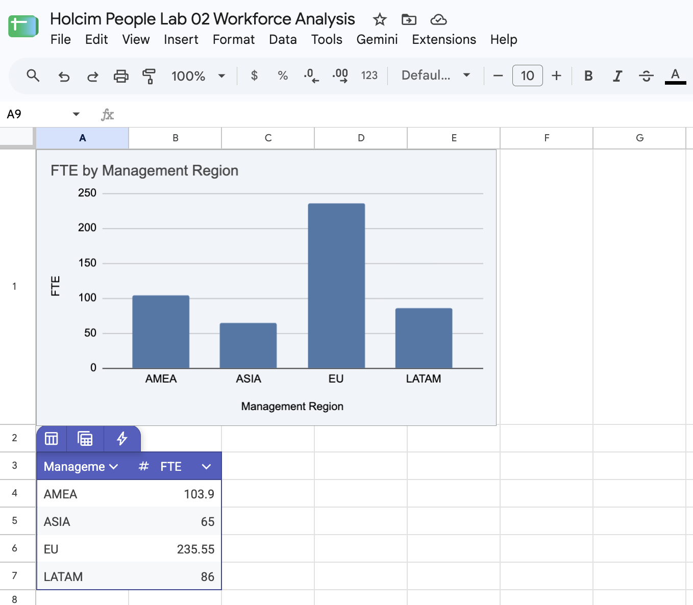
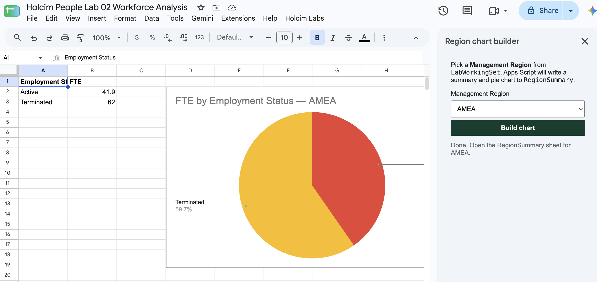

# Analyze Holcim Workforce Data with Sheets and Gemini

## Time Required

30 minutes

## Overview

In this lab, you will import a Holcim People workforce CSV into Google Sheets, use Gemini in Sheets to format and visualize the data, and build a small Apps Script sidebar that charts one region from your working set.

### You learn how to:

- Create a Google Sheet and import workforce CSV data from Google Drive.
- Use Gemini in Sheets to format a table, add header filters, apply conditional formatting, and insert a chart.
- Build a simple Apps Script menu and sidebar that charts one region from a working dataset.


## Scenario


Holcim’s People team received an anonymized workforce extract for training. The file is large (about 100,000 rows), so you will keep the full import for reference, create a smaller **LabWorkingSet** for AI-assisted analysis, and then ship a simple Apps Script chart builder so colleagues can summarize one region without writing formulas.

> [!NOTE]
> Gemini in Sheets works best on smaller, clean tables. Google documents more consistent Gemini performance on files below about 1 million cells. That is why this lab uses a working subset for Gemini and Apps Script.


## Lab Instructions


### Task 1: Create a Sheet and import the workforce CSV from Drive

In this task, you create a spreadsheet and load the shared Holcim workforce CSV from Google Drive.

1. Open [Google Sheets](https://sheets.google.com/) and sign in with the Google account your instructor provides.

2. Click **Blank spreadsheet**.

3. Rename the spreadsheet to `Holcim People Lab 02 Workforce Analysis`.

4. Rename the first tab from `Sheet1` to `WorkforceRaw`.



5. Open the shared CSV in Drive (confirm you can view it):

[https://drive.google.com/file/d/1ezcvB3UZD9calB087_P-HKNKsWgVeYpj/view](https://drive.google.com/file/d/1ezcvB3UZD9calB087_P-HKNKsWgVeYpj/view)

6. Return to your Sheet. Choose **File** | **Import**, and paste the Drive file link into the search box. Select the file and choose **Insert**. In the Import dialog set the following and click **Import data**.
  - Import location: **Replace current sheet**.
  - Separator type: **Detect automatically** (or **Comma**).
  - Convert text to numbers, dates, and formulas: **Checked**.

7. Confirm row 1 contains these headers (25 columns):

`User ID`, `Gender`, `Job Level`, `Date Of Birth`, `Division`, `Sub Division`, `Employment Type`, `Home Designation`, `Job Classification`, `Job Function`, `Employment Status`, `Date1`, `Date2`, `GRU Name`, `Management Region`, `Date3`, `Date4`, `Date5`, `Code1`, `Code2`, `Code3`, `Code4`, `Code5`, `Code6`, `FTE`

8. Freeze the header row: select row 1, then **View** | **Freeze** | **1 row**.

> [!IMPORTANT]
> Expect on the order of **~100,000 data rows**. Do not ask Gemini to rewrite or reformat the entire `WorkforceRaw` sheet in one prompt. Use the working subset in the next task.

9. To create a manageable analysis sheet, click **+** to add a sheet and rename it `LabWorkingSet`. In `LabWorkingSet!A1`, enter the following formula, and press Enter:

```text
={WorkforceRaw!A1:Y1; SORTN(FILTER(WorkforceRaw!A2:Y, WorkforceRaw!A2:A<>""), 500, 0, RANDARRAY(COUNTA(WorkforceRaw!A2:A)), TRUE)}
```

10. After the sample loads, select the entire `LabWorkingSet` data sheet with the button in the upper-left corner. Copy it, then **Paste special** → **Values only** into `A1`. This freezes the random sample so it does not reshuffle when the sheet recalculates.

> [!NOTE]
> The formula keeps the header row, then randomly samples **500** data rows from `WorkforceRaw`.

**Success criteria**

- `WorkforceRaw` contains the imported CSV with header row frozen.
- `LabWorkingSet` shows about 500 randomly sampled rows with the same header names (including mixed Employment Status values).


### Task 2: Format, filter, and chart with Gemini in Sheets

In this task, you use **Ask Gemini** in Sheets to turn `LabWorkingSet` into a clearer People analytics table with filters, conditional formatting, and a chart.

1. Open the `LabWorkingSet` sheet and select any cell inside the data.

2. At the top right, click **Ask Gemini** to open the side panel.



3. Ask Gemini to format the table. Paste:

```text
On LabWorkingSet, format the data as a clean table:
- Bold and freeze the header row if needed
- Autofit useful column widths for User ID, Gender, Job Level, Division, Employment Status, GRU Name, Management Region, and FTE
- Keep all existing columns
Do not delete rows.
```

4. Review Gemini’s proposal. Apply or insert the suggested formatting when it looks correct.

5. Add header filters with Gemini:

```text
On LabWorkingSet, turn on filters for the header row so I can filter Employment Status, Management Region, Gender, Job Level, and Division.
```

6. Manually verify filters: click a header filter arrow and confirm you can filter **Management Region** values such as `EU`, `LATAM`, and `AMEA`.

7. Add conditional formatting for employment status:

```text
On LabWorkingSet, apply conditional formatting to the rows based on the Employment Status column:
- Active = light green fill
- Terminated = light red fill
```

8. Create a chart with Gemini:

```text
Using LabWorkingSet, create an editable column chart that shows total FTE by Management Region.
Title the chart "FTE by Management Region".
Insert it into a new sheet.
```

9. Click **Insert** when Gemini previews the chart. Open the new chart sheet if Gemini creates one and confirm the chart is editable.




> [!TIP]
> If Gemini cannot act on the full working set, select a smaller visible range first, or ask: `Summarize FTE by Management Region in a new sheet named RegionSummary, then chart that summary.`

**Success criteria**

- `LabWorkingSet` has working column filters.
- Conditional formatting is visible on **Employment Status** for both Active and Terminated.
- You have at least one chart showing FTE by Management Region.


### Task 3: Build a simple Apps Script region chart builder

In this task, you add a small Apps Script project that shows the core pattern: a custom menu, an HTML sidebar, a server function that reads the sheet, and a chart written back to Sheets.

1. In your spreadsheet, open **Extensions** → **Apps Script**.

2. Rename the project to `Holcim Region Chart Builder`.

3. Replace any default `Code.gs` content with:

```javascript
/**
 * Holcim People Lab 02 — simple Apps Script demo
 * Custom menu + HTML sidebar + sheet read/write + chart
 */

var SOURCE_SHEET = 'LabWorkingSet';
var OUTPUT_SHEET = 'RegionSummary';

function onOpen() {
  SpreadsheetApp.getUi()
    .createMenu('Holcim Labs')
    .addItem('Open region chart builder', 'showSidebar')
    .addToUi();
}

function showSidebar() {
  var html = HtmlService.createHtmlOutputFromFile('Sidebar')
    .setTitle('Region chart builder')
    .setWidth(280);
  SpreadsheetApp.getUi().showSidebar(html);
}

/** Return sorted unique Management Region values from LabWorkingSet. */
function getRegions() {
  var sheet = SpreadsheetApp.getActive().getSheetByName(SOURCE_SHEET);
  if (!sheet) {
    throw new Error('Missing sheet: ' + SOURCE_SHEET);
  }
  var data = sheet.getDataRange().getDisplayValues();
  var regionCol = data[0].indexOf('Management Region');
  if (regionCol < 0) {
    throw new Error('Management Region column not found.');
  }
  var seen = {};
  for (var i = 1; i < data.length; i++) {
    var value = String(data[i][regionCol] || '').trim();
    if (value) {
      seen[value] = true;
    }
  }
  return Object.keys(seen).sort();
}

/**
 * Filter LabWorkingSet to one region, write FTE by Employment Status,
 * and insert a pie chart on RegionSummary.
 */
function buildRegionChart(region) {
  var ss = SpreadsheetApp.getActive();
  var source = ss.getSheetByName(SOURCE_SHEET);
  if (!source) {
    throw new Error('Missing sheet: ' + SOURCE_SHEET);
  }

  var data = source.getDataRange().getDisplayValues();
  var headers = data[0];
  var regionCol = headers.indexOf('Management Region');
  var statusCol = headers.indexOf('Employment Status');
  var fteCol = headers.indexOf('FTE');

  var totals = {};
  for (var i = 1; i < data.length; i++) {
    if (String(data[i][regionCol] || '').trim() !== region) {
      continue;
    }
    var status = String(data[i][statusCol] || 'Unknown').trim() || 'Unknown';
    var fte = Number(data[i][fteCol]);
    if (isNaN(fte)) {
      fte = 1;
    }
    totals[status] = (totals[status] || 0) + fte;
  }

  var out = ss.getSheetByName(OUTPUT_SHEET);
  if (!out) {
    out = ss.insertSheet(OUTPUT_SHEET);
  }
  out.clear();
  out.getCharts().forEach(function (chart) {
    out.removeChart(chart);
  });

  var rows = [['Employment Status', 'FTE']];
  Object.keys(totals).sort().forEach(function (status) {
    rows.push([status, totals[status]]);
  });
  out.getRange(1, 1, rows.length, 2).setValues(rows);
  out.getRange(1, 1, 1, 2).setFontWeight('bold');

  if (rows.length > 1) {
    var chart = out.newChart()
      .setChartType(Charts.ChartType.PIE)
      .addRange(out.getRange(1, 1, rows.length, 2))
      .setOption('title', 'FTE by Employment Status — ' + region)
      .setPosition(2, 4, 0, 0)
      .build();
    out.insertChart(chart);
  }

  return {
    region: region,
    categories: rows.length - 1
  };
}
```

4. In Apps Script, click **+** next to **Files** → **HTML**. Name the file `Sidebar` (Apps Script adds `.html`). Replace the default contents with:

```html
<!DOCTYPE html>
<html>
  <head>
    <base target="_top" />
    <style>
      body { font-family: Arial, sans-serif; font-size: 13px; margin: 12px; color: #202124; }
      select, button { width: 100%; margin-top: 6px; padding: 8px; box-sizing: border-box; }
      button { background: #0b3d2e; color: #fff; border: 0; font-weight: 600; cursor: pointer; }
      #msg { margin-top: 12px; color: #5f6368; }
      .error { color: #b3261e; }
    </style>
  </head>
  <body>
    <p>Pick a <strong>Management Region</strong> from <code>LabWorkingSet</code>. Apps Script will write a summary and pie chart to <code>RegionSummary</code>.</p>

    <label for="region">Management Region</label>
    <select id="region"></select>
    <button onclick="buildChart()">Build chart</button>
    <div id="msg">Loading regions…</div>

    <script>
      function setMsg(text, isError) {
        var el = document.getElementById('msg');
        el.className = isError ? 'error' : '';
        el.textContent = text;
      }

      google.script.run
        .withSuccessHandler(function (regions) {
          var select = document.getElementById('region');
          regions.forEach(function (region) {
            var option = document.createElement('option');
            option.value = region;
            option.textContent = region;
            select.appendChild(option);
          });
          setMsg('Ready.');
        })
        .withFailureHandler(function (err) {
          setMsg(err.message || String(err), true);
        })
        .getRegions();

      function buildChart() {
        var region = document.getElementById('region').value;
        setMsg('Building chart for ' + region + '…');
        google.script.run
          .withSuccessHandler(function (result) {
            setMsg('Done. Open the RegionSummary sheet for ' + result.region + '.');
          })
          .withFailureHandler(function (err) {
            setMsg(err.message || String(err), true);
          })
          .buildRegionChart(region);
      }
    </script>
  </body>
</html>
```

5. Save the project (**Ctrl/Cmd + S**).

6. Return to the spreadsheet and reload the browser tab.

7. Choose **Holcim Labs** → **Open region chart builder**.

> [!NOTE]
> The first run asks you to authorize the script. Review the permissions, choose your lab Google account, and allow access to the spreadsheet.



8. In the sidebar, choose the Management Region `AMEA`, and then click **Build chart**. Open the `RegionSummary` sheet and confirm a status table and pie chart appear.

9. Run it again with a different region, and confirm `RegionSummary` refreshes.

> [!IMPORTANT]
> Use `LabWorkingSet`, not `WorkforceRaw`. The demo is meant to stay fast on the smaller sample.

**What this demo teaches**


| Piece               | What it does                                        |
| ------------------- | --------------------------------------------------- |
| `onOpen`            | Adds the **Holcim Labs** menu when the Sheet opens  |
| `Sidebar.html`      | Simple HTML UI in a sidebar                         |
| `google.script.run` | Lets the sidebar call functions in `Code.gs`        |
| `buildRegionChart`  | Reads sheet data, writes a summary, inserts a chart |


**Success criteria**

- The **Holcim Labs** menu opens the sidebar.
- Choosing a region builds or refreshes `RegionSummary` with a pie chart.


### Bonus Task 4: Ask Gemini for People insights on your explorer output

With fewer step-by-step hints, use Gemini on `RegionSummary` or your earlier region chart sheet.

1. Ask Gemini a People-team question grounded in the sheet, for example:

```text
Using RegionSummary, summarize what this region chart implies for People planning.
Give 3 short talking points a People Business Partner could share.
Do not invent columns that are not in the sheet.
```

2. Optional: ask Gemini to create a pivot table of FTE by Management Region and Job Level from `LabWorkingSet`.

3. Optional stretch: add an Employment Status dropdown to `Sidebar.html` and filter on it inside `buildRegionChart` in `Code.gs`.


## Congratulations!

In this lab, you have:

- Created a Google Sheet and imported workforce CSV data from Google Drive.
- Used Gemini in Sheets to format a table, add header filters, apply conditional formatting, and insert a chart.
- Built a simple Apps Script menu and sidebar that charts one region from a working dataset.

