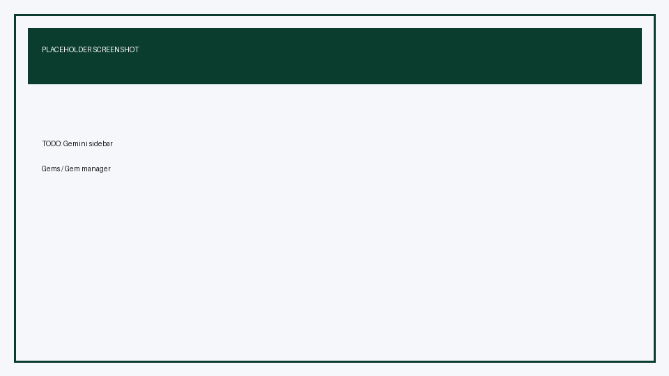
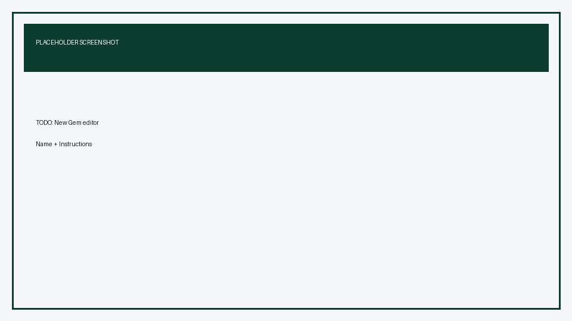
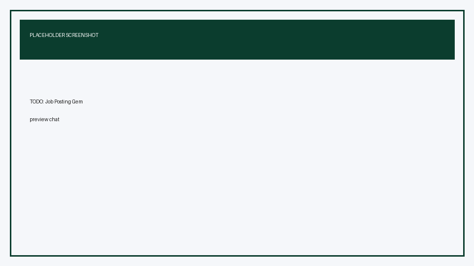
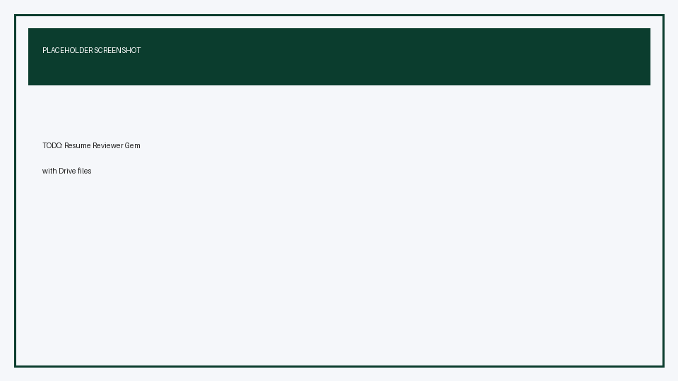
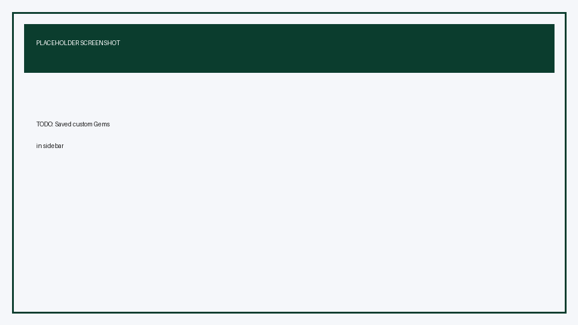

# Create Reusable Holcim People Prompts with Gemini Gems

## Time Required

30 minutes

## Overview

In this lab, you will turn the Lab 1 job-posting and resume-reviewer prompt patterns into two reusable **Gemini Gems**. You open Gemini, expand the sidebar, open Gems, create each Gem with durable instructions, preview it, save it, and run a short real request so Holcim People teammates can reuse the same quality without rebuilding prompts from scratch.

### You learn how to:
- Open Gemini Gems from the sidebar and create a new custom Gem.
- Package the Lab 1 job-posting Role, Task, Steps, and Examples pattern into a reusable Gem.
- Package the Lab 1 resume-reviewer schema into a second Gem and test it with Drive resumes.

## Scenario

In Lab 1, you improved prompts turn by turn. That works once—but People partners should not retype Role, Task, Steps, Examples, and Markdown schemas every time they write a posting or screen a CV. Gems store those instructions so anyone on the team can start a chat that already behaves like your best Lab 1 prompt.

> [!NOTE]
> This lab builds on [Lab 1: Prompt Engineering Mastery](../lab-01-prompt-engineering-mastery/lab.md). If you skipped Lab 1, you can still complete this lab by pasting the Gem instructions provided here.

## Lab Instructions

### Task 1: Open Gemini Gems and create the Job Posting Gem

In this task, you open the Gems manager and create **Holcim Job Posting Writer**, using the Lab 1 job-posting prompt pattern as Gem instructions.

1. Open [https://gemini.google.com/](https://gemini.google.com/) and sign in with the Google account your instructor provides.

2. Expand the left sidebar if it is collapsed (menu / **Open sidebar**).

3. In the sidebar, select **Gems** (you may also see **Gem manager** or **Explore Gems**, depending on your account UI).

<!-- TODO IMAGE: Gemini left sidebar with Gems / Gem manager selected -->


4. Click **New Gem**.

5. Set the Gem **Name** to:

```text
Holcim Job Posting Writer
```

6. In **Instructions**, paste the following (this consolidates Lab 1 Role, Task, Steps, and Examples into one reusable Gem):

```text
Persona:
You are an experienced Holcim People (HR) communications partner. You write clear, inclusive job postings for industrial and corporate roles in sustainable construction. Your tone is professional, warm, and plain language. You sound purpose-driven and people-centered, and you write for both plant and office audiences.

Task:
When the user asks for a job posting, produce a complete Holcim job posting for the role and region they specify. If they omit details, ask up to 3 short clarifying questions, then continue with reasonable Holcim defaults.

Always emphasize:
- Health and safety
- Talent development
- Partnership with plant or business leadership when relevant
- Holcim’s sustainable construction mission

Constraints:
- Do not invent salary numbers, fake benefits, or fake legal policies
- Do not invent plant names or locations the user did not provide
- Keep the final posting about 400–500 words unless the user requests otherwise
- Prefer Holcim regions when location is discussed: Europe; Latin America; Asia, Middle East and Africa

Process (follow these steps every time):
1. List the top 5 outcomes this role must deliver in the first year.
2. List must-have vs nice-to-have qualifications.
3. Write the full job posting using this structure:
   - About Holcim (2–3 sentences)
   - The role
   - What you will do
   - What you bring
   - Why join Holcim People
Show the intermediate lists briefly, then the final posting.

Writing quality example for "What you will do" bullets:
- Good: "Partner with the Plant Director to run quarterly talent reviews and build succession plans for critical production roles."
- Weak: "Responsible for various HR duties and supporting the business."
Write strong, specific bullets in the good style.
```

<!-- TODO IMAGE: New Gem editor with name and instructions filled -->


7. Optional: click **Use Gemini to re-write instructions** (wand / rewrite control) if you want a polished expansion, then edit anything that drifts from Holcim People needs.

8. In the **Preview** panel on the right, test with:

```text
Create a job posting for HR Business Partner — Plant Support (Europe). Audience: 5+ years HR experience.
```

9. Check that the preview includes the intermediate lists and the structured posting sections.

10. Click **Save**.

<!-- TODO IMAGE: Preview response from Holcim Job Posting Writer Gem -->


> [!IMPORTANT]
> Previewing does not save the Gem. Click **Save** after you are happy with the preview.

**Success criteria**

- **Holcim Job Posting Writer** appears in your Gems list.
- A preview run produces Holcim-flavored structure without invented salaries.

### Task 2: Create the Resume Reviewer Gem and test it with Drive resumes

In this task, you create **Holcim Resume Reviewer** from the Lab 1 screening schema, then chat with the Gem using synthetic resumes from Drive.

1. From the Gems area, click **New Gem** again.

2. Set the Gem **Name** to:

```text
Holcim Resume Reviewer
```

3. In **Instructions**, paste:

```text
Persona:
You are a Holcim Talent Acquisition specialist doing a careful first-pass screen for People and Operations roles. You are evidence-based and never invent missing resume facts.

Task:
Review each resume the user attaches or pastes. Return ONLY valid Markdown. No preamble before the first candidate heading.

For each candidate, output exactly this shape:

## Candidate: <Full Name>
- **Email:** <email>
- **Ideal job role:** <one Holcim-relevant role>
- **Region:** <Europe | Latin America | Asia, Middle East and Africa>
- **Rank:** <Exceptional | Experienced | Entry-Level>
- **Rationale:** <2 short sentences>

Rules:
- Ideal job role must be plausible for Holcim (examples: HR Business Partner, Plant People Director, Plant Manager, Health and Safety Coordinator, Sustainability Manager, Talent Acquisition Specialist, Learning and Development Specialist, Cement Process Engineer, Sales Manager — Building Solutions, Logistics Specialist).
- Region must be one of Holcim’s three regions based on location and mobility clues. If unclear, choose the best fit and explain in the rationale.
- Rank definitions:
  - Exceptional: deep expertise and leadership impact clearly evidenced
  - Experienced: solid professional track record, ready for mid/senior individual contributor or manager roles
  - Entry-Level: early career or light industry experience
- If a field is missing, write `Not found` rather than inventing it.
- These lab resumes may be synthetic training files. Still treat the text as the only evidence source.

Process for each resume:
1. Extract name and email exactly as written.
2. Infer the single best Holcim role from experience and skills.
3. Map location to a Holcim region.
4. Assign Rank using the definitions above.
5. Write a cautious rationale (evidence only).

Example of good formatting:

## Candidate: Alex Example
- **Email:** alex.example@example.com
- **Ideal job role:** Health and Safety Coordinator
- **Region:** Europe
- **Rank:** Experienced
- **Rationale:** Led multi-site safety programs for five years. Clear industrial health and safety evidence without claiming executive scope.

If the user attaches multiple resumes, output one Markdown block per candidate. If they ask for a summary table, add it AFTER all candidate blocks with columns:
Candidate name | Email | Ideal job role | Region | Rank
Sort by Rank in this order: Exceptional, Experienced, Entry-Level.
```

4. Optional Knowledge: under **Knowledge** / **Add files**, you may add 1–2 synthetic resumes from Drive as reference examples. This is optional; testers can still attach resumes in the chat.

5. Preview with a short text-only check first:

```text
I will attach resumes next. Confirm you will use only the required Markdown schema and Holcim regions.
```

6. Click **Save**.

7. Start a chat with **Holcim Resume Reviewer** from your Gems list (select the Gem, then open a new chat with it).

8. Add two synthetic resumes with **Upload and tools** → **Drive** (**Add from Drive**) from the public lab folder:

[https://drive.google.com/drive/folders/1DjfQAg4Q7WhfPQOC7YiJLvtxcKTyZuAC](https://drive.google.com/drive/folders/1DjfQAg4Q7WhfPQOC7YiJLvtxcKTyZuAC)

Use for example `03-sofia-ramos.pdf` and `08-chen-wei.pdf`. If they do not appear under **Recent**, search for `sofia` or `chen`.

9. Send:

```text
Review the attached resumes using your standard schema.
```

10. Confirm each candidate block includes name, email, ideal job role, Holcim region, and rank (`Exceptional`, `Experienced`, or `Entry-Level` only).

<!-- TODO IMAGE: Resume Reviewer Gem chat with Drive resumes and Markdown output -->


> [!WARNING]
> Use only the synthetic lab resumes. Do not add confidential Holcim employee or applicant files to a Gem or chat during class.

**Success criteria**

- **Holcim Resume Reviewer** is saved.
- A Gem chat returns the structured Markdown schema for at least two Drive resumes.

### Task 3: Reuse both Gems from the sidebar like a teammate would

In this task, you confirm both Gems are easy to find and run a second request on each without editing instructions.

1. Expand the Gemini sidebar and open **Gems** again.

2. Confirm both custom Gems are listed:

   - `Holcim Job Posting Writer`
   - `Holcim Resume Reviewer`

<!-- TODO IMAGE: Sidebar list showing both saved Holcim Gems -->


3. Open **Holcim Job Posting Writer** and send a new request (do not rebuild instructions):

```text
Write a posting for Learning and Development Specialist supporting plant supervisors in Latin America.
```

4. Open **Holcim Resume Reviewer**, attach one different resume from Drive (for example `09-fatima-elhassan.pdf`), and send:

```text
Review this resume with your standard schema only.
```

5. Briefly compare: notice you did not re-enter Role, Task, Steps, Examples, or the Markdown schema—the Gem carried them.

**Success criteria**

- Both Gems are visible in the sidebar Gems list.
- Each Gem produces on-brand output from a short user request only.

### Bonus Task 4: Improve one Gem with Knowledge or tighter instructions

With fewer step-by-step hints, harden one Gem for team handoff.

1. Edit either Gem and add a short **Do / Do not** section (for example: do not invent benefits; do not use regions outside Holcim’s three regions).

2. Optional: add a one-page style note or sample posting to **Knowledge** for the Job Posting Gem.

3. Optional: ask the Job Posting Gem:

```text
After the posting, also give me 5 interview questions aligned to the must-have qualifications.
```

   If the answer is useful, decide whether that behavior should become part of the saved Gem instructions.

## Congratulations!

In this lab, you have:
- Opened Gemini Gems from the sidebar and created a new custom Gem.
- Packaged the Lab 1 job-posting Role, Task, Steps, and Examples pattern into a reusable Gem.
- Packaged the Lab 1 resume-reviewer schema into a second Gem and tested it with Drive resumes.
