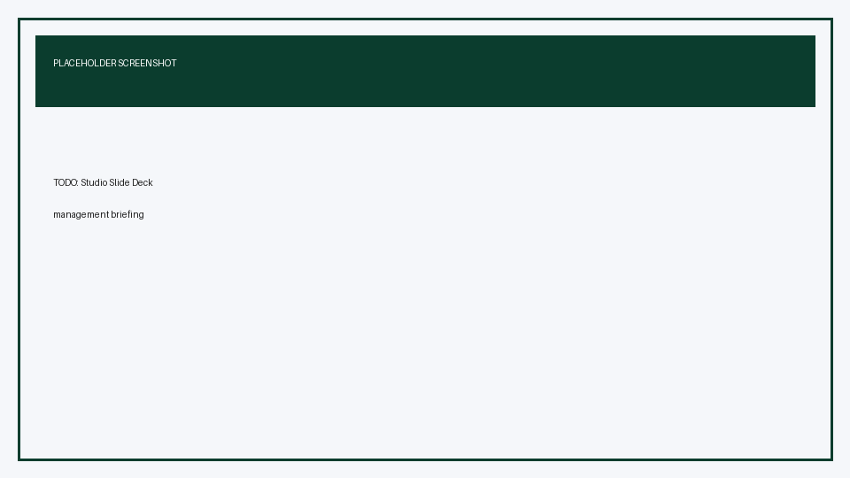

# Prepare Holcim Labor Availability Briefings with Gemini Notebook

## Time Required

45 minutes

## Overview

In this lab, you will build a Gemini Notebook (NotebookLM) research pack for a Holcim People leadership meeting on labor availability. You add synthetic HR guidelines and workforce snapshot sources by copy-paste, research EMEA and South America labor markets with web sources, ask chat questions to prepare talking points and likely gotcha questions, then use Studio to generate a one-page infographic executive summary and a slide deck.

### You learn how to:
- Create a Gemini Notebook and add Holcim People sources with Copied text.
- Research EMEA and South America labor markets using web sources.
- Ask grounded questions to prepare talking points and anticipate tough meeting questions.
- Generate a Studio infographic executive summary and a management slide deck.

## Scenario

You are a Holcim People Business Partner preparing a 30-minute management meeting on **labor availability** across Europe and South America priority markets. Leaders want to know where vacancies are hurting operations, what the external labor market looks like, and what decisions they must make this quarter.

You have two internal synthetic packs (HR staffing guidelines and a labor availability snapshot). You will combine them with public web research in Gemini Notebook, stress-test your narrative in chat, then produce meeting-ready Studio outputs.

> [!NOTE]
> Gemini Notebook is available at [https://notebooklm.google.com/](https://notebooklm.google.com/). Some accounts label the product **NotebookLM**. Use the same site either way.

> [!WARNING]
> The Holcim figures in this lab are **synthetic training data**. Do not treat them as real Holcim workforce statistics, and do not upload confidential employee files.

## Lab Instructions

### Task 1: Create a notebook and add Holcim HR guidelines as Copied text

In this task, you create the notebook and load Holcim People guidance that will ground every later answer.

1. Open [https://notebooklm.google.com/](https://notebooklm.google.com/) and sign in with the Google account your instructor provides.

2. On the home page, create a **New notebook**.

<!-- TODO IMAGE: Gemini Notebook home with New notebook control -->


3. Rename the notebook to:

```text
Holcim People — Labor Availability Briefing (EU and South America)
```

4. When **Add sources** opens, choose **Copied text** (wording may appear as **Paste text** / **Copied text** depending on UI).

5. Title the source:

```text
Holcim HR Staffing Guidelines (Synthetic)
```

6. Paste the full contents of this lab asset into the text box:

```text
labs/people/lab-04-labor-market-briefings-with-gemini-notebook/assets/holcim-hr-staffing-guidelines-synthetic.md
```

   Open that file in your editor, copy everything, and paste it into Gemini Notebook. Then insert / add the source.

<!-- TODO IMAGE: Add Copied text dialog with Holcim HR Guidelines -->


7. Add a second **Copied text** source titled:

```text
Holcim Labor Availability Snapshot Q2 (Synthetic)
```

8. Paste the full contents of:

```text
labs/people/lab-04-labor-market-briefings-with-gemini-notebook/assets/holcim-labor-availability-snapshot-synthetic.md
```

9. Wait until both sources appear as ready in the **Sources** panel.

> [!NOTE]
> Gemini indexes each source before chat quality improves. Keep both internal sources selected (checked) for the rest of the lab unless a step says otherwise.

**Success criteria**

- Notebook title is set.
- Two synthetic Holcim People sources are listed and ready.

### Task 2: Research EMEA and South America labor markets with web sources

In this task, you add public web sources so the notebook can compare Holcim’s internal snapshot with external labor market signals for EMEA and South America.

1. Click **Add sources** again.

2. Choose the **Web** / **Websites** option (label varies by account).

3. Add web research for **EMEA / Europe** labor markets. Prefer reputable public sources such as statistical agencies, ILO, OECD, World Bank, or major business press explainers. Use Notebook’s web finder or paste URLs you trust. Suggested search themes:

```text
Europe labor market shortage skilled trades manufacturing 2025 2026
EU employment construction building materials workforce shortage
EMEA industrial technician hiring trends
```

4. Add at least **two** Europe/EMEA-oriented web sources related to employment, skills shortages, or construction/industrial hiring.

5. Add web research for **South America / Latin America** labor markets using themes such as:

```text
South America labor market Brazil Colombia Chile Argentina employment 2025 2026
Latin America construction workforce shortage ready mix infrastructure
South America skilled trades vacancy manufacturing
```

6. Add at least **two** South America or broader Latin America web sources on employment or skills availability.

<!-- TODO IMAGE: Sources panel with copied Holcim docs plus web sources -->


7. In chat, ask Gemini Notebook to reconcile internal and external views:

```text
Using only the selected sources, summarize the strongest external labor market signals for (1) Europe/EMEA and (2) South America that help explain Holcim’s synthetic vacancy and time-to-fill pressures.
For each region, list 3 bullets and cite the sources.
Do not invent Holcim statistics that are not in the synthetic snapshot.
```

8. Skim the citations. If a claim looks weak, click the citation and confirm it maps to a real passage.

> [!IMPORTANT]
> Keep the synthetic Holcim snapshot as the source of truth for Holcim numbers. Use web sources for external context only.

**Success criteria**

- At least four web sources are in the notebook (two Europe/EMEA, two South America/LATAM-focused).
- A cited chat answer compares external signals to Holcim’s synthetic pressures.

### Task 3: Prepare for the management meeting in chat

In this task, you use chat to draft key talking points and anticipate tough questions before you generate Studio outputs.

1. Ensure all Holcim synthetic sources and your web sources are selected.

2. Generate **key talking points** for the meeting opener:

```text
Prepare key talking points for a 30-minute Holcim People leadership meeting on labor availability.
Audience: Regional People leaders and operations stakeholders for Europe and South America.
Structure:
1) Situation (what is happening in our synthetic snapshot)
2) External market context (EMEA and South America web signals)
3) Risks to safety, production, and cost if we wait
4) The four asks in the synthetic snapshot, ranked by urgency
Keep it concise and suitable to speak aloud. Cite sources.
```

3. Save useful output to a note if your UI offers **Save to note**.

4. Ask for **gotcha questions** leaders or finance partners might raise:

```text
Based on the Holcim synthetic guidelines and snapshot plus the web sources, list 8 gotcha questions people might ask in this meeting.
For each question, provide:
- Why it is likely to come up
- A short evidence-based answer grounded in the sources
- What to say if the sources do not fully answer it (do not invent data)
Cover challenges on contractor percentage, time-to-fill, internal mobility, and whether Europe or South America should get priority funding.
```

5. Pressure-test one recommendation:

```text
If leadership can fund only one of the four asks this quarter, which should it be and why?
Give a clear recommendation, two supporting points from the synthetic snapshot, and one supporting point from the web sources.
Then give the strongest counter-argument someone might raise.
```

6. Optional follow-up to tighten your narrative:

```text
Rewrite my recommendation as a 60-second verbal opener for the meeting, with no jargon.
```

<!-- TODO IMAGE: Chat panel showing talking points and gotcha Q and A -->


> [!TIP]
> If an answer drifts into generic HR advice, reply: `Stay grounded in the notebook sources. If a detail is missing, say what is missing.`

**Success criteria**

- You have spoken-ready talking points covering situation, market, risks, and asks.
- You have a gotcha list with source-aware answers.

### Task 4: Create a one-page executive summary infographic and a slide deck in Studio

In this task, you use the **Studio** panel to produce meeting artifacts: a one-page infographic executive summary and a slide deck.

1. Open the **Studio** panel on the right side of the notebook.

2. Generate an **Infographic** as your one-page executive summary:

   1. Select **Infographic** (use customize / pencil if shown).
   2. Prefer a **portrait** one-page layout if orientation options appear.
   3. Paste this custom instruction, then generate:

```text
Create a one-page executive summary infographic for Holcim People leaders titled "Labor Availability: Europe and South America".
Include:
- Headline risk in one sentence
- Side-by-side comparison of Europe vs South America focus cluster using only synthetic snapshot metrics (vacancy rate, contractor %, time-to-fill)
- Top 3 hard-to-fill role families
- Four decision asks as compact callouts
- One strip of external market context labeled as web-sourced (no fake Holcim numbers)
Style: clean corporate, deep forest green and sand accents, high readability for printing one page.
Do not invent statistics.
```

3. While the infographic generates (it can take a few minutes), start the **Slide Deck** so you are not blocked:

   1. In Studio, open **Slide Deck** customize options.
   2. Choose **Presenter Slides** if available (visual slides for speaking).
   3. Paste:

```text
Create a Holcim People leadership slide deck for a labor availability meeting.
Audience: Regional People and operations leaders.
Slide flow:
1) Meeting objective
2) Synthetic snapshot: Europe vs South America
3) Critical roles under pressure
4) External labor market signals (EMEA and South America)
5) Risks if we do nothing
6) Four asks with tradeoffs
7) Recommended sequencing if funding is limited
8) Proposed next steps and owners
Tone: confident, factual, safety-aware. Keep text concise for presenting.
Use only notebook sources. Do not invent Holcim metrics.
```

   4. Click **Generate**.

> [!WARNING]
> Studio generation can take several minutes. You can keep working in chat. Outputs usually appear in Studio / Outputs when ready.

<!-- TODO IMAGE: Studio Infographic one-page executive summary -->


<!-- TODO IMAGE: Studio Slide Deck for management briefing -->


4. When the infographic is ready, review it:

   - Holcim metrics match the synthetic snapshot (spot-check vacancy rates and contractor %)
   - External context is clearly separated from internal synthetic data
   - It is readable as a single printed page

5. When the slide deck is ready, open it and click **Start slideshow** if available. Check that the ask slides match the four asks in the snapshot.

6. Optional: download the deck (PDF or PowerPoint) and the infographic for your meeting pack using the Studio overflow menu.

**Success criteria**

- Infographic reads as a one-page executive summary with Europe vs South America contrast.
- Slide deck covers snapshot, market context, risks, asks, and next steps.
- Spot-checks show no invented Holcim statistics.

### Bonus Task 5: Rehearse the meeting with Studio and chat together

With fewer step-by-step hints, harden your meeting prep.

1. Ask chat:

```text
Using the slide deck outline you would expect from my Studio prompt, write speaker notes for slides 2, 4, and 6 only.
Each note should be under 80 words and cite whether the point comes from the synthetic snapshot, guidelines, or web sources.
```

2. Optional: generate a short **Report** in Studio titled for email follow-up after the meeting, or regenerate the infographic for a finance audience with stronger cost/risk emphasis.

3. Optional: add one more web source that challenges your recommendation, then ask:

```text
Does the new source change the priority ask? Answer yes or no, then explain in 5 bullets.
```

## Congratulations!

In this lab, you have:
- Created a Gemini Notebook and added Holcim People sources with Copied text.
- Researched EMEA and South America labor markets using web sources.
- Asked grounded questions to prepare talking points and anticipate tough meeting questions.
- Generated a Studio infographic executive summary and a management slide deck.
