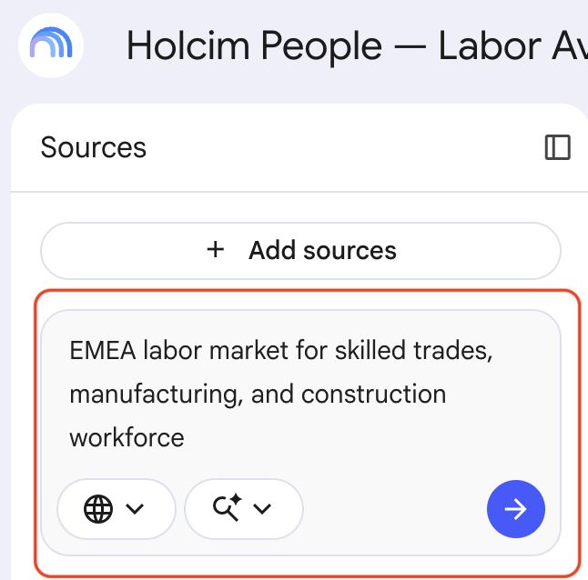
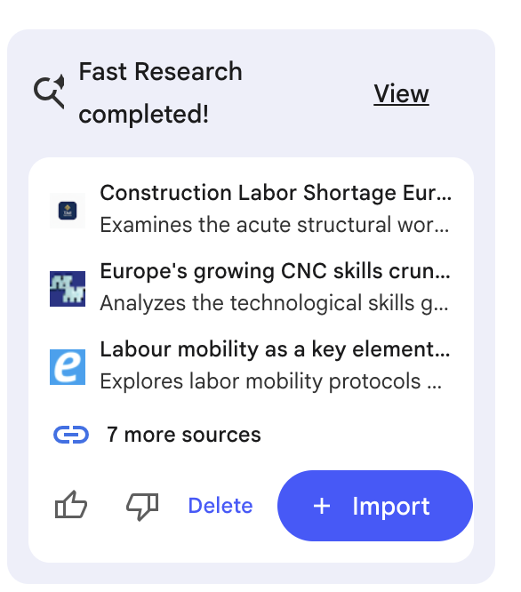
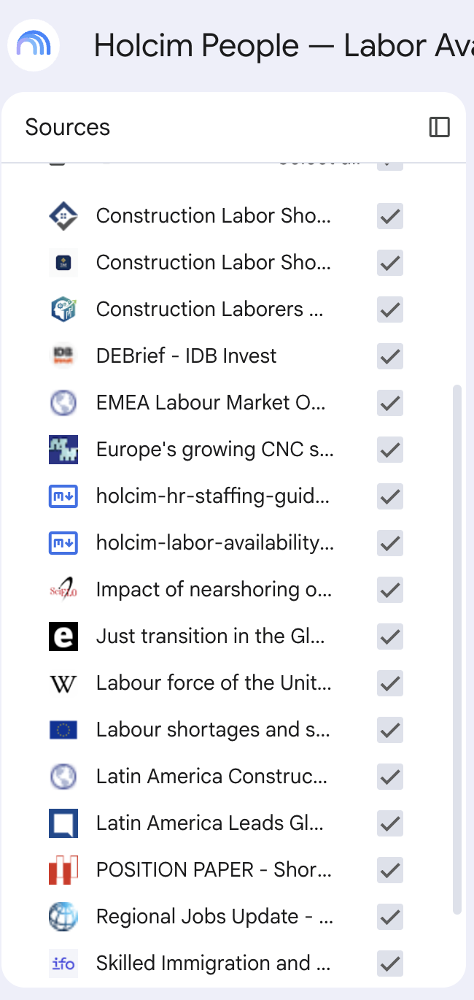
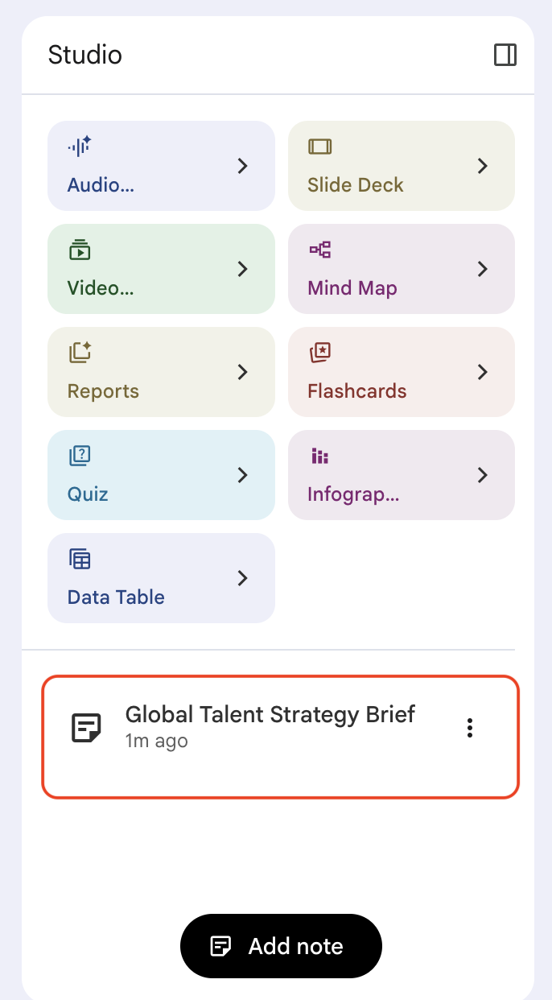
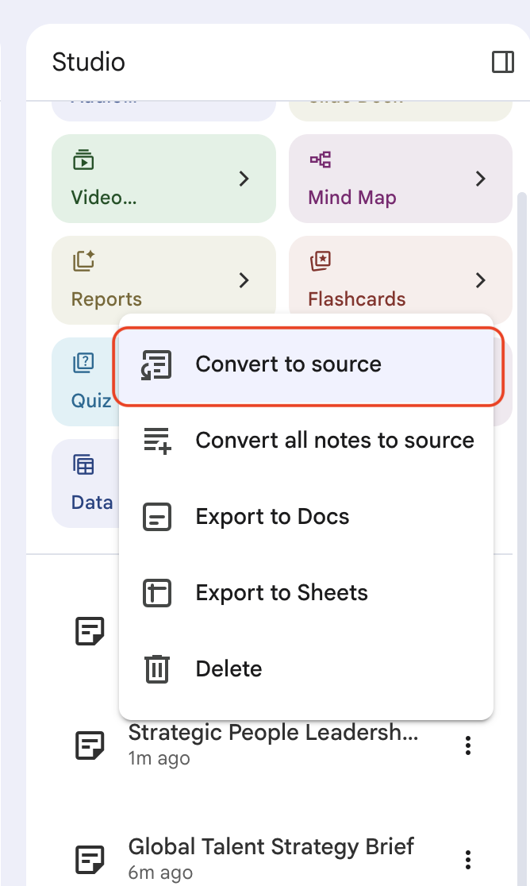
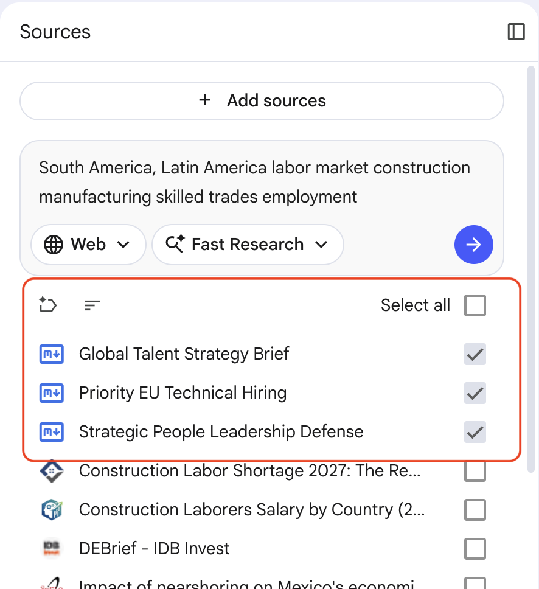
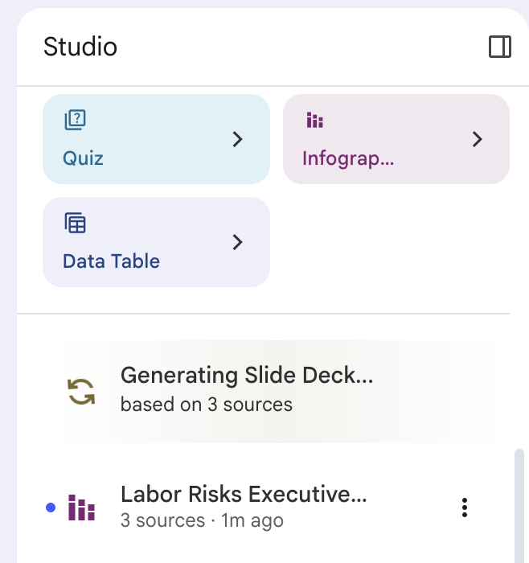
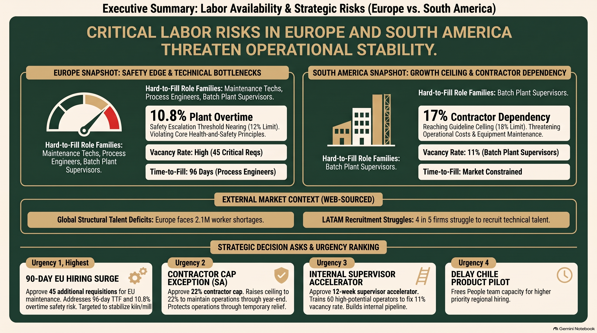

# Prepare Holcim Labor Availability Briefings with Gemini Notebook

## Time Required

30 minutes

## Overview

In this lab, you will build a Gemini Notebook (NotebookLM) research pack for a Holcim People leadership meeting on labor availability. You add synthetic HR guidelines and workforce snapshot sources by copy-paste, research EMEA and South America labor markets with web sources, ask chat questions to prepare talking points and likely gotcha questions, then use Studio to generate a one-page infographic executive summary and a slide deck.

### You learn how to:
- Create a Gemini Notebook and add Holcim People sources.
- Research EMEA and South America labor markets using web sources.
- Ask grounded questions to prepare talking points and anticipate tough meeting questions.
- Generate a Studio infographic executive summary and a slide deck.

## Scenario


You are a Holcim People Business Partner preparing a 30-minute management meeting on **labor availability** across Europe and South America priority markets. Leaders want to know where vacancies are hurting operations, what the external labor market looks like, and what decisions they must make this quarter.

You have two internal synthetic packs (HR staffing guidelines and a labor availability snapshot). You will combine them with public web research in Gemini Notebook, stress-test your narrative in chat, then produce meeting-ready Studio outputs.


## Lab Instructions

### Task 1: Create a notebook and add Holcim HR guidelines as Copied text

In this task, you create the notebook and load Holcim People guidance that will ground every later answer.

1. Open [https://notebooklm.google.com/](https://notebooklm.google.com/) and sign in with your account.

2. On the home page, create a **New notebook**.


3. Rename the notebook to:

```text
Holcim People — Labor Availability Briefing
```

4. Click **Add sources**, and choose **Drive**. Enter the following URL in the Search box, drill into the folder and add both files. 

```
https://drive.google.com/drive/folders/1fc6YBkUAiKz973jy0DJYEBSwb8Vuhq-v?usp=drive_link
```

5. Wait until both sources appear as ready in the **Sources** panel.


### Task 2: Research EMEA and South America labor markets with web sources

In this task, you use Gemini Notebook’s **Search for Web Sources** feature to pull public labor market context for the two regions in your briefing.

1. In the **Search the Web for new sources** tool, enter the following search and run it. 

```text
EMEA labor market for skilled trades, manufacturing, and construction workforce
```



2. Review the results, and selct __Import__ to add them to your notebook.



3. Run a second search for South America and add the results as you jsut did. 

```text
South America, Latin America labor market construction manufacturing skilled trades employment
```

4. Confirm the **Sources** panel now includes your Holcim Drive files plus web sources from both regional searches.




### Task 3: Prepare for the management meeting in chat

In this task, you use chat to draft key talking points and anticipate tough questions before you generate Studio outputs.

1. Ensure all Holcim sources and your web sources are selected.

2. In the Chat in the middle of the page, ask the following to generate **key talking points** for the meeting opener:

```text
Prepare key talking points for a 30-minute Holcim People leadership meeting on labor availability.
Audience: Regional People leaders and operations stakeholders for Europe and South America.
Structure:
1) Situation (what is happening in our synthetic snapshot)
2) External market context (EMEA and South America web signals)
3) Risks to safety, production, and cost if we wait
4) The four asks in the synthetic snapshot, ranked by urgency
Keep it concise and suitable to speak aloud. Cite sources.
```

3. Examine the results, then  click the **Save to note** icon (_the push pin icon_) to save the output in the __Gemini Notebook Studio__ on the right. 





4. Ask for **gotcha questions** leaders or finance partners might raise:

```text
List 6 gotcha questions people might ask in this meeting.
For each question, provide:
- Why it is likely to come up
- A short evidence-based answer grounded in the sources
- What to say if the sources do not fully answer it (do not invent data)
Cover challenges on contractor percentage, time-to-fill, internal mobility, and whether Europe or South America should get priority funding.
```

5. Examine the results, and also save this as a note. 

6. Ask for a recommendation for the executives at your meeting. As before, save the results as a note.  

```text
If leadership can fund only one of the four asks this quarter, which should it be and why?
Give a clear recommendation, two supporting points from the synthetic snapshot, and one supporting point from the web sources.
Then give the strongest counter-argument someone might raise.
```

### Task 4: Create a one-page executive summary infographic and a slide deck in Studio

In this task, you use the **Studio** panel to produce meeting artifacts: a one-page infographic executive summary and a slide deck.

1. In the **Studio** panel on the right side of the notebook, select the action menu to the right of each note, and convert them to sources. 



2. In the sources windows, deselect all selected sources. Then, sort by __Recent__, and select only the sources that were from your notes. 




3. Select the arrow (>) on the right of the **Infographic** card in the __Studio__. In the description, enter the following, and the click __Generate__. 

```text
Create a one-page executive summary infographic for Holcim People leaders titled "Labor Availability: Europe and South America".
Include:
- Headline risk in one sentence
- Side-by-side comparison of Europe vs South America focus cluster using only synthetic snapshot metrics (vacancy rate, contractor %, time-to-fill)
- Top 3 hard-to-fill role families
- Four decision asks as compact callouts
- One strip of external market context labeled as web-sourced (no fake Holcim numbers)
Style: clean corporate, deep forest green and sand accents, high readability for printing one page.
Do not invent statistics.
```

4. While the infographic generates (_it can take a few minutes_), you can create a **Slide Deck** for your upcoming meeting. 

  In Studio, open **Slide Deck** customize options by clicking the arrow icon. Choose **Presenter Slides**, and add the following description, and click __Generate__. 

```text
Create a Holcim People leadership slide deck for a labor availability meeting.
Audience: Regional People and operations leaders.
Slide flow:
1) Meeting objective
2) Synthetic snapshot: Europe vs South America
3) Critical roles under pressure
4) External labor market signals (EMEA and South America)
5) Risks if we do nothing
6) Four asks with tradeoffs
7) Recommended sequencing if funding is limited
8) Proposed next steps and owners
Tone: confident, factual, safety-aware. Keep text concise for presenting.
Use only notebook sources. Do not invent Holcim metrics.
```

> [!WARNING]
> Studio generation can take several minutes. You can keep working in chat. Outputs usually appear in Studio / Outputs when ready.



5. When your assets are finished generating, click on them in the Studio. Below, are example results. 




[Slide Deck PDF](https://drive.google.com/file/d/18sKCvhRlhUyf406z6x70YP8N5WCnPhXc/view?usp=sharing) 


### Bonus Task 5: Rehearse the meeting with Studio and chat together

Harden your meeting prep.

1. Try generating other assets that will help you prepare for your meeting. Experiment with a Quiz, Flashcards, or generate an Audio Overview. 

## Congratulations!

In this lab, you have:
- Created a Gemini Notebook and added Holcim People sources.
- Researched EMEA and South America labor markets using web sources.
- Asked grounded questions to prepare talking points and anticipate tough meeting questions.
- Generated a Studio infographic executive summary and a slide deck.


