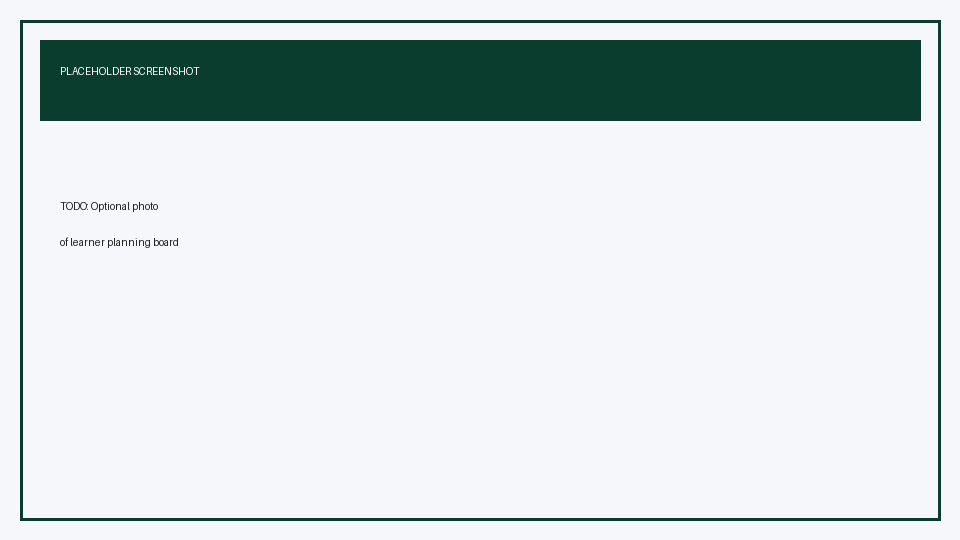
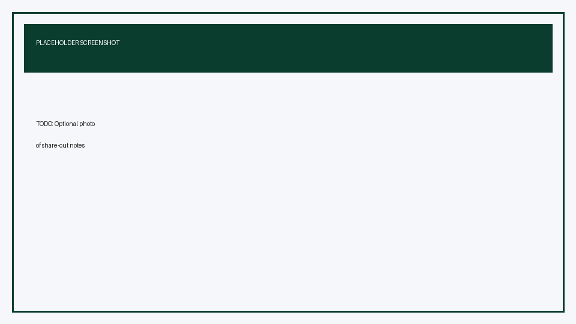

# Bring Your Own Holcim People Use Case

## Time Required

20 minutes

## Overview

In this lab, you will pick one real People-team task from your work and apply techniques from Labs 1–4 to produce something you can use after class. You choose the tools, keep data safe, and leave with a short artifact plus a reuse plan.

### You learn how to:
- Select a real Holcim People use case that fits the skills from Labs 1–4.
- Apply at least two prior-lab techniques to produce a useful work artifact.
- Capture a simple reuse plan so the approach sticks after training.

## Scenario


Training only sticks when it hits Monday morning work. You already practiced prompt engineering, Sheets with Gemini, Gems, and Gemini Notebook briefings. Now you apply those skills to **your** Holcim People priority—hiring, screening, workforce insights, manager briefings, or learning content—without waiting for a perfect scripted scenario.

## Lab Instructions

### Task 1: Choose one use case and the tools you will use

In this task, you pick a single, realistic People task and map it to prior labs.

1. Write your use case in one sentence using this pattern:

```text
I need to [outcome] for [audience] by [timeframe].
```

Example:

```text
I need to draft a plant supervisor job posting for Europe by next Thursday.
```

2. Choose **at least two** techniques from prior labs:

| Prior lab | Technique you can reuse |
| :--- | :--- |
| Lab 1 | Structured prompts (Role, Task, Steps, Examples) in Gemini |
| Lab 2 | Sheets import, Gemini formatting/charts, or the explorer pattern |
| Lab 3 | A reusable Gem for a repeatable People workflow |
| Lab 4 | Gemini Notebook sources, meeting prep chat, Studio infographic or slides |

3. List the inputs you will use (for example: a public policy page, anonymized notes, a non-confidential template). If the ideal input is confidential, substitute a sanitized or synthetic version for class.

> [!WARNING]
> Do not paste confidential employee data, applicant PII, medical information, performance ratings, or non-public Holcim documents into public AI tools. When in doubt, anonymize or use synthetic samples.

<!-- TODO IMAGE: Optional photo of learners choosing use cases -->


**Success criteria**

- You have one clear outcome sentence.
- You named at least two techniques from Labs 1–4.
- Your inputs are safe for classroom use.

### Task 2: Build a useful artifact in 15 minutes

In this task, you execute your plan and produce something a colleague could review.

1. Open the tools you chose (Gemini app, Sheets, Gems, and/or Gemini Notebook).

2. Spend about **15 minutes** building **one** primary artifact, such as:

   - A strong job posting or interview guide (Lab 1 / Lab 3)
   - A cleaned Sheet view or chart for a People metric (Lab 2)
   - A saved Gem for a workflow you repeat weekly (Lab 3)
   - A short Notebook briefing, talking points, infographic, or slide outline (Lab 4)

3. Do one quality pass:

```text
Critique your own output: What is still generic? What Holcim context is missing? What should I not invent?
```

4. Make one improvement based on that critique.

5. Save or export the artifact where you will find it after class (Drive, Gem, Notebook, or Sheet).

**Success criteria**

- You have a saved artifact tied to your use case.
- You can point to at least one improvement you made after the critique pass.

### Task 3: Write a 3-line reuse plan and share out

In this task, you lock in how you will reuse the approach at work.

1. Complete these three lines:

```text
Artifact: ...
I will reuse this when: ...
Next improvement after class: ...
```

2. In 60 seconds or less, share with a partner or the room:

   - Your use case sentence
   - Which two techniques you used
   - What you will do differently next week

<!-- TODO IMAGE: Optional photo of share-out or completed reuse plan notes -->


### Bonus Task 4: Package it for a teammate

If you finish early, turn your approach into something handoff-ready.

1. Convert your best prompt into a Gem **or** paste your briefing sources into a Gemini Notebook your teammate could copy.

2. Add a 5-bullet “How to run this” note at the top of the artifact or in a sibling Doc.

## Congratulations!

In this lab, you have:
- Selected a real Holcim People use case that fits the skills from Labs 1–4.
- Applied at least two prior-lab techniques to produce a useful work artifact.
- Captured a simple reuse plan so the approach sticks after training.


