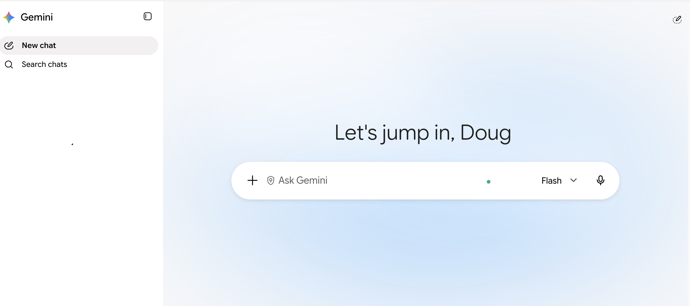
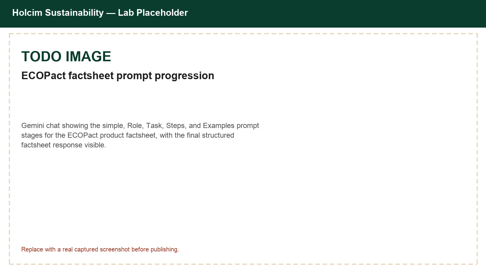
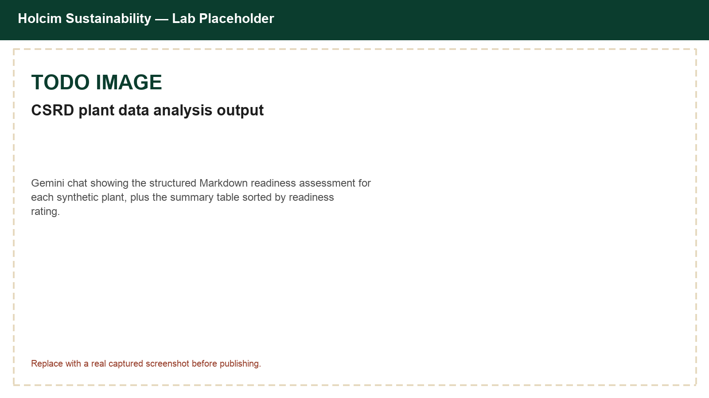
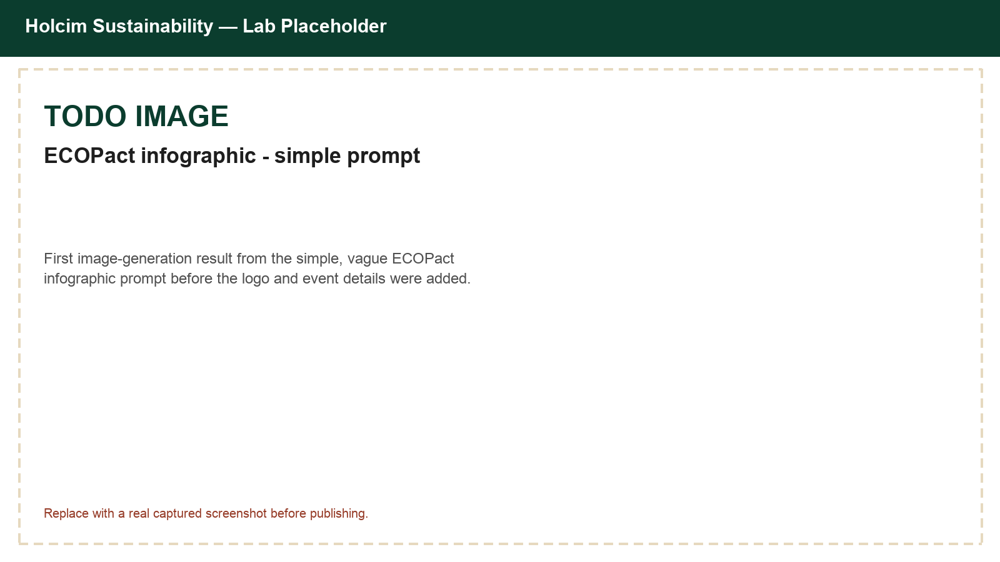
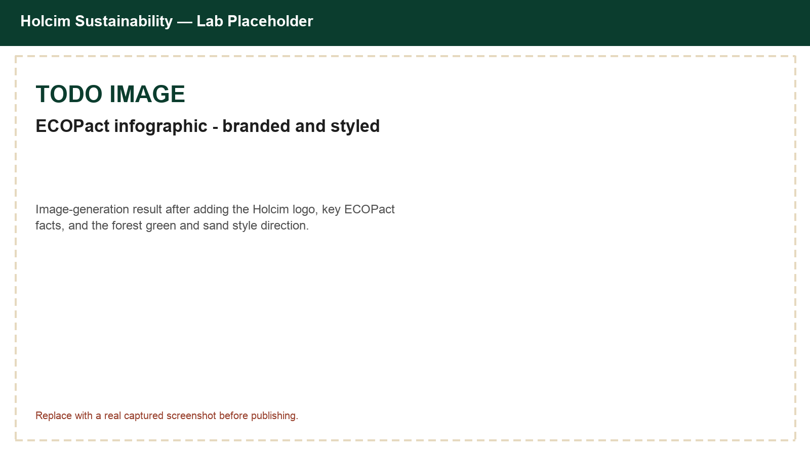
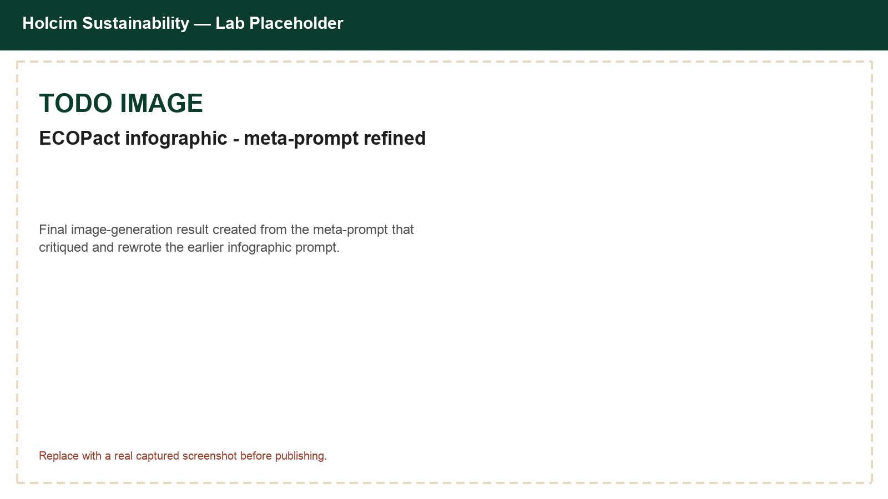

# Prompt Engineering Mastery with Gemini for Holcim Sustainability Teams

## Time Required

30 minutes

## Overview

In this lab, you will practice structured prompt engineering in Gemini. Using Holcim Sustainability scenarios, you progressively improve prompts for a product factsheet, a synthetic plant data readiness check, and a promotional infographic so outputs become more accurate, consistent, and useful.

### You learn how to:
- Build an ECOPact product factsheet prompt step by step with role, task, steps, and examples.
- Design a multi-turn prompt that checks synthetic plant data against CSRD reporting themes and returns structured Markdown.
- Improve Gemini image prompts with brand assets, style detail, and meta-prompting to create an ECOPact promotional infographic.

## Scenario


You support Holcim's Sustainability team. Marketing needs a clear, accurate ECOPact factsheet, your CSRD reporting lead wants a fast first-pass readiness check across a handful of plants before the real reporting cycle, and the team wants a polished infographic to promote ECOPact. Gemini can help, but only if your prompts are structured. You will treat prompting as a craft: start simple, then add role context, process steps, examples, and feedback loops until the output matches what Holcim colleagues can use.

## Lab Instructions

### Task 1: Open Gemini and craft a progressive ECOPact factsheet prompt

In this task, you open the Gemini app in your browser and improve a product factsheet prompt in four stages: simple request, then Role, Task, Steps, and Examples.

1. Open [https://gemini.google.com/](https://gemini.google.com/) in Chrome (or your preferred browser) and sign in with your Google account.

2. Start a **new chat** so this exercise has a clean history.



3. Paste this **simple** prompt and send it:

```text
Write a product factsheet for ECOPact.
```

4. Skim the result. Note what is generic, invented, or not Holcim-specific (made-up statistics, no mention of certifications, no sense of where it is available).

5. In the **same chat**, send this improved prompt that adds a **Role**:

```text
You are a Holcim Sustainability product marketing partner who writes clear, accurate factsheets for low-carbon building materials. You never invent performance statistics; you only use figures the user gives you or figures you already know are accurate and publicly disclosed by Holcim.

Rewrite the ECOPact factsheet so it sounds like Holcim: confident, factual, and practical for architects, contractors, and developers.
```

6. Next, add a clear **Task** and constraints, including the approved facts Gemini should use instead of inventing its own. Send:

```text
Task: Produce a complete product factsheet for "ECOPact", Holcim's range of lower-carbon ready-mix concrete.

Constraints:
- Audience: architects, contractors, and sustainability-minded developers
- Length: about 350–450 words
- Tone: confident, factual, plain language
- Use only these approved facts (do not add other statistics):
  - Minimum 30% reduction in embodied carbon versus standard (OPC) concrete, with some mixes exceeding 70% reduction
  - Achieved through mix design and supplementary cementitious materials (SCMs), without changing strength or durability
  - Available in more than 30 markets worldwide
  - Can contribute to LEED and BREEAM green building certification points
  - ECOPact+ is a near-zero-carbon variant for select applications, using certified offsets for residual emissions
  - Part of Holcim's mission: building progress for people and the planet
- Do not invent pricing, delivery timelines, or regional availability beyond "more than 30 markets"
```

7. Add **Steps** so Gemini follows a repeatable process. Send:

```text
Follow these steps before you write the final factsheet:
1. List the top 4 reasons a specifier would choose ECOPact over standard concrete.
2. List the 3 most likely objections a cost-focused contractor would raise, with a one-line rebuttal for each.
3. Only then write the full factsheet using this structure:
   - What is ECOPact (2–3 sentences)
   - Key benefits
   - How it works
   - Certifications and green building value
   - Availability
   - Call to action
Show the intermediate lists briefly, then the final factsheet.
```

8. Finish the progression with **Examples** (few-shot style). Send:

```text
Use this style example for benefit-bullet quality (do not copy the content):

Good bullet: "Cuts embodied carbon by at least 30% without changing how crews place or finish the concrete."
Weak bullet: "It's a greener option for your project."

Now regenerate only the "Key benefits" section with 5 strong bullets in that style.
```

<!-- TODO IMAGE: Screenshot of Gemini chat showing the multi-turn ECOPact factsheet progression, ending with the final structured factsheet -->


> [!IMPORTANT]
> Keep this as **one multi-turn chat**. The value is watching quality improve as you add Role, Task, Steps, and Examples—not starting over each time.

### Task 2: Check synthetic plant data against CSRD reporting themes

In this task, you paste a small synthetic plant dataset into Gemini and build a screening prompt that returns consistent Markdown a Sustainability reporting lead can scan quickly, based on the EU Corporate Sustainability Reporting Directive (CSRD) and its ESRS E1 Climate Change standard.

> [!WARNING]
> The plant data below is **synthetic training data**. Do not treat the plant IDs, figures, or ratings as real Holcim emissions data, and do not add real confidential plant data during this lab.

1. Start a **new Gemini chat** for this exercise.

2. Copy the synthetic plant table below, along with the simple prompt underneath it, into the chat and send them together:

```text
Plant ID | Country | Region | Scope 1 (tCO2e, FY2025) | Scope 2 (tCO2e, FY2025) | Scope 3 Data Coverage | Renewable Electricity % | Alternative Fuel Rate % | Transition Plan Published | Site-Level Target Published
HLC-EU-014 | France | Europe | 148,200 | 9,100 | Full | 62% | 55% | Yes | Yes (-25% by 2030)
HLC-EU-027 | Poland | Europe | 210,500 | 14,700 | Partial | 38% | 41% | Yes | No
HLC-LATAM-009 | Brazil | Latin America | 176,900 | 6,200 | Partial | 71% | 33% | No | Yes (-20% by 2030)
HLC-LATAM-018 | Mexico | Latin America | 98,400 | 5,050 | None | 29% | 18% | No | No
HLC-AMEA-005 | Morocco | Asia, Middle East and Africa | 132,300 | 7,800 | Full | 44% | 47% | Yes | Yes (-30% by 2030)
HLC-AMEA-022 | India | Asia, Middle East and Africa | 254,600 | 21,300 | None | 19% | 22% | No | No

Here is data from six Holcim plants. Are we ready for CSRD reporting?
```

3. Read the answer. It is a reasonable start, but it is not consistent enough to compare plants side by side. Let's be more specific about what we want.

4. Add a **Role** and **Task** upgrade in the same chat:

```text
You are a Holcim Sustainability reporting specialist who prepares first-pass readiness checks against the EU Corporate Sustainability Reporting Directive (CSRD) and its ESRS E1 Climate Change standard.

Task: Review each plant in the table above and return ONLY valid Markdown. No preamble.
```

5. Add the required **output schema** and rating rules. Send:

```text
For each plant, output a Markdown block in exactly this shape:

## Plant: <Plant ID> (<Country>, <Region>)
- **Scope 1 and 2 status:** <one line on completeness>
- **Scope 3 data gap:** <Yes | Partial | No, one line>
- **Energy transition signal:** <one line on renewable electricity and alternative fuel rate>
- **Readiness rating:** <On Track | Needs Data | At Risk>
- **Recommended next action:** <one short sentence>

Rules:
- Readiness rating definitions:
  - On Track: full Scope 3 coverage, a published transition plan, and a published site-level target
  - Needs Data: missing or partial Scope 3 coverage, or a missing transition plan, but at least one target or plan element in place
  - At Risk: no transition plan, no target, and missing or partial Scope 3 coverage
- If a data point is missing from the table, write `Not found` rather than inventing it
- Do not restate raw figures beyond what is needed to support the rating
```

6. Add **Steps** and an **example** so Gemini stays consistent. Send:

```text
Process each plant with these steps:
1. Read the Scope 1 and Scope 2 figures and note completeness.
2. Read the Scope 3 Data Coverage value as given (Full, Partial, or None).
3. Read renewable electricity percent and alternative fuel rate together as the energy transition signal.
4. Check whether a transition plan and a site-level target are published.
5. Assign a Readiness rating using the definitions above.

Example of good formatting:

## Plant: HLC-EU-014 (France, Europe)
- **Scope 1 and 2 status:** Both reported for FY2025; no gaps noted
- **Scope 3 data gap:** No, coverage is Full
- **Energy transition signal:** 62% renewable electricity and 55% alternative fuel rate, both above the plant set average
- **Readiness rating:** On Track
- **Recommended next action:** Carry the current transition plan and target into the FY2026 disclosure with no changes

Re-run the review for all six plants using this format only.
```

7. Optional stretch inside this task: ask Gemini to also produce a **summary table** after all individual plant blocks:

```text
After all plant blocks, add a Markdown summary table with columns:
Plant ID | Region | Scope 3 Data Gap | Readiness rating
Sort the table by Readiness rating in this order: On Track, Needs Data, At Risk.
```

<!-- TODO IMAGE: Screenshot of Gemini chat showing the structured plant readiness Markdown output and summary table -->


> [!NOTE]
> If Gemini summarizes instead of using your schema, reply: `Reformat using the exact Markdown schema. Do not add extra sections.`

### Task 3: Generate an ECOPact promotional infographic with progressive image prompts

In this task, you use Gemini's image generation to create a promotional infographic for **ECOPact**, starting simple, then adding the Holcim logo, approved facts, style direction, and a meta-prompt to refine the image prompt itself.

1. In Gemini, start a **new chat**. Then, select the **create image** tool from the tools menu.

2. Send a **simple** image request:

```text
Create an infographic promoting ECOPact.
```

> [!NOTE]
> It will create something, and it might look good. However, it likely invents its own statistics and layout. Let's be more specific.

3. Create a new chat, and select the create image tool again.

4. Copy the Holcim logo below to the clipboard, and paste it in the prompt box.


5. Send a stronger prompt that references the logo and provides approved facts:

```text
Create a vertical promotional infographic image for "ECOPact" by Holcim.

Brand:
- Place the attached Holcim logo clearly near the top
- Keep logo proportions intact; do not distort or recolor the logo mark incorrectly

Content to include as readable text on the infographic:
- Title: ECOPact
- Subtitle: Lower-carbon concrete, same performance
- Stat callout: At least 30% less embodied carbon versus standard concrete
- Line: Available in more than 30 markets
- Line: Contributes to LEED and BREEAM certification points
- Footer: Building progress for people and the planet

Visual direction:
- Clean corporate design suitable for a global building materials company
- Plenty of whitespace; avoid clutter
- Suggest concrete, construction, and sustainability without literal unsafe worksite imagery
```



6. Add **style details** in a follow-up to refine (or regenerate) the infographic:

```text
Regenerate the infographic with these style constraints:
- Color palette: deep forest green, white, and warm sand accents (Holcim-inspired, not neon)
- Typography: bold modern sans-serif for the title; simple sans-serif for body text
- Layout: logo top, title center-upper, stat callout as a large highlighted number mid-page, 2 supporting lines below it, footer at bottom
- Aspect: portrait infographic (roughly A4 / letter proportions)
- No fake QR codes, no fake URLs, no extra logos
```



7. Practice **meta-prompting for image generation**. Ask Gemini to improve the prompt before making the next image:

```text
You are an expert prompt engineer for image generation.

Meta-task:
1. Critique my previous infographic prompt for ambiguity, missing art direction, and text-rendering risks.
2. Write an improved single image prompt (under 180 words) that is more specific about composition, lighting, camera/layout language, and negative constraints.
```

8. Copy the improved prompt to the clipboard, create a new chat, and re-run the image generation using it. Don't forget to attach the logo, and select the create image tool.



> [!TIP]
> If text on the image is misspelled, ask Gemini to regenerate with: `Keep all infographic text exactly as specified; prioritize correct spelling of ECOPact.`

### Bonus Task 4: Package a reusable Holcim Sustainability prompt playbook snippet

With fewer step-by-step hints, turn what you learned into a short reusable prompt your Sustainability teammates can copy.

1. In a new Gemini chat, ask Gemini to draft a one-page **Prompt Playbook** Markdown snippet that includes:

- The Role / Task / Steps / Examples pattern
- Your best ECOPact factsheet prompt skeleton (with blanks for product name and approved facts)
- Your CSRD plant readiness schema (fields and rating definitions)
- A short checklist for infographic prompts (logo, text lock, style, negative constraints, meta-prompt pass)

2. Edit the playbook so it only references approved or synthetic facts and avoids inventing confidential emissions data.

3. Optional: save the final Markdown into a note your team shares after class.

## Congratulations!

In this lab, you have:
- Built an ECOPact product factsheet prompt step by step with role, task, steps, and examples.
- Designed a multi-turn prompt that checked synthetic plant data against CSRD reporting themes and returned structured Markdown.
- Improved Gemini image prompts with brand assets, style detail, and meta-prompting to create an ECOPact promotional infographic.


