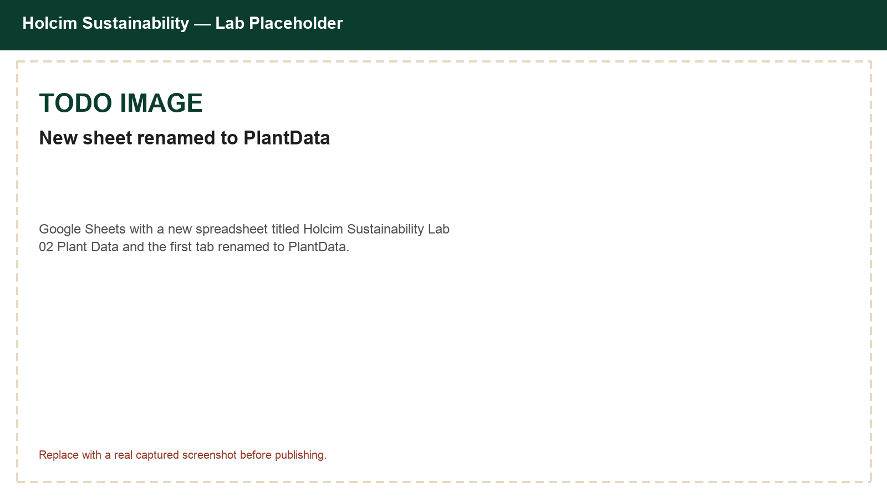
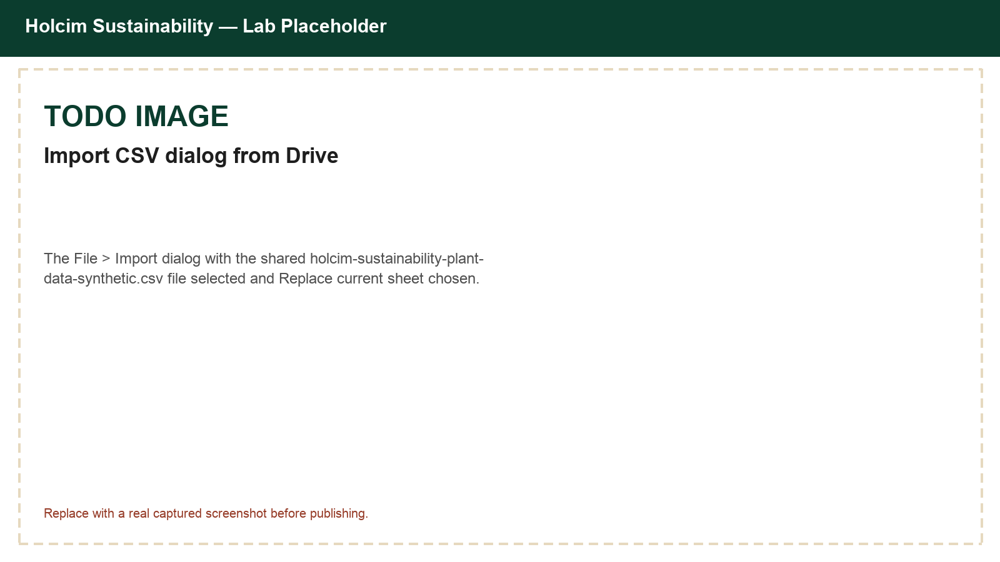
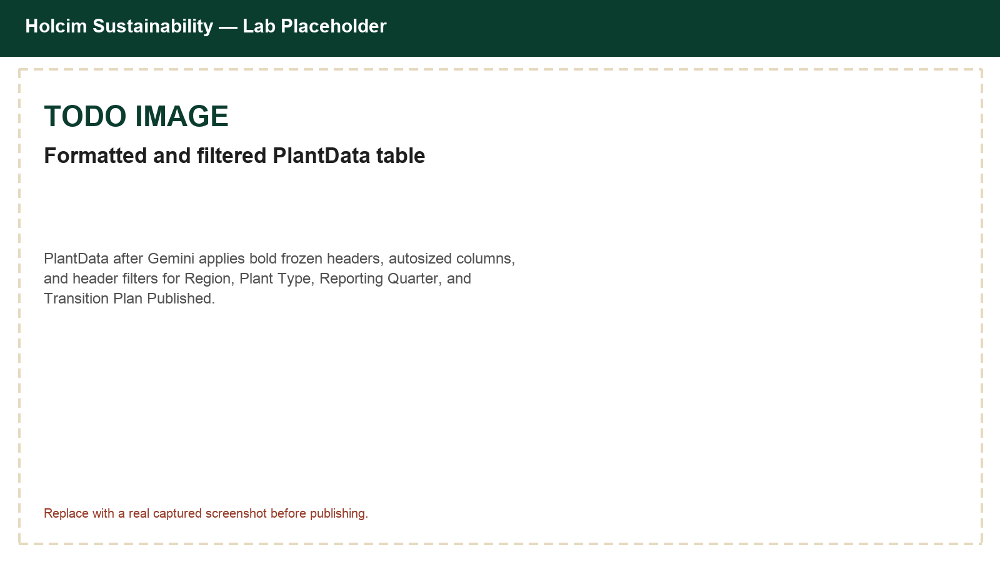
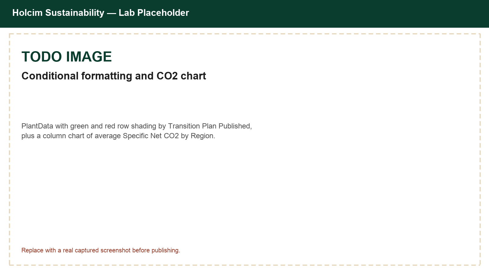
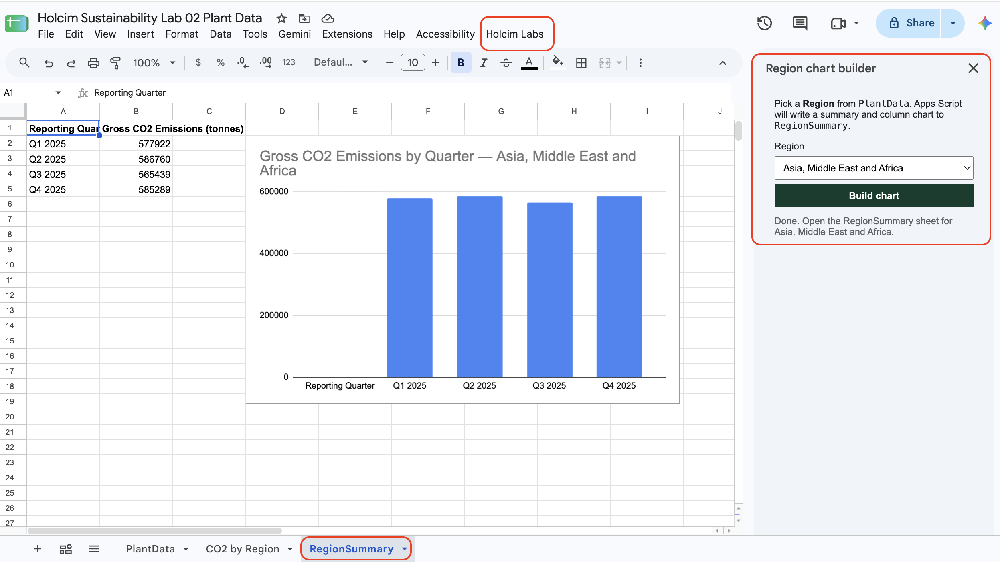

# Analyze Holcim Sustainability Plant Data with Sheets and Gemini

## Time Required

45 minutes

## Overview

In this lab, you will import a Holcim Sustainability plant data CSV into Google Sheets, use Gemini in Sheets to format and visualize the data, ask focused analysis questions on that sheet, and build a small Apps Script sidebar that charts one region's CO2 trend.

### You learn how to:

- Create a Google Sheet and import synthetic plant sustainability CSV data from Google Drive.
- Use Gemini in Sheets to format a table, add header filters, apply conditional formatting, and insert a chart.
- Ask Gemini one question at a time to interpret N/A thermal rates, compare Specific Net CO2 by plant type, and read the quarterly trend without forecasting a future year.
- Build a simple Apps Script menu and sidebar that charts one region's CO2 emissions by quarter.

## Scenario


Holcim's Sustainability team receives a quarterly plant-level extract covering CO2 emissions, thermal substitution, renewable electricity, and water withdrawal for 25 plants. The file is small enough to work with directly, so you will import it, use Gemini in Sheets to turn it into a clean analytics table, and then ship a simple Apps Script chart builder so colleagues can review one region's emissions trend without writing formulas. You will also ask Gemini specific questions about thermal substitution, plant type, and the quarterly CO2 trend. Pasting the CSV into a chat and asking for a finished analysis does not work, even on a file this small.

> [!NOTE]
> Gemini in Sheets works best on smaller, clean tables. Google documents more consistent Gemini performance on files below about 1 million cells. At 100 rows and 12 columns, this file is already well inside that range, so there is no need to build a smaller working subset first.

## Lab Instructions

### Task 1: Create a Sheet and import the plant sustainability CSV from Drive

In this task, you create a spreadsheet and load the shared Holcim Sustainability plant data CSV from Google Drive.

1. Open [Google Sheets](https://sheets.google.com/) and sign in with your account.

2. Click **Blank spreadsheet**.

3. Rename the spreadsheet to `Holcim Sustainability Lab 02 Plant Data`.

4. Rename the first tab from `Sheet1` to `PlantData`.



5. Open the shared CSV in Drive (confirm you can view it):

[https://drive.google.com/file/d/1uRbv_qx4xjg4WvnlAMHV3qvWCysYQfVb/view?usp=drive_link](https://drive.google.com/file/d/1uRbv_qx4xjg4WvnlAMHV3qvWCysYQfVb/view?usp=drive_link)

6. Return to your Sheet. Choose **File** | **Import**, and paste the Drive file link into the search box. Select the file and choose **Insert**. In the Import dialog set the following and click **Import data**.
   - Import location: **Replace current sheet**.
   - Separator type: **Detect automatically** (or **Comma**).
   - Convert text to numbers, dates, and formulas: **Checked**.




7. Confirm row 1 contains these headers (12 columns):

`Plant ID`, `Country`, `Region`, `Plant Type`, `Reporting Quarter`, `Cementitious Production (tonnes)`, `Gross CO2 Emissions (tonnes)`, `Specific Net CO2 (kg per tonne cementitious)`, `Thermal Substitution Rate (%)`, `Renewable Electricity (%)`, `Water Withdrawal (m3 per tonne)`, `Transition Plan Published`

8. Freeze the header row: select row 1, then **View** | **Freeze** | **1 row**.

> [!NOTE]
> This is **100 rows**: 25 synthetic plants across 4 quarters of FY2025. All plant IDs and figures are synthetic training data, not real Holcim emissions.

### Task 2: Format, filter, and chart with Gemini in Sheets

In this task, you use **Ask Gemini** in Sheets to turn `PlantData` into a clearer Sustainability analytics table with filters, conditional formatting, and a chart.

1. Open the `PlantData` sheet and select any cell inside the data.

2. At the top right, click **Ask Gemini** to open the side panel, if it is not already open.


3. Ask Gemini to format the table. Paste:

```text
On PlantData, format the data as a clean table:
- Bold and freeze the header row if needed
- Autofit useful column widths for Plant ID, Country, Region, Plant Type, Reporting Quarter, and Transition Plan Published
- Keep all existing columns
Do not delete rows.
```

4. Review Gemini's proposal. If asked, apply or insert the suggested formatting when it looks correct.

5. Add header filters with Gemini:

```text
On PlantData, turn on filters for the header row so I can filter Region, Plant Type, Reporting Quarter, and Transition Plan Published.
```

6. Manually verify filters: click a header filter arrow and confirm you can filter **Region** values such as `Europe`, `Latin America`, and `Asia, Middle East and Africa`.

7. Add conditional formatting for transition plan status:

```text
On PlantData, apply conditional formatting to the rows based on the Transition Plan Published column:
- Yes = light green fill
- No = light red fill
```

8. Create a chart with Gemini:

```text
Using PlantData, create an editable column chart that shows average Specific Net CO2 (kg per tonne cementitious) by Region.
Title the chart "Average Specific Net CO2 by Region".
Insert it into a new sheet.
```

9. Click **Insert** when Gemini previews the chart. Open the new chart sheet if Gemini creates one and confirm the chart is editable.





> [!TIP]
> If Gemini cannot act on the full table, select a smaller visible range first, or ask: `Summarize average Specific Net CO2 by Region in a new sheet named RegionSummary, then chart that summary.`

### Task 3: Ask Gemini focused analysis questions

In this task, you use **Ask Gemini** on `PlantData` to answer three questions this file can actually support. Each prompt names the sheet, the columns, and one result. You check that result before you trust it.

> [!IMPORTANT]
> Do not ask Gemini to "analyze this CSV." Ask one question per prompt, and read the proposal before you apply it. If a proposal deletes rows, changes Plant ID, or replaces `N/A` with a number, cancel it or undo until `PlantData` again has 100 data rows.
>
> This file has no blank cells. Thermal Substitution Rate (%) stores the text `N/A` on grinding stations because that metric does not apply there. Gemini can average and filter the numbers that are already in the sheet. It cannot forecast next year's emissions from four quarters of training data.

1. Open the `PlantData` sheet. If the side panel is closed, click **Ask Gemini**.

2. Find where thermal substitution does not apply. Paste:

```text
On PlantData, Thermal Substitution Rate (%) contains the text N/A.
How many rows are N/A, and which Plant Type are they?
Do not replace N/A with a number or with zero.
Do not change PlantData.
```

3. Filter **Thermal Substitution Rate (%)** for `N/A` and confirm those rows are **Grinding Station**. Integrated Plant rows in that column are numbers.

> [!WARNING]
> `N/A` is a stored value, not an empty cell and not a rate for Gemini to guess. Leave it as `N/A`. An average of Thermal Substitution Rate (%) that includes those rows is not a real average.

4. Compare Specific Net CO2 by plant type, not only by region. The chart from the previous task averages regions without separating plant types. Paste:

```text
Using PlantData, create a new sheet named Co2ByPlantType.
Calculate average Specific Net CO2 (kg per tonne cementitious) for:
- each Plant Type
- each combination of Region and Plant Type
For each group show the row count and the average.
Round averages to one decimal place.
Do not add a chart.
Do not change PlantData.
```

5. Open `Co2ByPlantType` and compare it with the Average Specific Net CO2 by Region chart.

> [!NOTE]
> Integrated plants are near 580 to 590 kg in every region. Grinding stations are near 20 to 40 kg. Europe has more grinding-station rows than the other regions, so a region-only average makes Europe look much lower. Split by plant type before you compare regions.

6. Read the quarterly trend for integrated plants only. Paste:

```text
Using PlantData, create a new sheet named IntegratedTrend.
Use only rows where Plant Type is Integrated Plant.
For each Reporting Quarter, calculate:
- Average Specific Net CO2 (kg per tonne cementitious)
- Average Thermal Substitution Rate (%)
Put the quarters in order: Q1 2025, Q2 2025, Q3 2025, Q4 2025.
Do not include Grinding Station rows.
Round averages to one decimal place.
Do not change PlantData.
```

7. Check the direction on `IntegratedTrend`. Across Q1 to Q4, average Specific Net CO2 should edge down and average Thermal Substitution Rate should rise. If the thermal average is blank or enormous, Gemini included `N/A` rows. Ask it to use Integrated Plant rows only.

8. List the integrated plants that are still high in the last quarter. Paste:

```text
On PlantData, list rows that meet all of these conditions:
- Plant Type is Integrated Plant
- Reporting Quarter is Q4 2025
- Specific Net CO2 (kg per tonne cementitious) is greater than 590
Return Plant ID, Country, Region, Specific Net CO2 (kg per tonne cementitious), Thermal Substitution Rate (%), and Transition Plan Published.
Put the rows on a new sheet named HighSpecificCo2.
Sort by Specific Net CO2 (kg per tonne cementitious), highest first.
Do not change PlantData.
```

9. Look up one of those plants across the year. Copy a Plant ID from `HighSpecificCo2`. Replace `PASTE_PLANT_ID` in this prompt, then paste:

```text
On PlantData, look up Plant ID PASTE_PLANT_ID.
Return every quarter for that plant on a new sheet named PlantLookup.
Show Plant ID, Country, Reporting Quarter, Specific Net CO2 (kg per tonne cementitious), and Thermal Substitution Rate (%).
Do not summarize. Show the stored values.
Do not change PlantData.
```

10. Confirm `PlantLookup` has four rows, Q1 through Q4, and that the Q4 Specific Net CO2 matches `HighSpecificCo2`.

11. Ask for a short reading of the tables, and for the limit Gemini must state. Paste:

```text
Using Co2ByPlantType and IntegratedTrend, write three observations.
Each observation must cite a number from one of those sheets.
Then answer: can you forecast each plant's Specific Net CO2 for 2026 from this file?
If four quarters are not enough history, answer no, and say what you would need instead.
Do not create a forecast or replace any N/A values.
```

> [!IMPORTANT]
> Treat a 2026 forecast as a failed answer. A year of quarters can show a direction. It does not justify a plant-level prediction.

**Success criteria**

- Thermal Substitution Rate `N/A` is confined to Grinding Station rows, and those cells are still `N/A`.
- `Co2ByPlantType` separates Integrated Plant from Grinding Station, and the region chart no longer looks like a fair region comparison on its own.
- `IntegratedTrend` shows Specific Net CO2 easing down and Thermal Substitution Rate rising from Q1 to Q4.
- `HighSpecificCo2` lists Q4 integrated plants above 590, and `PlantLookup` shows all four quarters for one of those plants.
- The written observations cite those tables and decline to forecast 2026.

### Task 4: Build a simple Apps Script region chart builder

In this task, you add a small Apps Script project that shows the core pattern: a custom menu, an HTML sidebar, a server function that reads the sheet, and a chart written back to Sheets.

1. In your spreadsheet, open **Extensions** | **Apps Script**.

2. Rename the project to `Holcim Sustainability Region Chart Builder`.

3. Replace any default `Code.gs` content with:

```javascript
/**
 * Holcim Sustainability Lab 02 — simple Apps Script demo
 * Custom menu + HTML sidebar + sheet read/write + chart
 */

var SOURCE_SHEET = 'PlantData';
var OUTPUT_SHEET = 'RegionSummary';

function onOpen() {
  SpreadsheetApp.getUi()
    .createMenu('Holcim Labs')
    .addItem('Open region chart builder', 'showSidebar')
    .addToUi();
}

function showSidebar() {
  var html = HtmlService.createHtmlOutputFromFile('Sidebar')
    .setTitle('Region chart builder')
    .setWidth(280);
  SpreadsheetApp.getUi().showSidebar(html);
}

/** Return sorted unique Region values from PlantData. */
function getRegions() {
  var sheet = SpreadsheetApp.getActive().getSheetByName(SOURCE_SHEET);
  if (!sheet) {
    throw new Error('Missing sheet: ' + SOURCE_SHEET);
  }
  var data = sheet.getDataRange().getDisplayValues();
  var regionCol = data[0].indexOf('Region');
  if (regionCol < 0) {
    throw new Error('Region column not found.');
  }
  var seen = {};
  for (var i = 1; i < data.length; i++) {
    var value = String(data[i][regionCol] || '').trim();
    if (value) {
      seen[value] = true;
    }
  }
  return Object.keys(seen).sort();
}

/**
 * Filter PlantData to one region, write Gross CO2 Emissions by Reporting
 * Quarter, and insert a column chart on RegionSummary.
 */
function buildRegionChart(region) {
  var ss = SpreadsheetApp.getActive();
  var source = ss.getSheetByName(SOURCE_SHEET);
  if (!source) {
    throw new Error('Missing sheet: ' + SOURCE_SHEET);
  }

  var data = source.getDataRange().getDisplayValues();
  var headers = data[0];
  var regionCol = headers.indexOf('Region');
  var quarterCol = headers.indexOf('Reporting Quarter');
  var co2Col = headers.indexOf('Gross CO2 Emissions (tonnes)');

  var totals = {};
  for (var i = 1; i < data.length; i++) {
    if (String(data[i][regionCol] || '').trim() !== region) {
      continue;
    }
    var quarter = String(data[i][quarterCol] || 'Unknown').trim() || 'Unknown';
    var co2 = Number(data[i][co2Col]);
    if (isNaN(co2)) {
      co2 = 0;
    }
    totals[quarter] = (totals[quarter] || 0) + co2;
  }

  var out = ss.getSheetByName(OUTPUT_SHEET);
  if (!out) {
    out = ss.insertSheet(OUTPUT_SHEET);
  }
  out.clear();
  out.getCharts().forEach(function (chart) {
    out.removeChart(chart);
  });

  var rows = [['Reporting Quarter', 'Gross CO2 Emissions (tonnes)']];
  Object.keys(totals).sort().forEach(function (quarter) {
    rows.push([quarter, totals[quarter]]);
  });
  out.getRange(1, 1, rows.length, 2).setValues(rows);
  out.getRange(1, 1, 1, 2).setFontWeight('bold');

  if (rows.length > 1) {
    var chart = out.newChart()
      .setChartType(Charts.ChartType.COLUMN)
      .addRange(out.getRange(1, 1, rows.length, 2))
      .setOption('title', 'Gross CO2 Emissions by Quarter — ' + region)
      .setPosition(2, 4, 0, 0)
      .build();
    out.insertChart(chart);
  }

  return {
    region: region,
    quarters: rows.length - 1
  };
}
```

4. In Apps Script, click **+** next to **Files** | **HTML**. Name the file `Sidebar` (Apps Script adds `.html`). Replace the default contents with:

```html
<!DOCTYPE html>
<html>
  <head>
    <base target="_top" />
    <style>
      body { font-family: Arial, sans-serif; font-size: 13px; margin: 12px; color: #202124; }
      select, button { width: 100%; margin-top: 6px; padding: 8px; box-sizing: border-box; }
      button { background: #0b3d2e; color: #fff; border: 0; font-weight: 600; cursor: pointer; }
      #msg { margin-top: 12px; color: #5f6368; }
      .error { color: #b3261e; }
    </style>
  </head>
  <body>
    <p>Pick a <strong>Region</strong> from <code>PlantData</code>. Apps Script will write a summary and column chart to <code>RegionSummary</code>.</p>

    <label for="region">Region</label>
    <select id="region"></select>
    <button onclick="buildChart()">Build chart</button>
    <div id="msg">Loading regions…</div>

    <script>
      function setMsg(text, isError) {
        var el = document.getElementById('msg');
        el.className = isError ? 'error' : '';
        el.textContent = text;
      }

      google.script.run
        .withSuccessHandler(function (regions) {
          var select = document.getElementById('region');
          regions.forEach(function (region) {
            var option = document.createElement('option');
            option.value = region;
            option.textContent = region;
            select.appendChild(option);
          });
          setMsg('Ready.');
        })
        .withFailureHandler(function (err) {
          setMsg(err.message || String(err), true);
        })
        .getRegions();

      function buildChart() {
        var region = document.getElementById('region').value;
        setMsg('Building chart for ' + region + '…');
        google.script.run
          .withSuccessHandler(function (result) {
            setMsg('Done. Open the RegionSummary sheet for ' + result.region + '.');
          })
          .withFailureHandler(function (err) {
            setMsg(err.message || String(err), true);
          })
          .buildRegionChart(region);
      }
    </script>
  </body>
</html>
```

5. Save the project (**Ctrl/Cmd + S**).

6. Return to the spreadsheet and reload the browser tab.

7. Choose **Holcim Labs** | **Open region chart builder**.

> [!NOTE]
> The first run asks you to authorize the script. Review the permissions, choose your lab Google account, and allow access to the spreadsheet.



8. In the sidebar, choose the Region `Asia, Middle East and Africa`, and then click **Build chart**. Open the `RegionSummary` sheet and confirm a quarterly table and column chart appear.

9. Run it again with a different region, and confirm `RegionSummary` refreshes.


**What this demo teaches**

| Piece               | What it does                                        |
| ------------------- | --------------------------------------------------- |
| `onOpen`            | Adds the **Holcim Labs** menu when the Sheet opens  |
| `Sidebar.html`      | Simple HTML UI in a sidebar                         |
| `google.script.run` | Lets the sidebar call functions in `Code.gs`        |
| `buildRegionChart`  | Reads sheet data, writes a summary, inserts a chart |

### Bonus Task 5: Extend the Apps Script sidebar with Gemini

Use Gemini to turn your simple region chart builder into a richer Sustainability analytics sidebar.

1. With the help of Gemini, try to upgrade the sidebar so it can filter on more columns and build more than one chart type. Try things like:

```text
Upgrade this Apps Script sidebar and Code.gs for a Holcim Sustainability plant sheet named PlantData.
Add dropdowns for Region, Plant Type, and Reporting Quarter.
When I click Build, filter PlantData with those choices, write the matching rows to a sheet named ExplorerResults, and create a column chart of average Specific Net CO2 by Plant Type.
Keep the code short and commented. Return complete Code.gs and Sidebar.html files I can paste.
```

```text
Using the same Apps Script project, add a Chart type dropdown with Column and Line options.
Also add a Metric dropdown with Specific Net CO2, Thermal Substitution Rate, and Renewable Electricity.
Build the selected chart type from the selected metric, averaged by Reporting Quarter, after applying the region and plant type filters.
Return the full updated Code.gs and Sidebar.html.
```

2. Paste Gemini's updated files into Apps Script, save, reload the Sheet, and test the new sidebar. Fix any errors by pasting the error message back into Gemini and asking for a corrected version.

## Congratulations!

In this lab, you have:

- Created a Google Sheet and imported synthetic plant sustainability CSV data from Google Drive.
- Used Gemini in Sheets to format a table, add header filters, apply conditional formatting, and insert a chart.
- Asked Gemini one question at a time to interpret N/A thermal rates, compare Specific Net CO2 by plant type, and read the quarterly trend without forecasting a future year.
- Built a simple Apps Script menu and sidebar that charted one region's CO2 emissions by quarter.


