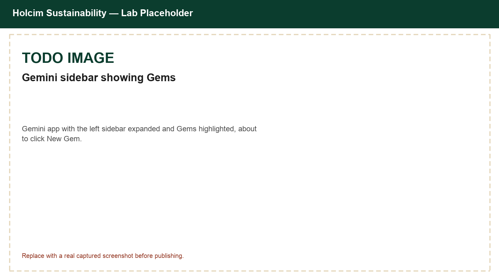
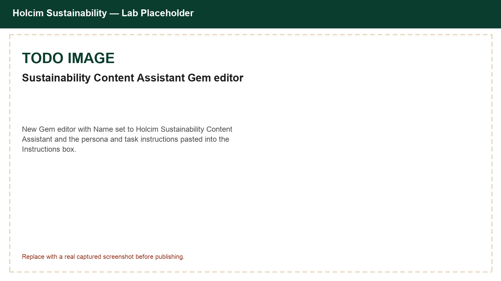
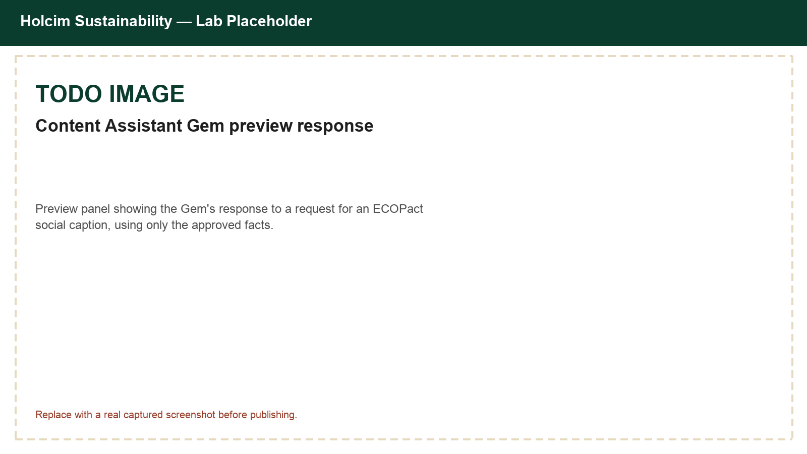
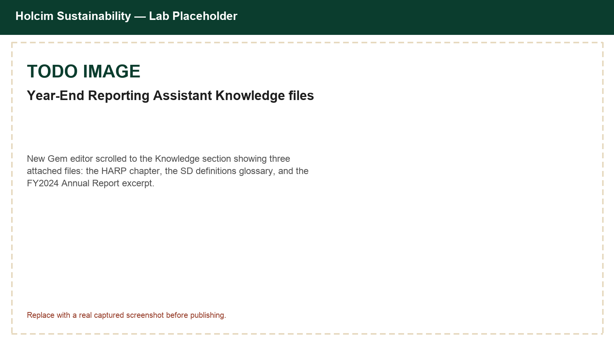
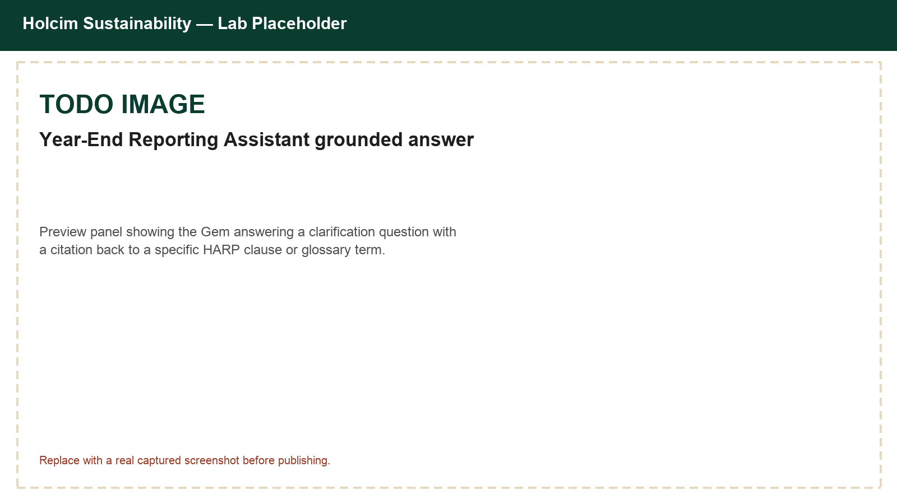
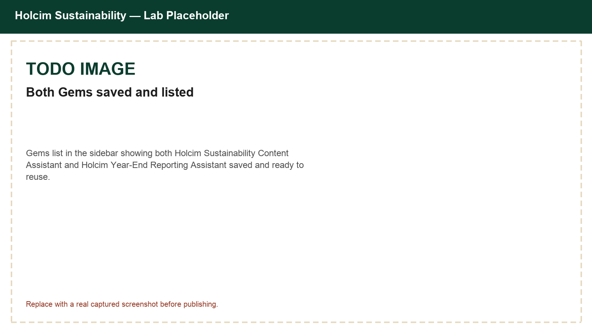

# Create Reusable Holcim Sustainability Assistants with Gemini Gems

## Time Required

30 minutes

## Overview

In this lab, you will create two reusable **Gemini Gems** for Holcim Sustainability work: a content assistant that drafts on-brand copy from approved facts, and a year-end reporting assistant grounded in real reference documents. You open Gemini, expand the sidebar, open Gems, paste durable instructions, attach reference files as Knowledge, preview each Gem, save it, and run short requests so teammates can reuse the same standard without rebuilding prompts from scratch.

### You learn how to:
- Open Gemini Gems from the sidebar and create a new custom Gem.
- Package a structured content-writing prompt into a reusable Gem.
- Attach reference documents as Gem Knowledge so a second Gem can answer year-end reporting questions grounded in your own files.

## Scenario


Holcim Sustainability partners often rewrite the same kinds of prompts for ECOPact content, and they field the same clarification questions every year-end close: what does a HARP chapter require, how does the SD glossary define a term, what did we disclose last year. One Sustainability stakeholder described the second problem directly: *"Our idea is to explore the option of developing a chatbot / AI assistant that takes HARP chapters and our SD definitions and annual reports for year-end reporting so it can answer questions and clarification requests automatically."* Gems store instructions once, and can also hold reference files as **Knowledge**, so a Gem can act as exactly that kind of always-available, grounded assistant.

## Lab Instructions

### Task 1: Open Gemini Gems and create the Sustainability Content Assistant Gem

In this task, you open the Gems manager and create **Holcim Sustainability Content Assistant** using a complete set of instructions provided below.

1. Open [https://gemini.google.com/](https://gemini.google.com/).

2. Expand the left sidebar if it is collapsed.

3. In the sidebar, select **Gems**.

4. Click **New Gem**.

<!-- TODO IMAGE: Screenshot of the Gemini sidebar with Gems highlighted, about to click New Gem -->


5. Set the Gem **Name** to:

```text
Holcim Sustainability Content Assistant
```

6. In **Instructions**, paste the following:

```text
Persona:
You are a Holcim Sustainability communications partner. You write clear, factual content about Holcim's low-carbon building materials and sustainability performance for architects, contractors, developers, and internal stakeholders. Your tone is confident, factual, and plain language.

Task:
When the user asks for content (a factsheet paragraph, a social caption, a talking point, an email blurb), produce it using ONLY the approved facts below. If the user asks about a fact not listed here, say you do not have an approved figure for that and ask them to confirm it rather than inventing one.

Approved facts:
- ECOPact: minimum 30% reduction in embodied carbon versus standard (OPC) concrete, with some mixes exceeding 70% reduction
- ECOPact is achieved through mix design and supplementary cementitious materials (SCMs), without changing strength or durability
- ECOPact is available in more than 30 markets worldwide
- ECOPact can contribute to LEED and BREEAM green building certification points
- ECOPact+ is a near-zero-carbon variant for select applications, using certified offsets for residual emissions
- Holcim's mission: building progress for people and the planet

Constraints:
- Do not invent statistics, plant names, or regional availability beyond what is listed above
- Match the requested format and length exactly (for example, a social caption should be short; a factsheet paragraph can be longer)
- Flag any request for confidential or unpublished figures instead of guessing

Process (follow these steps every time):
1. Identify the content type and length the user wants.
2. Select only the approved facts relevant to that request.
3. Draft the content, then reread it and remove anything not grounded in the approved facts.

Writing quality example:
- Good: "Cuts embodied carbon by at least 30% without changing how crews place or finish the concrete."
- Weak: "It's a greener option for your project."
Write strong, specific copy in the good style.
```

<!-- TODO IMAGE: Screenshot of the New Gem editor with Name and Instructions filled in -->


7. Optional: click **Use Gemini to re-write instructions** (_the wand icon_) if you want a polished expansion, then edit anything that drifts from the approved facts.

8. In the **Preview** panel on the right, test with:

```text
Write a 2-sentence social caption promoting ECOPact for a LinkedIn post.
```

9. Check that the preview stays within the approved facts and matches the short caption format you asked for.

10. Click **Save**.

<!-- TODO IMAGE: Preview response from Holcim Sustainability Content Assistant Gem -->


> [!IMPORTANT]
> Previewing does not save the Gem. Click **Save** after you are happy with the preview.

### Task 2: Create the Year-End Reporting Assistant Gem with Knowledge files

In this task, you create **Holcim Year-End Reporting Assistant**, attach three reference documents as **Knowledge**, and test it with clarification questions like the ones a reporting lead would ask during year-end close.

> [!WARNING]
> The HARP chapter, SD glossary, and Annual Report excerpt used in this task are **synthetic training documents**, written for this course. Do not treat them as real Holcim policy, real definitions, or real disclosed figures, and do not attach real confidential Holcim documents during this lab.

1. From the Gems area, click **New Gem** again.

2. Set the Gem **Name** to:

```text
Holcim Year-End Reporting Assistant
```

3. In **Instructions**, paste:

```text
Persona:
You are a Holcim Sustainable Development (SD) reporting assistant. You help People preparing year-end sustainability disclosures by answering clarification questions using ONLY the attached Knowledge files.

Task:
Answer each question using the attached HARP chapter, the SD definitions glossary, and the Annual Report excerpt. Do not use outside knowledge about Holcim or about accounting standards beyond what these files say.

Rules:
- Every answer must cite which source and section supports it, for example "(HARP 14.3.2)" or "(SD Glossary: Thermal Substitution Rate)" or "(FY2024 Annual Report, Group Sustainability KPIs table)"
- If the attached files do not answer the question, say exactly: "Not found in the provided materials — check with the SD or Reporting team." Do not guess or infer beyond what is written.
- Keep answers short and audit-ready: 2-4 sentences, plus the citation
- If a question mixes a defined term with a HARP rule, answer both parts and cite both sources

Process for each question:
1. Identify whether the question is about a definition, a HARP rule, or a disclosed figure.
2. Search the relevant Knowledge file for the exact supporting text.
3. Answer using only that text, in your own words, with the citation.
4. If nothing in the files supports the answer, use the exact fallback sentence above.

Example of good formatting:

Q: How do we define Thermal Substitution Rate, and does it apply to every plant?
A: Thermal Substitution Rate is the share of kiln thermal energy from alternative fuels instead of fossil fuels. It only applies to Integrated Plants; Grinding Stations do not operate a kiln and report it as not applicable. (SD Glossary: Thermal Substitution Rate)
```

4. Scroll down to **Knowledge**, and click **Add files**.

5. Choose **Drive**, paste the following folder link, and add all three files:

[https://drive.google.com/drive/folders/19sR6xrg_Fq3z4RwNyn88MT9rh4ExSHTK?usp=sharing](https://drive.google.com/drive/folders/19sR6xrg_Fq3z4RwNyn88MT9rh4ExSHTK?usp=sharing)

<!-- TODO IMAGE: Screenshot of the Knowledge section with all three files attached -->


6. Click **Save**.

7. In the **Preview** panel (or start a new chat with the Gem after saving), test with:

```text
Do we need to disclose a plant's Specific Net CO2 individually if it is a very small plant?
```

8. Confirm the answer cites the materiality threshold and section number from the HARP chapter.

9. Ask a second question that spans a definition and a disclosed figure:

```text
What was our Group thermal substitution rate in FY2024, and how is thermal substitution rate defined?
```

10. Ask a question the files cannot answer, to confirm the Gem does not invent a figure:

```text
What is our Group Scope 3 emissions total for FY2024?
```

<!-- TODO IMAGE: Preview response showing a grounded answer with a citation -->


> [!NOTE]
> Step 10 should trigger the "Not found in the provided materials" fallback, since the Annual Report excerpt does not disclose a Group Scope 3 total. If Gemini answers anyway, reply: `Only answer from the attached files. If it is not there, use the fallback sentence.`

### Task 3: Reuse both Gems from the sidebar like a teammate would

In this task, you confirm both Gems are easy to find and run a second request on each without editing instructions.

1. Expand the Gemini sidebar and open **Gems** again.

2. Confirm both custom Gems are listed:

   - `Holcim Sustainability Content Assistant`
   - `Holcim Year-End Reporting Assistant`

<!-- TODO IMAGE: Gems list showing both saved Gems -->


3. Open **Holcim Sustainability Content Assistant** and send a new request (do not rebuild instructions):

```text
Write a 3-bullet talking point for an internal town hall introducing ECOPact+.
```

4. Open **Holcim Year-End Reporting Assistant** and send:

```text
Was any prior-year sustainability figure restated in FY2024? If so, why?
```

5. Briefly compare: notice you did not re-enter the persona, rules, or reference documents—the Gem carried them, Knowledge files included.

### Bonus Task 4: Create a Gem for Holcim Sustainability infographics

Build a reusable **Gem** that creates Holcim Sustainability infographics with Gemini's image generation.

1. In Gemini, create a new Gem aimed at Holcim Sustainability infographics (for example ECOPact promotion, quarterly plant KPI recaps, or event flyers).

2. When you define the Gem, enable the **Create image** tool so the Gem can generate visuals, not only text.

3. Ask Gemini for advice on how to write strong Gem instructions for this use case (what to put in Instructions, how to steer layout and brand tone, and how teammates should request an infographic). Use that advice, then save and test the Gem with one short request.

## Congratulations!

In this lab, you have:
- Opened Gemini Gems from the sidebar and created a new custom Gem.
- Packaged a structured content-writing prompt into a reusable Gem.
- Attached reference documents as Gem Knowledge so a second Gem could answer year-end reporting questions grounded in your own files.


