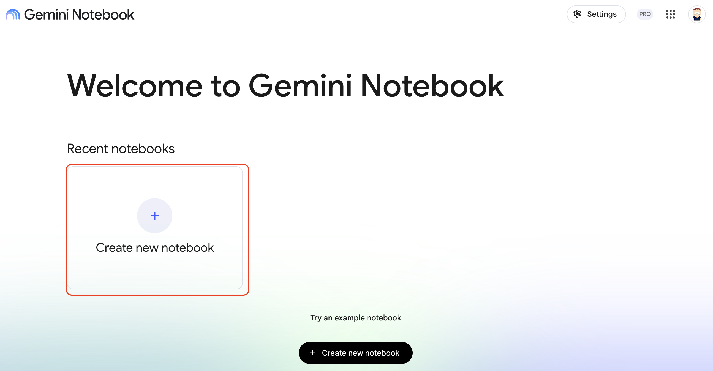
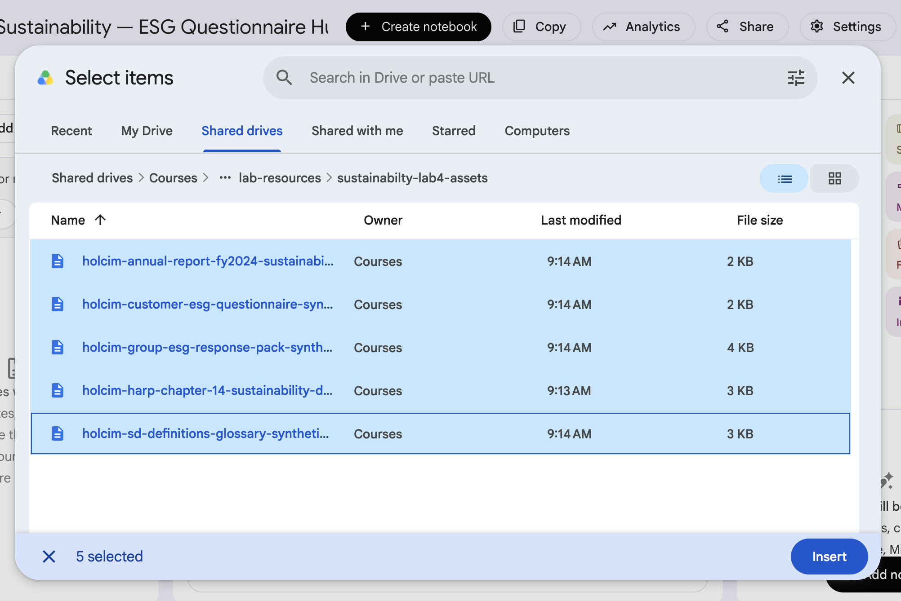
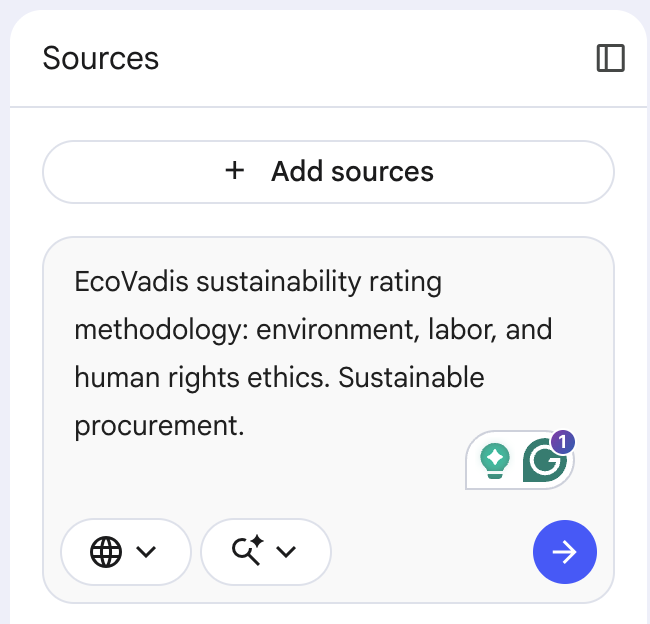
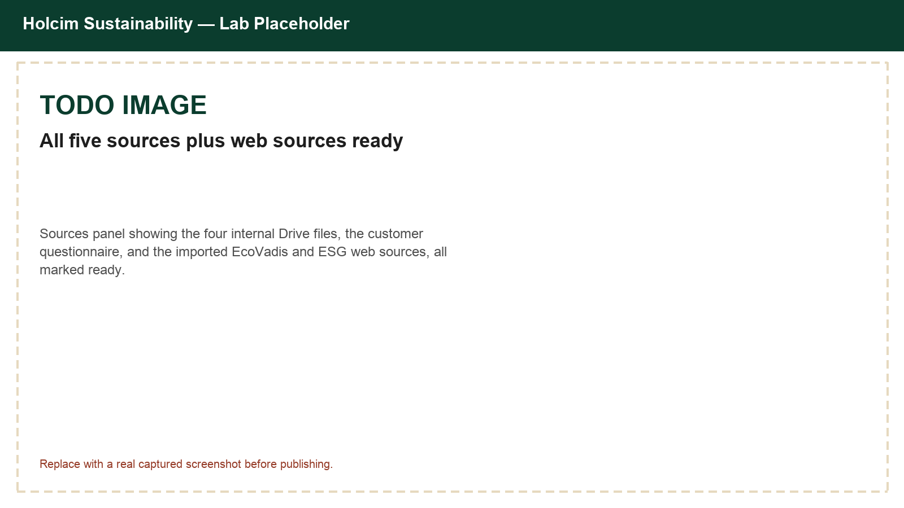
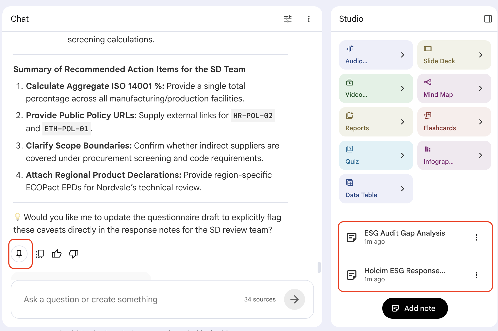
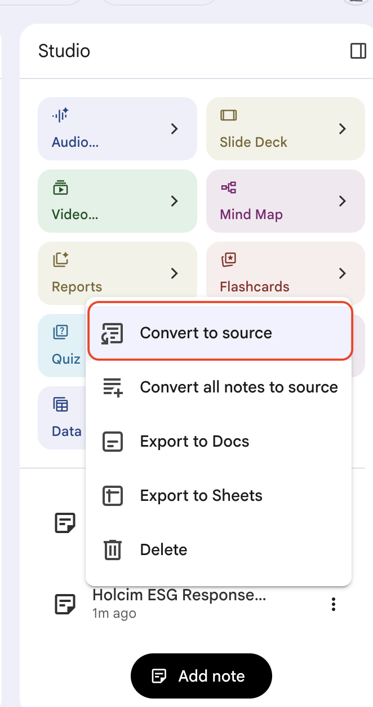
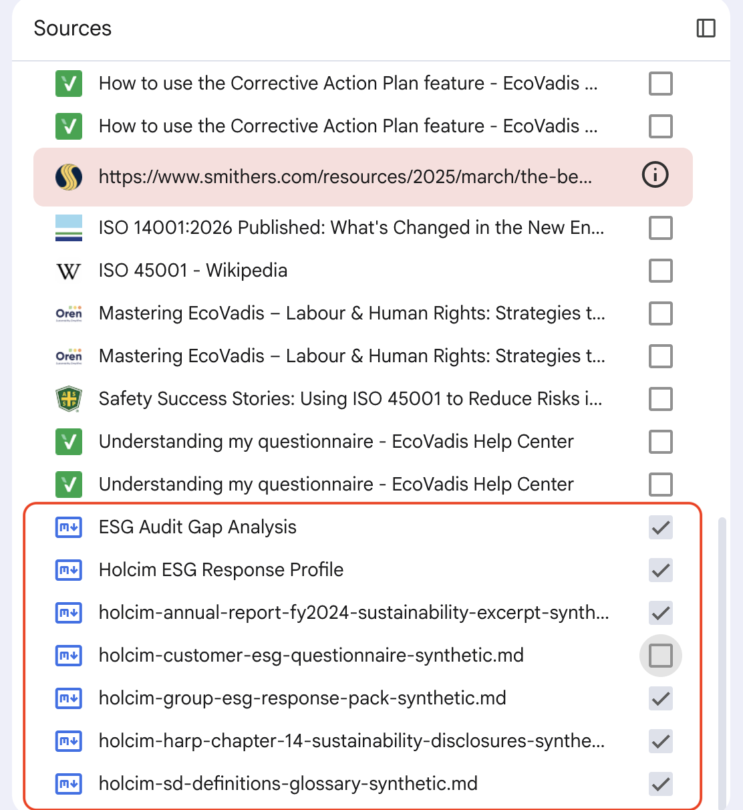
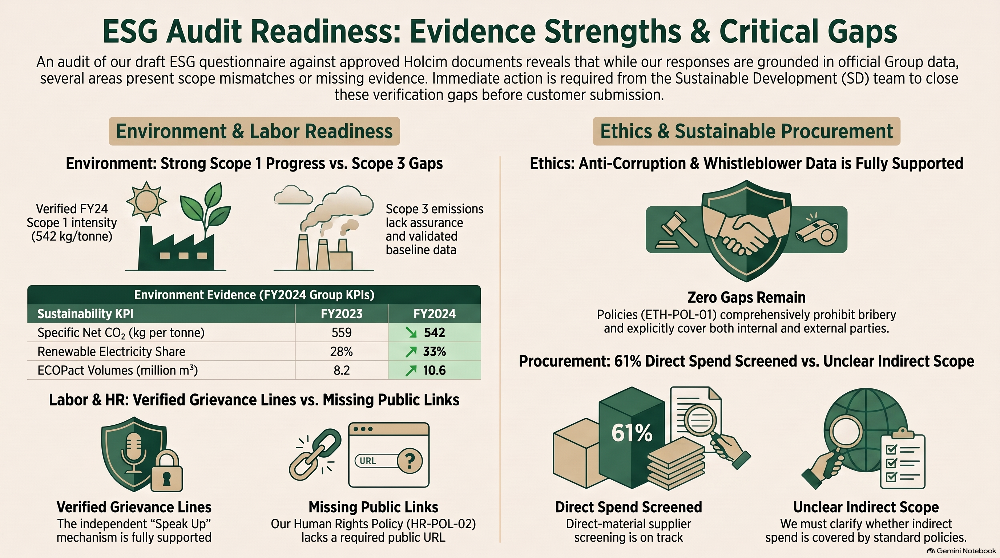

# Build a Holcim ESG Questionnaire Hub with Gemini Notebook

## Time Required

30 minutes

## Overview

In this lab, you will build a Gemini Notebook (NotebookLM) ESG Questionnaire Hub for Holcim's Sustainability team. You add internal Holcim sources plus a customer's original ESG questionnaire, research public ESG rating criteria with web sources, draft cited answers in chat, generate a manager-ready Report, Infographic, and Slide Deck grounded only in Holcim's own sources, then transfer the answers into a copy of the customer's original questionnaire document.

### You learn how to:
- Create a Gemini Notebook and add Holcim Sustainability sources, including a customer's original questionnaire.
- Research EcoVadis and public ESG rating criteria using web sources.
- Draft grounded, cited answers to customer ESG questionnaire questions in chat.
- Convert notes to sources and narrow your selection to Holcim's own content before generating a Report, Infographic, and Slide Deck in Studio.
- Transfer grounded answers into a copy of the customer's original questionnaire.

## Scenario


You are on Holcim's Sustainability team, supporting commercial and key accounts. A customer, Nordvale Construction Group, has sent an ESG questionnaire as part of its supplier qualification process, with questions modeled on common third-party rating formats like EcoVadis. Digging through HARP chapters, the SD glossary, and last year's Annual Report for every question wastes time and risks inconsistent answers between colleagues. This lab is modeled on a real Holcim Germany approach: a Gemini Notebook "ESG Hub" grounded in Holcim's own sources, used to draft every answer with a citation, before a person places the finished answers into the customer's original file.

> [!NOTE]
> Gemini Notebook cannot edit an arbitrary Word or PDF file for you. This lab teaches the realistic workflow: draft grounded, cited answers in Notebook, then place them into a copy of the customer's original questionnaire yourself.

## Lab Instructions

### Task 1: Create a notebook and add Holcim Sustainability sources

In this task, you create the notebook and load the internal sources plus the customer's original questionnaire that will ground every later answer.

1. Open [https://notebooklm.google.com/](https://notebooklm.google.com/) and sign in with your account.

2. On the home page, create a **New notebook**.



3. Rename the notebook to:

```text
Holcim Sustainability — ESG Questionnaire Hub
```

4. Click **Add sources**, and choose **Drive**. Enter the following URL in the Search box, drill into the folder, and add all five files.

```
https://drive.google.com/drive/u/1/folders/1VlwKZ8-UPqC119fZ8dNu64mLTO7nArzq
```

You should see:
   - `holcim-harp-chapter-14-sustainability-disclosures-synthetic.md`
   - `holcim-sd-definitions-glossary-synthetic.md`
   - `holcim-annual-report-fy2024-sustainability-excerpt-synthetic.md`
   - `holcim-group-esg-response-pack-synthetic.md`
   - `holcim-customer-esg-questionnaire-synthetic` (the customer's original questionnaire)

<!-- TODO IMAGE: Screenshot of the Add sources dialog with the Drive folder link pasted and all five files visible -->


5. Wait until all five sources appear as ready in the **Sources** panel.

> [!WARNING]
> Every source in this lab, including the "Nordvale Construction Group" questionnaire, is **synthetic training content**. Do not attach a real customer questionnaire or real confidential Holcim documents during this lab.

### Task 2: Research EcoVadis and public ESG rating criteria with web sources

In this task, you use Gemini Notebook's **Search for Web Sources** feature to pull public context on how third-party ESG ratings actually evaluate a company, so your answers speak the same language as the questionnaire.

1. In the **Search the Web for new sources** tool, enter the following search and run it.

```text
EcoVadis sustainability rating methodology: environment, labor, and human rights ethics. Sustainable procurement.
```

<!-- TODO IMAGE: Screenshot of the Search the Web tool with the EcoVadis query and results listed -->


2. Review the results, and select **Import** to relevant results to your notebook.

3. Run a second search for the certifications your response pack references, and import the results.

```text
ISO 14001 environmental management and ISO 45001 occupational health and safety certification overview
```

4. Confirm the **Sources** panel now includes your five Holcim and customer files plus your web sources.

<!-- TODO IMAGE: Screenshot of the full Sources panel with internal, questionnaire, and web sources all listed -->


### Task 3: Draft cited answers to the customer questionnaire in chat

In this task, you use chat to extract the exact questions from the customer's file, then draft grounded, cited answers before you touch the original document.

1. Ensure all sources are selected.

2. In the chat in the middle of the page, ask Gemini to confirm it can read the customer's questions:

```text
List every question from the Nordvale Construction Group ESG questionnaire source, grouped by section.
```

3. Ask for drafted answers, cited to your own sources:

```text
Draft an answer to each question in the Nordvale Construction Group ESG questionnaire.
Use only the Holcim Group ESG Response Pack, the SD Definitions Glossary, the HARP chapter, and the FY2024 Annual Report excerpt as evidence.
For each answer, cite the source and section it came from, for example (ESG Response Pack: Environment) or (Annual Report FY2024, Group Sustainability KPIs table).
If nothing in the sources answers a question, say the answer needs input from the SD team instead of guessing.
```

4. Examine the results, then click the **Save to note** icon (_the push pin icon_) to save the draft answers in the **Gemini Notebook Studio** on the right.


5. Ask Gemini to stress-test the draft before you send it anywhere:

```text
Review the draft answers. Flag any answer that is not directly supported by a source, and suggest what additional evidence the SD team would need to strengthen a weak answer.
```

6. Save this review as a note as well.




### Task 4: Turn your notes into a Report, Infographic, and Slide Deck in Studio

In this task, you convert your saved notes into sources, narrow your selected sources to Holcim's own content, and use Studio to produce a Report, an Infographic, and a Slide Deck your manager can review before the questionnaire goes back to the customer.

1. In the **Studio** panel on the right side of the notebook, select the action menu next to each saved note (your drafted answers and your gap review), and convert them to sources.




2. In the **Sources** panel, deselect all sources. Then select only the Holcim sources: the four internal Holcim documents (HARP chapter, SD glossary, Annual Report excerpt, ESG Response Pack) and your two converted notes. Leave the customer questionnaire and the web sources unselected.

> [!TIP]
> You can sort the sources by type and the Holcoim ones will be grouped together at the bottom. 




> [!NOTE]
> Leaving the customer questionnaire and web sources unselected keeps Studio outputs grounded in Holcim's own facts and drafted answers, not the customer's raw question text or generic web pages.

3. In **Studio**, click generate a **Report**. Choose whatever format you like., 


4. Generate an **Infographic** with this description:

```text
Create a one-page executive summary infographic of our ESG questionnaire readiness, covering Environment, Labor and Human Rights, Ethics, and Sustainable Procurement.
Highlight our strongest evidence and our biggest remaining gap in each theme.
Style: clean corporate, deep forest green and sand accents.
```

5. Click the **Slide Deck** button. Choose **Presenter Slides** and paste the following description:

```text
Create a short slide deck to brief my manager before we send the completed ESG questionnaire back to Nordvale Construction Group.
Cover: what the customer asked, how well we can answer today, remaining gaps, and who owns closing each gap.
Keep it concise and suitable for a 5-minute update.
```


> [!NOTE]
> Studio generation can take a few minutes each. Start the next one while the previous one generates.

6. Below, is sample output.

[Slide Deck](https://drive.google.com/file/d/1i8AsX0mRrZV67EQFiX0KazkU1hu7YKN-/view?usp=drive_link)





### Bonus Task 5: Rehearse the hub on a second question set

Harden your ESG Hub so it holds up under a different question mix.

1. Ask Gemini Notebook for a short EcoVadis-style readiness gap analysis using only the Environment-theme questions and sources:

```text
Based only on the Environment-theme sources, where are we strongest and weakest against typical EcoVadis Environment questions? Keep it to 5 bullets.
```

2. Optional: try generating a **Quiz** in Studio from the SD Definitions Glossary so a teammate can self-test the terminology before their own customer call.

## Congratulations!

In this lab, you have:
- Created a Gemini Notebook and added Holcim Sustainability sources, including a customer's original questionnaire.
- Researched EcoVadis and public ESG rating criteria using web sources.
- Drafted grounded, cited answers to customer ESG questionnaire questions in chat.
- Converted notes to sources and narrowed your selection to Holcim's own content before generating a Report, Infographic, and Slide Deck in Studio.
- Transferred grounded answers into a copy of the customer's original questionnaire.


