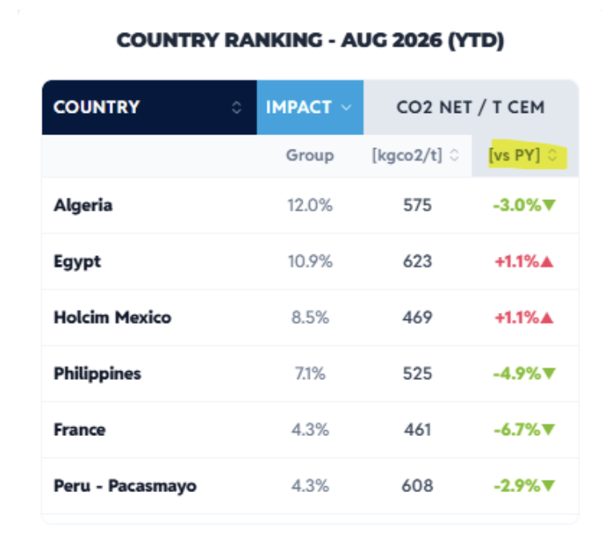

# Apps Script Showcase Challenge for the Sustainability Team

## Time Required

30 minutes

## Overview

In this lab, you will open a live Holcim Sustainable Development (SD) spreadsheet, make your own copy, and take on the same Apps Script challenge the SD team uses to introduce Apps Script: build a tab that sorts and ranks Country/OpCo sustainability data, modeled on a real SD mobile dashboard view. This lab is intentionally open-ended. You explore, build, and use Gemini as your coding partner rather than follow a fixed script.

### You learn how to:
- Open a live Google Sheet, make your own working copy, and read an Apps Script brief written directly into the sheet.
- Use Gemini to help design and write an Apps Script function that ranks sustainability data dynamically.
- Build a sortable "country ranking" tab modeled on a real Holcim SD Performance App view.

## Scenario


Holcim's SD team uses a mobile dashboard, the "SD Performance APP," to let leaders quickly see which countries have the biggest impact on a Group metric and whether that metric is improving. The whole view is generated with Apps Script. This lab is the same 1-hour challenge the SD team uses to teach that skill: read the mission brief already written into the sheet, then build your own version.

## Lab Instructions

### Task 1: Open the sheet, make your copy, and read the brief

1. Open the shared spreadsheet. This link opens the **Make a copy** dialog directly:

[https://docs.google.com/spreadsheets/d/1c3OpaP37NETH2IVMGxFRJbzfFHKqcyqQroeH40QmxhY/copy](https://docs.google.com/spreadsheets/d/1c3OpaP37NETH2IVMGxFRJbzfFHKqcyqQroeH40QmxhY/copy)

2. Save the copy to your own Drive, and give it a name you will recognize.

3. Read the **Read me** and **SD APP Tab examples** tabs. They contain your mission brief, straight from the SD team. **SD APP Tab examples** also includes a target layout image to aim for.

4. Open the **Nature data_dummy** tab. This is your data: one row per Country/OpCo, grouped by region, with three metric groups (each split into a prior blank column, a `YTD AY` actual-year column, and a `YTD PY` prior-year column): Cementitious Materials volume, Freshwater withdrawal, and Specific freshwater withdrawal.

> [!NOTE]
> The target image is a **CO2** dashboard, but this data tab only has volume and freshwater metrics. Treat the image as the pattern to recreate (rank by a share percentage, show a per-tonne KPI, color-code the change versus prior year), not a literal column match. **Specific freshwater withdrawal [L/t cem mat]** is the closest per-tonne KPI in this data to the CO2 metric shown.

### Task 2: Explore and build your ranking tab

This is the open-ended part. Your goal: a new tab that lists each Country/OpCo, ranked, the way the SD Performance App image does.

A ranking tab like this usually needs three things:
- A **share metric** to rank by (for example, each country's Cementitious Materials volume as a percent of the Group total).
- A **per-tonne KPI** to display (Specific freshwater withdrawal is the natural fit here).
- A **change indicator** versus prior year, color-coded (green when it improved, red when it worsened).

1. Open **Extensions** | **Apps Script** in your copy of the sheet.

2. Build your script iteratively: first get it reading `Nature data_dummy` and listing countries, then add the ranking calculation, then add the sort, then add the color-coded change column.

3. Skip the region "Totals" rows. You want one row per Country/OpCo only.

> [!TIP]
> Use Gemini as your coding partner. Open a chat at [https://gemini.google.com/](https://gemini.google.com/) alongside the Apps Script editor and describe what you are building. A starting point:
>
> ```text
> I'm building a Google Apps Script for a Sheet tab called "Nature data_dummy".
> Columns: A Total, B Region, C Country/OpCo, then three metric groups, each with a blank column, a YTD AY column, and a YTD PY column: Cementitious Materials volume [Kt] (D-F), Freshwater withdrawal Cement (FWW) [m3,'000] (G-I), and Specific freshwater withdrawal (Cement) [L/t cem mat] (J-L). Region cells are merged, so only the first row of each region block has a value, and some rows are region "Totals" rows I want to skip.
>
> Write an Apps Script function that:
> 1. Reads only the individual Country/OpCo rows, not the region Totals rows.
> 2. Computes each country's Impact percent as its Cementitious Materials volume YTD AY divided by the Group Total YTD AY.
> 3. Computes the percent change in Specific freshwater withdrawal YTD AY versus YTD PY.
> 4. Writes a new tab called "Country Ranking" with columns Country, Impact %, Specific Freshwater Withdrawal, and % vs PY, sorted by Impact % descending.
> 5. Colors the % vs PY cell green if it decreased and red if it increased.
>
> Explain the script briefly, then give me the full code to paste into Code.gs.
> ```
>
> Paste any error message back into the same chat and ask for a fix rather than debugging from scratch.

4. Run your script, fix what breaks, and keep iterating until your **Country Ranking** tab is sorted, shows a per-tonne KPI, and color-codes the trend versus prior year.

**Your tab is done when:**
- It lists each Country/OpCo once, not the region Totals rows.
- Rows are sorted by your share/impact metric, highest first.
- A per-tonne KPI is visible for each country.
- The change versus prior year is color-coded (green improved, red worsened).
- Re-running the script rebuilds the tab correctly, rather than requiring a manual sort.



### Bonus Task 3: Make it dynamic

With fewer hints, extend your script so a colleague could reuse it without editing code.

1. Add a custom menu (like `onOpen` in Lab 2) so a colleague can rebuild the ranking with one click instead of running the script from the editor.

2. Optional stretch: let the user pick which metric to rank by (Cementitious Materials volume vs Freshwater withdrawal) from a simple prompt or dropdown, and rebuild the ranking accordingly.

## Congratulations!

In this lab, you have:
- Opened a live Google Sheet, made your own working copy, and read an Apps Script brief written directly into the sheet.
- Used Gemini to help design and write an Apps Script function that ranked sustainability data dynamically.
- Built a sortable "country ranking" tab modeled on a real Holcim SD Performance App view.


